# Planner — React Implementation Onboarding for Claude Code

> **READ THIS FIRST — before writing any React code.**
> This is the single onboarding guide for engineers implementing the Planner. It explains the architecture, what is frozen, the reusable components, the build order, and the design rules so your implementation matches the **frozen** design exactly.
>
> **Golden rule:** *reuse before inventing, and never redesign during implementation.* The design is done and frozen. Your job is a faithful React translation — not a new design pass.

---

## 0. Where everything lives (source of truth)

| You need… | Read |
|---|---|
| What's frozen, scorecard, build order | `planner/planner-freeze.md` |
| The master plan, data model, routes, IPI mapping | `planner/planner.md` |
| Every component + REUSE/REUSE+/NEW mapping | `planner/planner-component-catalog.md` |
| Voice + exact strings + vocabulary | `planner/planner-copy-guide.md` |
| Every interaction, state, keyboard + a11y behavior | `planner/planner-interaction-catalog.md` |
| Mobile reflow rules + bottom sheets | `planner/planner-mobile-plan.md` |
| First-time-user UX rationale | `planner/planner-firstuse-review.md` |
| QA + acceptance-criteria mapping | `planner/planner-qa-handoff.md`, `planner/planner-final-qa.md` |
| Visual system, tokens, AI patterns | `DESIGN.md` → `app/src/styles/tokens.css` + `app/src/styles/design-system-rules.md` |
| The literal pixels to match | The 5 DC prototypes: `Pages/SCR-32…35-Planner-*.dc.html` + `Pages/SCR-MOBILE-Planner-Gallery.dc.html` |

**Stack:** Next.js (`app/`), Mastra AI runtime, Supabase. **All AI calls are server-side only.** Tokens in `app/src/styles/tokens.css` are the source of truth — **never hardcode a hex value.** UI primitives are **shadcn**.

---

## 1. Project Overview

### Purpose
The **Planner** is the surface where a fashion operator sees **what work exists, what's mine today, and what needs my sign-off** — across shoots, campaigns, and CRM deals — and moves plans forward step by step. It is **one more surface in the existing operator app (iPix / FashionOS), not a new product.**

### Target users
- **Owner / Producer** — runs the plan: assigns work, approves steps, manages who has access.
- **Contributor** — owns and completes their assigned tasks.
- **Client approver (Viewer+approve)** — browses and signs off approvals; cannot edit.
- All are fashion-operations people, not project-management specialists. Copy and UX assume **no PM jargon**.

### Design philosophy (from `DESIGN.md`)
> **Guide operators — never wait for them.** Eliminate waiting (no blank spinners → stream progress), guessing (always show the next step), repetitive work (smart defaults), and unreviewed AI writes (**every AI output is a draft behind an approval**). The interface is a *calm executive workspace*, not a busy dashboard. Visual language is **v3 "Zeely Editorial"** — pure white / grey / charcoal / black, **Inter** type, image-first.

### The three-question UX principle
Every Planner surface answers, in reading order:
1. **What is this?** (name + status)
2. **What's happening / what's wrong?** (one-sentence状态, at-risk reason)
3. **What do I do next?** (the primary action)

Plan cards, detail panels, and mobile sheets are all built on this order. Never lead with a field dump.

### Decision hierarchy (when specs conflict)
```
1. Frozen DC prototypes (the pixels)         ← visual truth
2. planner-freeze.md + this doc              ← what's frozen & why
3. planner.md + PR #283 schema/enums         ← data & routes truth
4. DESIGN.md + tokens.css                     ← visual system truth
5. Linear IPI-476…483 acceptance criteria     ← scope truth
```
If something isn't in these, **do not invent it** — ask.

---

## 2. What is FROZEN (must NOT change)

These are settled. Changing any of them is a regression, not an improvement.

- **Layouts** — the adaptive 3-panel structure and every screen's composition. Match the DC pixels.
- **Navigation** — the 5-icon scoped sub-rail, its routes, and per-screen active state (see §3).
- **Terminology** — **step** (not phase/stage), **approval** (not gate/checkpoint), **plan** (not project/instance), **member/access** (not user/permission). See Copy Guide.
- **State matrix** — the 12 states in §6. Every screen implements its applicable set.
- **Adaptive 3-panel architecture** — rail · main · **one** adaptive right panel (Intelligence ⇄ detail). **Never a 4th panel.**
- **Responsive behavior** — the breakpoints in §7 (≥1280 persistent · 1024–1279 narrowed · <1024 slide-over · <768 mobile/bottom-sheet).
- **Planner Assistant behavior** — proactive teammate that *offers*; the honesty pill; AI drafts, humans decide. Never auto-executes.
- **Design tokens** — the `:root` scale (colors, radii, Inter/Geist Mono). Amber = border/tint only, never a filled panel. Numbers always in mono.
- **Component behavior** — approval contract is **Approve · Edit · Discard** (no Reject/Request-changes); Kanban columns = **phases**; Members = **access roles only**; status enum is fixed.

> **Enforcement:** do not edit the frozen DC files. If you must explore an alternative, copy to `…v2` and leave the frozen source intact.

---

## 2A. Open questions for eng (resolve before/while building)

Carried forward from `planner-qa-handoff.md` §4.7 — read this before you start, not after you hit one of these mid-build:

1. ~~**PLN-009** — open a Linear issue for SCR-35 Hub before implementing.~~ **Resolved:** [`IPI-526`](https://linear.app/amo100/issue/IPI-526/planner-hub-scr-35-screen-implementation-tracking) opened 2026-07-12.
2. **Calendar view** — multi-day status bars vs simple event chips? Fixture shows chips; confirm against `IPI-478` before building `PlannerCalendar`.
3. **Role-conditional Dashboard** — exact stat set per persona (Producer→budget gates, Client approver→only their gates) resolved server-side (`IPI-479` AC-F); design has labelled slots, needs the real persona→stat map.
4. **Notifications tab** — when `IPI-481` lands, does it live as a tab on Settings (SCR-34) or route to SCR-15? Spec is non-committal.
5. **Nav active-state for SCR-34** (Planner vs Settings rail item) — pick one convention before wiring the scoped sub-rail.

---

## 3. Architecture Overview

### Navigation flow
```
Operator Shell (56px global + scoped rail)
        │
        ▼
   Planner Hub  (/app/planner)                 "what plans exist"
        │  select a plan
        ├──────────────► Dashboard (/app/planner/dashboard)   "what's mine today"
        │
        ▼
   Workspace  (/app/planner/[instanceId])       "move the plan forward"
        │
        ▼
   Instance Settings (/app/planner/[instanceId]/settings)  "who has access"
```

### The adaptive right panel (the heart of the architecture)
There is **one** right panel per screen. It has two modes and swaps between them — it never becomes two panels:
- **Intelligence mode (default):** the `production-planner` insights for the current screen.
- **Detail mode:** when the user selects an entity (a step, a plan, a member), the same panel swaps to show that entity's detail. Deselect / Esc → back to Intelligence.

Dashboard (SCR-33) is the exception: it has **no detail swap** (static Intelligence panel) because it's a personal landing, not an object browser.

### Desktop / tablet / mobile at a glance
- **Desktop (≥1280):** rail · main · right panel all persistent.
- **Tablet (1024–1279):** panel persists but narrows to ~300px.
- **Tablet (768–1023):** panel becomes an **off-canvas slide-over** — an Insights **FAB** opens it; scrim or Esc closes it.
- **Mobile (<768):** the mobile design takes over — bottom tab bar, docked AI composer, **bottom sheets** for detail. A deep-link into Workspace **redirects to Dashboard** as the default mobile landing.

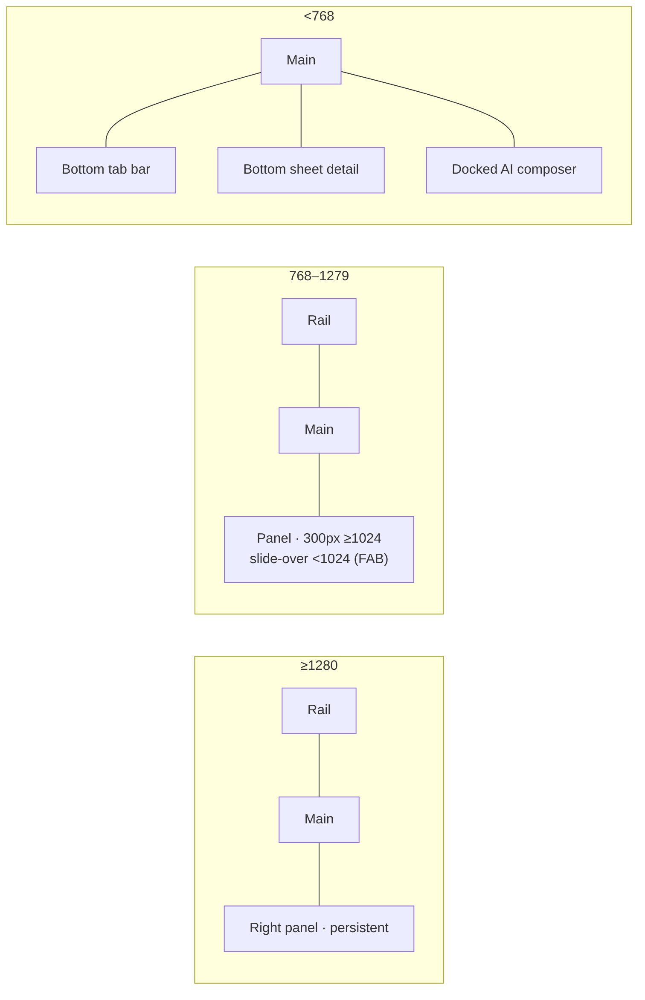

---

## 4. Screen Implementation Order (and why)

| # | Build | Why this position |
|:--:|---|---|
| 1 | **Operator Shell** (rail, routes, chat dock slot, right-panel slot) | Everything mounts inside it; wiring routes first prevents dead links. |
| 2 | **Shared Planner components** (StatusChip ext., EmptyState, Skeleton, ErrorState, PersistentChatDock, IntelligencePanel, toast, plan card) | Every screen depends on these; build once, reuse four times. |
| 3 | **SCR-33 Dashboard** | Simplest screen, **default mobile landing**, exercises the shell + shared components without the new Timeline. Fast confidence win. |
| 4 | **SCR-35 Hub** | Reskin of Shoots List; adds filter + adaptive detail panel; still no new composite. |
| 5 | **SCR-32 Workspace** | The **critical path** — contains the one genuinely new build (`PlannerTimeline`) + the gate flow. Do it after the shell + patterns are proven. |
| 6 | **SCR-34 Instance Settings** | Members table + Invite dialog (focus-trap + validation); isolated, low-risk. |
| 7 | **Mobile** | Reflow each screen to the mobile gallery spec + bottom sheets, once desktop is stable. |
| 8 | **Accessibility** | Port the DC-proven a11y pattern onto real shadcn primitives (see §8). |
| 9 | **Data integration** | Replace fixtures with `planner.*` reads (enums pre-matched to PR #283). |
| 10 | **AI integration** | Wire the `production-planner` agent last (IPI-482); until then the honesty pill stays. |

**Critical path:** 1 → 2 → 5 (Workspace + `PlannerTimeline`). Dashboard/Hub/Settings parallelize after step 2. ~11–12 dev-days of design-representable work before backend integration.

---

## 5. Component Inventory

Legend: **REUSE** = ships already, use as-is · **REUSE+** = ships, needs a Planner variant/prop · **NEW** = build it.
Canonical React names are from `planner.md §0.3`; design-catalog aliases in parentheses.

### Shell & chrome
| Component | Class | Source | Depends on |
|---|:--:|---|---|
| `OperatorShell` (rail + slots) | REUSE | existing app shell | routing |
| Scoped sub-rail (5 icons) | REUSE | CRM sub-app pattern | `OperatorShell` |
| `PersistentChatDock` | REUSE | IPI-482 slot | agent (later) |
| `IntelligencePanel` | REUSE+ | existing panel, reskin | adaptive-panel host |
| Adaptive right panel host | REUSE+ | new wrapper around IntelligencePanel + detail | — |
| Panel slide-over + FAB + scrim | NEW (tiny) | — | breakpoint hook |
| Sample-data ribbon · honesty pill · toast · live region | REUSE / NEW-tiny | — | — |

### Content composites
| Component (alias) | Class | Source | Notes |
|---|:--:|---|---|
| **`PlannerTimeline`** (TimelineGrid) | **NEW** | none — obeys tokens | **The only major new build.** Phase rows × week columns, milestone markers, current-date line, at-risk bars, subtle neutral dependency lines (static in v1), keyboard step-nav. |
| `PlannerKanban` (KanbanBoard) | REUSE+ | `SCR-30-CRM-Pipeline` | **Columns = phases** (IPI-478 AC-B): dragging sets `phase_id` **and** `status`. Gated column = blocked drop-zone. |
| `PlannerCalendar` | REUSE+ | shadcn `Calendar` + event overlay | Legend says "Approval". |
| `PlannerList` | REUSE | list-table conventions §5F | List view is **transient**, not persisted. |
| `TaskDetailDrawer` | REUSE+ | shadcn `Sheet` | One shared drawer across all 4 views. |
| `ApprovalCard` / gate card | REUSE | existing ApprovalCard | Contract **Approve · Edit · Discard** only. |
| `PlannerRoleDashboard` | REUSE+ | `SCR-25-Role-Dashboards` | KPI cards deep-link into Workspace. |
| Plan card | REUSE+ | Shoots list card | 3-question order; risk-sorted; entity icon. |
| Attention band / Start-Here / WeekStrip | REUSE+ | dashboard/hub patterns | First-use guidance (do not drop). |
| `InviteMemberDialog` | REUSE+ | shadcn `Dialog` | Email + access-role + preset; focus-trap + inline validation + focus-return. |
| Member table | REUSE+ | §5F table | **Access roles only** — never a production-role column. |
| `StatusChip` (planner enum) | REUSE+ | `components/StatusChip` | Extend with `todo/in_progress/blocked/done/cancelled` + instance enum. **Do not fork.** |
| `DependencyLine` (SVG) | NEW (tiny, deferred) | — | IPI-483; static example only in v1. |
| `PresenceBar` | NEW (small, deferred) | NavSidebar avatar | IPI-480; later. |

> **Budget:** essentially **one substantial new component (`PlannerTimeline`)** + a few tiny utilities. Everything else is reuse or reskin. This is why the design-system risk is low — protect it by not reinventing shipped components.

---

## 6. State Matrix

Every screen implements its applicable subset. Copy for each is in the Copy Guide.

| State | What it looks like | Where used |
|---|---|---|
| **default / live** | Populated content | all |
| **loading** | Skeleton shimmer (reduced-motion safe) | all |
| **empty** | Icon + bold title + one sentence + one CTA | Hub ("No plans yet"), Dashboard ("No plans yet"), Settings ("Just you so far"), Workspace ("No steps yet") |
| **error** | Icon + message + inline Retry | all |
| **success** | Auto-dismiss toast (2.6 s) | on any committed action |
| **read-only** | Banner; edit/approve disabled | Viewer role, all screens |
| **permission-denied** | Toast on a gated action as Viewer | all |
| **sync-failed** | Dismissible banner + "Retry now" | all |
| **offline** | "Showing last synced. Editing disabled." | mobile (no offline mode desktop) |
| **selected-detail** | Right panel swaps to entity detail | Workspace (step), Hub (plan), Settings (member) |
| **complete (celebration)** | Check + 3 stat cards + Archive/View; `popIn`, no confetti | Workspace when a plan is done |
| **invite-error** | Inline `role=alert`, red border, dialog stays open | Settings invite dialog (empty + invalid email) |
| **blocked drop-zone** | Dashed amber zone, `cursor:not-allowed`, explanatory toast | Workspace Kanban gated column |

---

## 7. Responsive Rules

| Breakpoint | Rail | Main | Right panel | Nav | Touch |
|---|---|---|---|---|---|
| **Desktop ≥1280** | 56px persistent | full | persistent 320/340px | scoped rail | pointer |
| **Tablet 1024–1279** | 56px persistent | full | persistent, **narrowed to 300px** | scoped rail | pointer/touch |
| **Tablet 768–1023** | 56px persistent | full-width | **off-canvas slide-over** (340px, ≤88vw) via FAB; scrim/Esc closes | scoped rail | 44px targets |
| **Mobile <768** | replaced by **bottom tab bar** | full | **bottom sheet** on tap (drag handle + scrim) | bottom tabs + docked composer | 44px targets, swipe on sheets |

- **< 768 Workspace:** deep-link redirects to Dashboard. If forced in: Timeline → vertical list grouped by week; Kanban → single column + stage-accordion (mirror the mobile gallery).
- **Below 768** the reference is `SCR-MOBILE-Planner-Gallery.dc.html` (bottom sheets, tab bar, docked composer, per-frame state chips).
- Transitions disabled under `prefers-reduced-motion`.

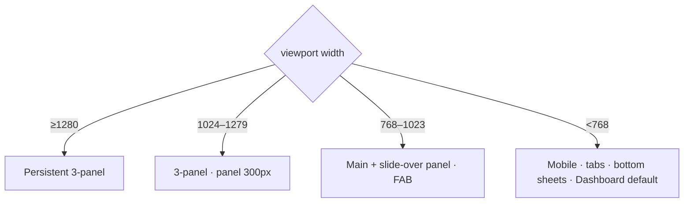

---

## 8. Accessibility Requirements

The DC prototypes prove these behaviors; reimplement them on real shadcn primitives with identical behavior.

**Checklist (every screen):**
- [ ] **Keyboard:** all actions reachable; no pointer-only interactions. Workspace Timeline supports **arrow-key step navigation** (↑/↓/←/→ move selection, open detail).
- [ ] **Focus:** visible `:focus-visible` ring (2px `--action`, 2px offset). **Skip link** ("Skip to <region>") is the first focusable element → `#main`.
- [ ] **Dialog behavior:** Invite dialog is `role="dialog" aria-modal="true"`; **focus moves to first field on open, traps within (Tab/Shift-Tab cycle), returns to trigger on close.** Esc closes.
- [ ] **ARIA:** rail items `aria-current="page"` when active + `aria-label`; inputs `aria-invalid` + `aria-describedby` for errors (`role="alert"`).
- [ ] **Live regions:** `aria-live=polite` announces step-nav ("Step N of 11: …") and filter result counts ("N plans shown · Shoot"), invite validation.
- [ ] **Reduced motion:** `prefers-reduced-motion` disables shimmer, slide-over transition, completion `popIn`.
- [ ] **Status never colour-alone** — always text + icon/dot.
- [ ] **Esc priority:** slide-over → dialog → detail panel (never navigates away).

---

## 9. Planner Assistant

**Role:** a proactive teammate surfaced by the existing **`production-planner`** agent (IPI-482) through the reused `PersistentChatDock`. **No new agent.** It **guides — it does not automate work.**

**Behavior:**
- Each dock line = **one observation + one offer**, ending in a question (e.g. *"Item delivery is slipping — want me to shift the downstream steps by 2 days and flag the shoot date?"*).
- **Never** claims to have done something; **AI drafts, humans decide.** Every AI write is a reversible draft behind an approval.
- The **honesty pill** `production-planner · not yet wired` stays on every dock until the agent is actually wired. Until then, chip taps return an honest sample toast.

**Onboarding / first-use guidance:**
- **View-aware conversation starters** as suggested-prompt chips in the Workspace dock (Timeline → *Shift downstream 2 days · Explain the delay · What needs me today?*; Kanban → *Suggest owners · Balance the workload · What's blocked?*; etc.).
- **Contextual prompts** reflect the current screen and selection.
- **Suggested actions** map to real, schema-backed operations only (reschedule, assign, explain, approve) — never invented capabilities.

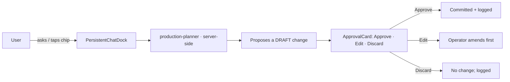

---

## 10. Copy Rules

- **Reference `planner-copy-guide.md` for every string.** Do not write new microcopy from memory.
- **Never invent terminology.** Approved vocabulary only: **step · approval · plan · member · access · at risk · needs you · Sample data — not live · production-planner · not yet wired.**
- **Never** use: phase, stage, gate, checkpoint, project, instance (user-facing), user, seat, permission level.
- **Fixed status set:** `To do · In progress · At risk · Blocked · Done · Cancelled · Approval needed`; plan statuses `Active · Planned · Completed · Draft`. **Do not add new status values.**
- New empty/error strings must follow **bold title (≤4 words) + one sentence + one CTA**.
- Numbers render in **Geist Mono**.

---

## 11. React Development Guidelines

1. **Reuse existing components first** — check the inventory (§5) before creating anything.
2. **Never redesign during implementation** — match the frozen DC pixels; if you think something's wrong, flag it, don't "fix" it.
3. **Do not invent backend features** — if it isn't in PR #283 / IPI acceptance criteria, it doesn't exist. Represent future capability with the honesty pill, not fake data.
4. **Keep UI identical** to the frozen prototypes across desktop, tablet, and mobile.
5. **Tokens only** — `tokens.css`; no hardcoded hex, no ad-hoc spacing.
6. **Extend, don't fork** — especially `StatusChip`.
7. **Maintain parity** — a change on desktop must land on tablet + mobile too.
8. **AI is server-side only** — never call the model from the client.

---

## 12. Testing Checklist (per screen)

- [ ] **Navigation** — every rail/link routes correctly; active state correct; back-affordance works.
- [ ] **Responsive** — verify all four breakpoints; slide-over opens <1024; bottom sheet <768; no horizontal overflow.
- [ ] **Accessibility** — run the §8 checklist; keyboard-only pass; screen-reader labels; reduced-motion.
- [ ] **State matrix** — exercise every applicable state from §6.
- [ ] **Interactions** — match `planner-interaction-catalog.md` row-by-row.
- [ ] **Keyboard** — arrow-key step nav (Workspace), Esc priority, dialog focus-trap.
- [ ] **Planner Assistant** — honesty pill present; chips contextual; no over-claiming.
- [ ] **Visual parity** — side-by-side against the DC prototype at the same width.

---

## 13. Common Mistakes to Avoid

- ❌ Creating a **fourth panel** (phase detail must live in the **one** adaptive right panel).
- ❌ Changing **terminology** (phase→step, gate→approval already settled).
- ❌ Changing **navigation** routes, icons, order, or active states.
- ❌ Replacing **Design v3** components with custom ones, or hardcoding hex.
- ❌ **Inventing Planner features** (Workflow builder, Approval History, Analytics, Comments, etc. are explicitly out of scope).
- ❌ Changing **layouts** or spacing away from the frozen pixels.
- ❌ Adding **new status values** or a Reject/Request-changes button (contract is Approve · Edit · Discard).
- ❌ Making Kanban columns = statuses (they are **phases**).
- ❌ Adding a production-role field to Members (Members = **access roles only**).
- ❌ Building an **offline mode** on desktop, or full-screen loaders (use lightweight sync indicators).

---

## 14. Definition of Done

The Planner implementation is complete **only when all of these are true:**
- [ ] **Visual parity** — every screen matches the frozen DC at every breakpoint.
- [ ] **Responsive parity** — desktop, tablet, and mobile all correct; slide-over + bottom sheets working.
- [ ] **Accessibility complete** — §8 checklist passes on all screens.
- [ ] **State matrix complete** — every applicable state implemented and reachable.
- [ ] **All interactions implemented** — matches the Interaction Catalog.
- [ ] **React components match** the frozen designs and reuse the inventory (§5); `PlannerTimeline` is the only major new build.
- [ ] **No regressions** — terminology, navigation, tokens, and the 3-panel architecture unchanged.
- [ ] **Copy** — all strings from the Copy Guide; no invented vocabulary.
- [ ] **AI honesty** — honesty pill until the agent is wired; no over-claiming.

---

## 15. Reference Diagrams

### 15.1 Overall architecture
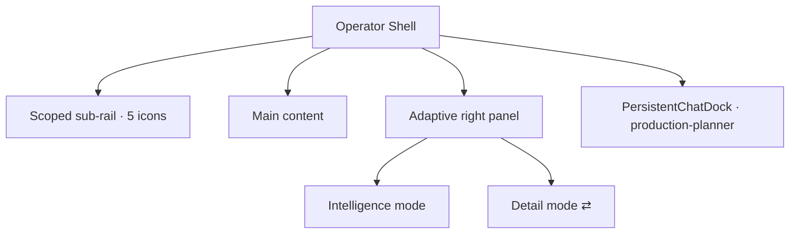

### 15.2 Screen navigation
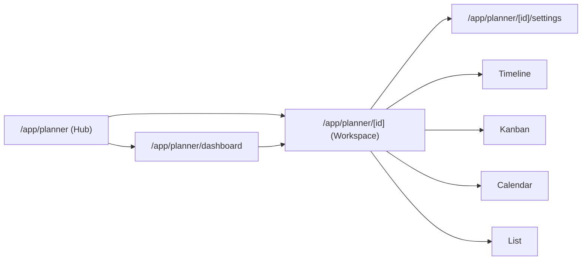

### 15.3 Planner workflow (step → approval)
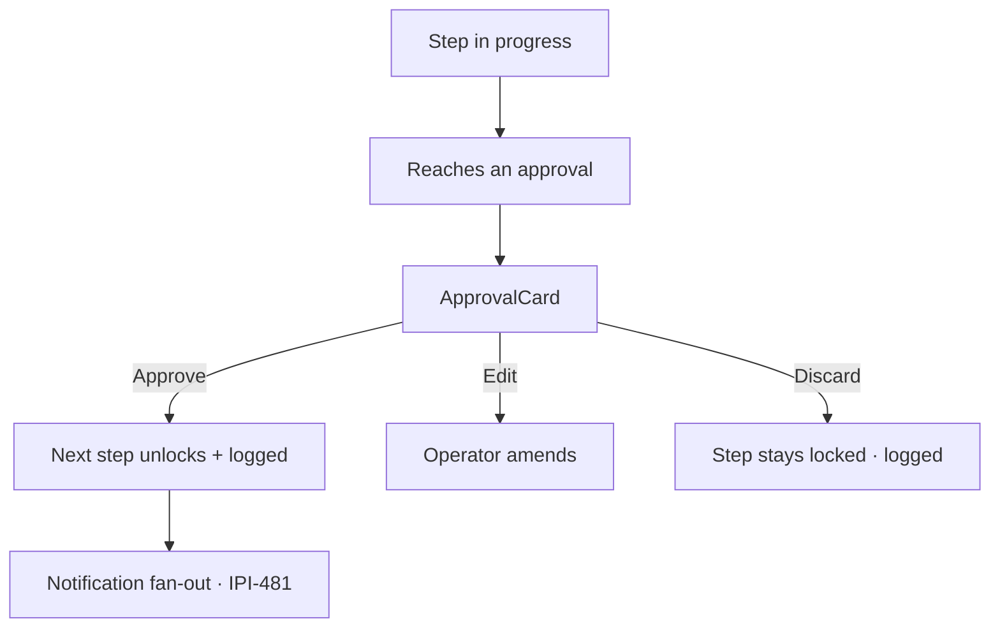

### 15.4 Adaptive panel behavior
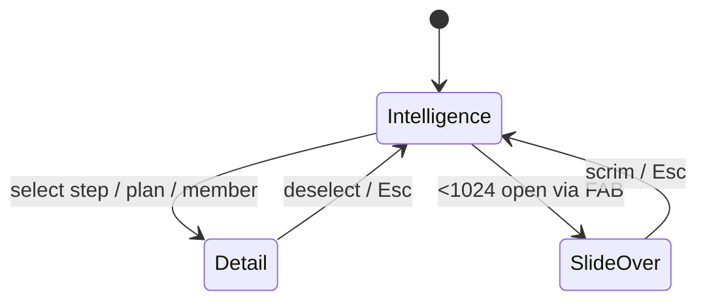

### 15.5 Responsive layouts
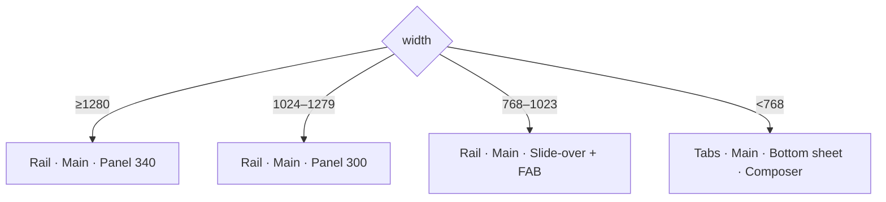

### 15.6 React component hierarchy
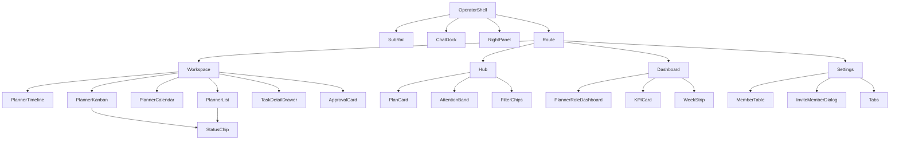

### 15.7 Data flow
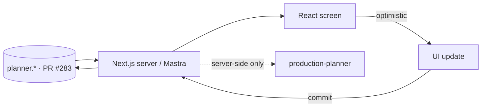

### 15.8 Implementation order
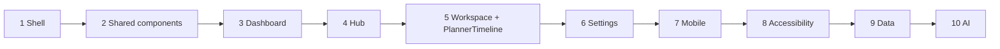

---

*Onboarding guide compiled 2026-07-10 from the frozen Planner design system. If a decision isn't covered here or in the referenced docs, stop and ask — do not invent.*
