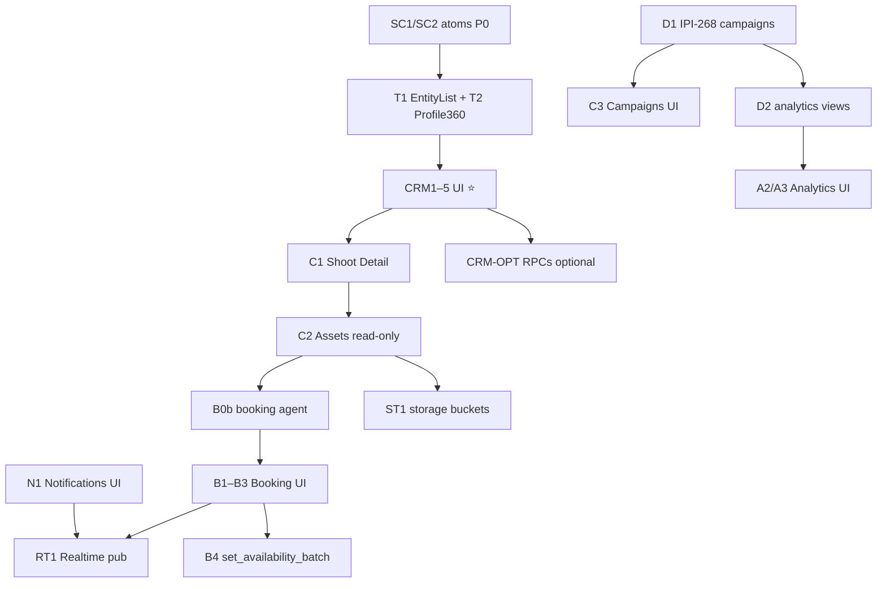
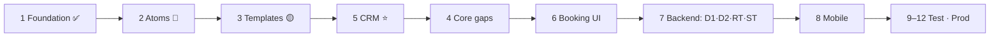

# iPix / FashionOS — Master Implementation Backlog

> **Updated:** 2026-07-06 · **SSOT for task execution** · Supabase verified via MCP ([`data/supabase-plan.md`](../plan/data/supabase-plan.md))
> **Companion:** [`../implement.md`](docs/implement.md) (full screen/component IDs) · [`../todo.md`](../todo.md) (screen queue)
> **Per-screen tasks:** [`screens/README.md`](./screens/README.md) · [`screens/MATRIX.md`](./screens/MATRIX.md) — **27 SCR task files** (one per built screen)
> **Refactor tasks:** [`refactor/README.md`](./refactor/README.md) — **13 RF tasks** (shared primitives, build-order Steps 1–5)
> **Mobile tasks:** [`mobile/README.md`](./mobile/README.md) — **11 MOB tasks** (fresh track — replaces canceled IPI-251/298–301)

**Legend:** ✅ Complete · 🟡 Partial · ⚪ Not Started · 🔴 Blocked/Refactor

---

## Readiness scores (2026-07-06)

| Dimension | Impl | Supabase | Dot |
|---|:--:|:--:|:--:|
| Design spec | 95 | — | 🟢 |
| Platform (shell/AI) | 82 | — | 🟢 |
| Operator-core screens | 72 | 78 | 🟡 |
| CRM | 25 | **85** | 🟡 UI-gated |
| Booking/Talent | 12 | **72** | 🟡 UI + 1 agent |
| Analytics / Notifications | 3 | 65 / 15 RT | 🔴 |
| Mobile | 10 | — | 🔴 |
| **Overall** | **~38** | **~62** | 🟡 |

**Backend is ahead of React.** CRM wire now; booking RPCs shipped (`transition_booking` ✅ live); only **`booking` Mastra agent** blocks Booking Wizard AI.

---

## Dependency-ordered master backlog

### Track A — Frontend critical path (no new migrations)

| ID | Task | Pri | Deps | Cx | Status | Task file |
|---|---|:--:|---|:--:|:--:|---|
| SC1 | Extract StatusChip + CRM tokens | P0 | — | S | 🔴 | [RF-01](./refactor/RF-01-status-chip.md) |
| SC2 | Extract EmptyState / ErrorState | P0 | — | S | 🔴 | [RF-A7b](./refactor/RF-A7b-empty-error-state.md) |
| T1 | EntityList\<T\> | P0 | SC1–3 | M | 🟡 | [RF-02](./refactor/RF-02-entity-list.md) |
| T2 | Profile360 | P1 | SC1 | L | 🟡 | [RF-04b](./refactor/RF-04b-profile360-extract.md) |
| CRM1–5 | CRM screens 26–31 | **P1** | SC1, T1, T2 | M–L | 🟡 | [RF-03/04](./refactor/README.md) + [screens/](./screens/) |
| C1 | Shoot Detail tabs (IPI-337) | P1 | T4 | L | 🟡 | implement.md |
| C2 | Assets read-only (IPI-248) | P2 | SC4 | L | 🔴 | implement.md |
| C4 | Matching tabs + Casting | P2 | T1 | L | 🟡 | implement.md |
| N1 | Notifications inbox (15) | P2 | — | M | ⚪ | implement.md |
| B1–B3 | Booking UI 20–22 | P2 | B0b, T2/T3 | L | ⚪ | implement.md |

### Track B — Backend / Supabase (verified gaps)

| ID | Task | Pri | Deps | Cx | Status | Task file |
|---|---|:--:|---|:--:|:--:|---|
| **B0b** | **Booking Mastra agent** | **P2** | — | M | 🔴 | [BE-B0b-booking-mastra-agent.md](./backend/BE-B0b-booking-mastra-agent.md) |
| **D1** | **Campaigns schema (IPI-268)** | **P2** | — | M | 🔴 | [BE-D1-campaigns-schema-IPI-268.md](./backend/BE-D1-campaigns-schema-IPI-268.md) |
| **D2** | **Analytics views + RPCs** | P3 | D1 | M | ⚪ | [BE-D2-analytics-views-rpcs.md](./backend/BE-D2-analytics-views-rpcs.md) |
| **RT1** | **Realtime: notifications + bookings** | P3 | N1, B3 | M | ⚪ | [BE-RT1-realtime-notifications-bookings.md](./backend/BE-RT1-realtime-notifications-bookings.md) |
| **ST1** | **Storage buckets** | P2 | C2 upload | S | ⚪ | [BE-ST1-storage-buckets.md](./backend/BE-ST1-storage-buckets.md) |
| **B4-RPC** | **set_availability_batch** | P3 | — | S | ⚪ | [BE-B4-set-availability-batch.md](./backend/BE-B4-set-availability-batch.md) |
| **CRM-OPT** | **CRM convenience RPCs** | P3 | CRM1 | M | ⚪ | [BE-CRM-opt-convenience-rpcs.md](./backend/BE-CRM-opt-convenience-rpcs.md) |
| **ACT1** | **Org activity log + list RPC** | P3 | — | M | ⚪ | [BE-ACT1-org-activity-log.md](./backend/BE-ACT1-org-activity-log.md) |

### Track B — Done (do not recreate)

| ID | Was listed as gap | Live status |
|---|---|---|
| B0 | `transition_booking` RPC | ✅ MCP verified |
| — | `search_talent`, `toggle_shortlist_item` | ✅ MCP verified |
| — | `talent.bookings` + FSM RPCs | ✅ `talent` schema |
| — | CRM tables + RLS + trigger | ✅ |
| — | `list_notifications`, `mark_notifications_read` | ✅ |

### Track C — Mobile (after desktop parity)

See [`mobile/README.md`](./mobile/README.md) · **11 MOB tasks** · replaces canceled IPI-251/298–301.

| Phase | IDs | When |
|---|---|---|
| Primitives | MOB-01–04 | After RF-03 + SCR-05/08 core |
| MVP screens | MOB-10 | Shell integrated |
| Flows + polish | MOB-20 · MOB-30 · MOB-31 · MOB-32 | Per screen readiness |
| Booking mobile | MOB-40 | After SCR-15/20–25 routes |
| Verification | MOB-90 | Gate before Phase 10 Done |

Mobile (M1–M3), Analytics UI (A1–A3), Campaigns UI (C3 → **after D1**), AI depth (AI1–AI2), Hardening (H1–H3) — see [`../implement.md`](docs/implement.md).

---

## Recommended execution order

---

## Phase roadmap (12 phases)

| Phase | Focus | Status |
|---|---|---|
| 1 Foundation | AppShell, tokens, providers | ✅ |
| 2 Shared components | StatusChip, EmptyState, ErrorState, Skeleton | 🔴 extract |
| 3 Shared templates | EntityList, Profile360, WizardShell, DetailShell | 🟡 |
| 4 HTML → React | DC parity per screen (no backend unless ready) | 🟡 8/31 real |
| 5 CRM | 6 screens — backend ✅ | 🟡 stubs |
| 6 Core operator | Shoot Detail, Assets, Campaigns*, Matching, Notifications | 🟡 |
| 7 Booking | Agent + UI 20–22 (RPCs ✅) | ⚪ |
| 8 Supabase wiring | Queries, RPCs, Realtime, storage | 🟡 partial |
| 9 AI integration | CopilotKit, Mastra, HITL per screen | 🟡 |
| 10 Mobile | BottomNav, BottomSheet, responsive | ⚪ | [mobile/](./mobile/) |
| 11 Testing | Unit, Playwright, a11y, visual | 🟡 |
| 12 Production | Perf, cleanup, fixture removal | ⚪ |

\*Campaigns UI blocked on **D1**.

---

## Refactor track (shared primitives)

**Build order:** [`refactor/README.md`](./refactor/README.md) · Sources: [`../REFACTOR.md`](docs/REFACTOR.md) · [`../refactor/build-order.md`](refactor/README.md)

| Step | ID | Task | Status |
|:--:|:---|:---|:--:|
| 1 | RF-01 | StatusChip + CRM tokens | 🔴 |
| 1b | RF-A7b | EmptyState + ErrorState | 🔴 |
| 2 | RF-02 | EntityList | 🔴 |
| 3 | RF-03 | CRM list screens | 🔴 |
| 4a | RF-04a | Company detail | 🔴 |
| 4b | RF-04b | Profile360 extract | 🔴 |
| ⏸ | RF-A1 | WizardShell split | deferred |
| ⏸ | RF-A1b | DetailShell | deferred |

A2 AppShell ✅ · A8 tokens.css ✅ — already shipped in React.

---

## Screen tasks (HTML → React)

**One task file per SCR** in [`screens/`](./screens/) — verified against `app/` routes 2026-07-06.

| Bucket | Count | Index |
|---|---:|---|
| ✅ Complete (≥80%) | 7 | SCR-01–04, 06, 10–11 |
| 🟡 Partial / stub | 8 | SCR-05, 09, 26–31 |
| 🔴 Blocked stub | 2 | SCR-07 (D1), 08 |
| ⚪ No route | 10 | SCR-15–18, 20–25 |
| **Total** | **27** | SCR-12/13/14/19 deferred |

Deferred (no file): SCR-12, 13, 14, 19.

**Start here:** [screens/MATRIX.md](./screens/MATRIX.md) → individual `SCR-XX-*.md`

---

## Checklists

All verification checklists: [`checklists.md`](./checklists.md)

---

## Before every task

1. Verify React implementation exists — grep `app/src/app`
2. Verify against design DC in `Universal-design-prompt-new/Pages/`
3. Verify Supabase via MCP or `npm run supabase:verify-rls`
4. Reuse existing components, providers, agents
5. Load skills: `design-to-production`, `ipix-supabase`, `mastra`, `copilotkit`, `worktrees`, `task-verifier`
6. One concern per PR · worktree branch `ipi/<id>-slug`

---

## Skills map (by track)

| Track | Skills |
|---|---|
| Frontend screens | `design-to-production`, `frontend-design`, `shadcn`, `nextjs-developer` |
| Backend migrations | `ipix-supabase`, `@supabase` MCP |
| Booking agent | `mastra`, `copilotkit`, `gemini` |
| Assets / storage | `cloudinary`, `ipix-supabase` |
| Verify | `task-verifier`, `graphify` |

---

*Do not duplicate tasks in Linear without checking [`../implement.md`](docs/implement.md) IDs first.*
