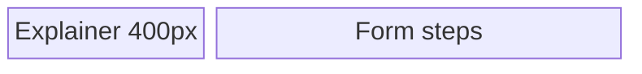
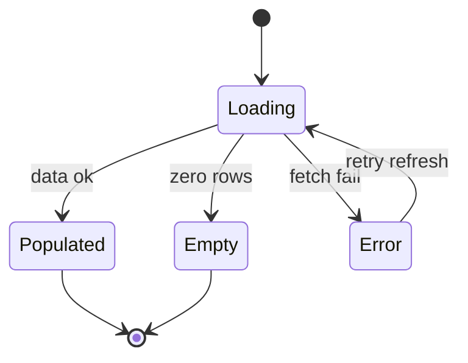
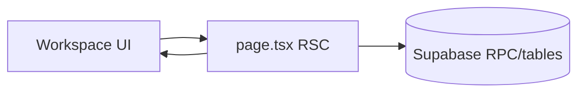

# SCR-24 diagrams — Talent Onboarding

> **SSOT:** [`SCR-24-Talent-Onboarding.dc.html`](../../../Pages/SCR-24-Talent-Onboarding.dc.html) · Skill: [`mermaid-diagrams`](../../../../.claude/skills/mermaid-diagrams/SKILL.md)

## Layout block (matches DC shell)

## User flow

## State machine (if applicable)

## Data touchpoints

_Validate diagrams in [Mermaid Live](https://mermaid.live) before PR._
