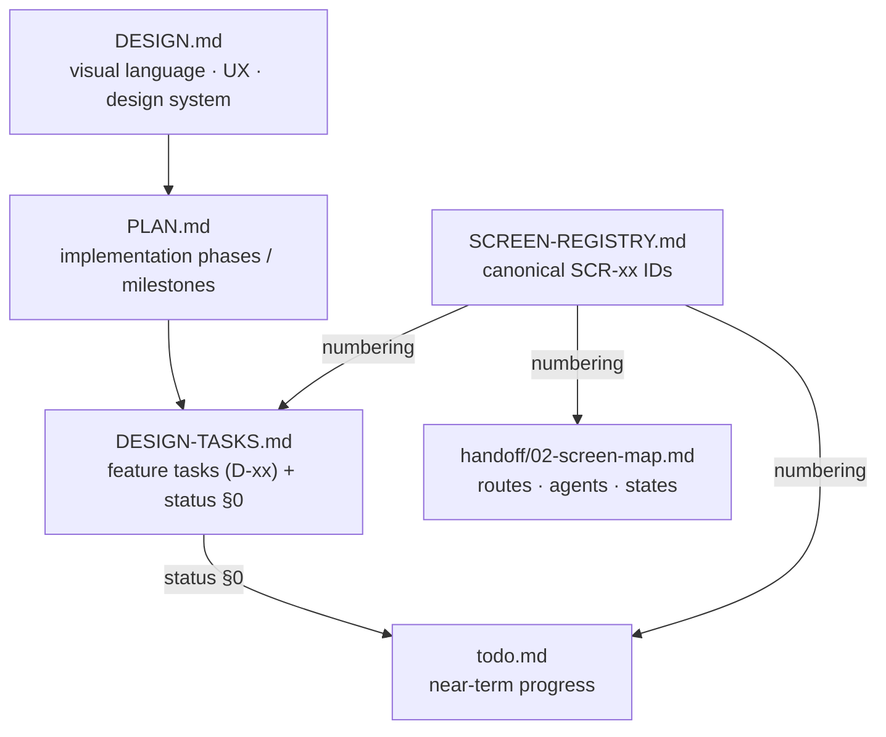

# SCREEN-REGISTRY.md — Canonical Screen IDs

> **This file is the single owner of screen numbering.** Every other doc (`DESIGN.md`, `PLAN.md`, `DESIGN-TASKS.md`, `todo.md`, `02-screen-map.md`, `docs/models/*`) references a **`SCR-xx`** ID from this table and **never** invents its own ordinal ("Screen 14"). If a screen isn't here, it doesn't have a number yet — add it here first.
>
> **Implementation handoff:** `docs/CLAUDE-CODE-HANDOFF.md` is the implementation-ready superset for Claude Code (per-screen specs, shared React architecture + build order, mobile architecture, Casting Review notes, AI architecture, Supabase verify-first, backend phases, verification checklists, readiness report).
>
> Rule: **`SCR-xx` IDs are permanent.** They are never renumbered once a screen is built. New screens take the next free ID; they do not shift existing ones.

## Document ownership

- **DESIGN.md** owns visual language, UX, design system. No screen numbering.
- **PLAN.md** owns implementation phases / milestones. References SCR-xx.
- **DESIGN-TASKS.md** owns feature tasks (`D-xx`) and the live **status** tracker (§0). References SCR-xx; does **not** own numbering.
- **SCREEN-REGISTRY.md** (this file) owns canonical SCR-xx IDs — nothing else does.
- **todo.md** owns near-term progress. References SCR-xx.
- **handoff/02-screen-map.md** owns routes/agents/states per screen. References SCR-xx.

Status legend: 🟢 Built & verified · 🟡 In progress · ⚪ Planned · 🔵 Next up · 🔴 Blocked · ⏸ Future.

---

## Registry

| SCR | Feature | Route | Agent | Status | Design task(s) | Prompt |
|---|---|---|---|:--:|---|---|
| SCR-01 | Command Center | `/app` | production-planner | 🟢 | D-CC | `prompts/01-dashboard.md` |
| SCR-02 | Brand List | `/app/brand` | brand-intelligence | 🟢 | D-BL | `prompts/04-brand-list.md` |
| SCR-03 | Brand Detail | `/app/brand/[id]` | brand-intelligence | 🟢 | D-BD | `prompts/02-brand-detail.md` |
| SCR-04 | Shoots List | `/app/shoots` | production-planner | 🟢 | D-SL | `prompts/03-shoots.md` |
| SCR-05 | Shoot Detail (**+ inline booking on crew row**) | `/app/shoots/[id]` | production-planner | 🟢 | D-SD · D-MB5–6 | — |
| SCR-06 | Shoot Wizard | `/app/shoots/new` | production-planner | 🟢 | D-SW | `prompts/05-shoot-wizard.md` |
| SCR-07 | Campaigns | `/app/campaigns` | creative-director | 🟢 | D-CM | `prompts/06-campaigns.md` |
| SCR-08 | Assets | `/app/assets` | visual-identity | 🟢 | D-AS | `prompts/07-assets.md` |
| SCR-09 | Matching (+ **Talent tab** · **Casting Review / Grid / List** modes) | `/app/matching` | social-discovery · **model-match** 🟢 built | 🟢 / 🟡 Talent | D-MT · IPI-308 | `prompts/09-matching.md` · `11a` · `SCR-09-Casting-Review.plan.md` |
| SCR-10 | Channel Preview | `/app/preview` | visual-identity | 🟢 | D-CH | — |
| SCR-11 | Onboarding | `/onboarding` | brand-intelligence | 🟢 | D-ON | `prompts/08-onboarding.md` |
| SCR-12 | Product Catalog | `/app/catalog` | ecommerce-assistant | ⚪ | D-NS1 | — |
| SCR-13 | Collections / Seasons | `/app/collections` | production-planner | ⚪ | D-NS2 | — |
| SCR-14 | Asset → PDP crops | `/app/assets/pdp` | visual-identity | ⚪ | D-NS3 | — |
| SCR-15 | Notification Center (**incl. booking/talent notifs**) | `/app/inbox` | — | 🟡 proto | D-NS4 · IPI-310 | `11g` → `Pages/SCR-15-Notification-Center.dc.html` |
| SCR-16 | Analytics Overview | `/app/analytics` | analytics-intelligence | 🟢 | D-NS5 | — |
| SCR-17 | Campaign Performance | `/app/analytics/campaigns` | analytics-intelligence | 🟢 | D-NS6 | — |
| SCR-18 | Collaboration / Comments / Audit | `/app/activity` | — | 🟢 proto | D-NS7 | `Pages/SCR-18-Collaboration-Audit.dc.html` |
| SCR-19 | Event Management | `/app/events` | — | ⏸ Future | D-NS8 | — |
| SCR-20 | Talent / **Model Profile** (`mode` operator·model, AI-native 3-panel) | `/app/matching/talent/[id]` · `/app/talent/profile` | model-match · booking 🔴 | 🟡 | D-NS12 · IPI-309 | `Pages/SCR-20-Talent-Profile.dc.html` (`mode` tweak) |
| SCR-21 | Booking Wizard (**booking flow of the Shoot Wizard** — one reusable wizard) | `/app/matching/talent/[id]/book` | **booking** 🔴 | 🟡 proto | IPI-311 · `11c` | DC: `Pages/Shoot Wizard.v2.image-first.dc.html` `flow=booking`; RPCs/route 🔴 |
| SCR-22 | Booking Detail (**booking flow of Shoot Detail** — variant, not a new framework) | `/app/bookings/[id]` | **booking** 🔴 | 🟡 proto | IPI-312 · `11c` | DC: `Pages/Shoot Detail.v2.image-first.dc.html` `?flow=booking`; RPCs/route 🔴 |
| SCR-23 | Availability Editor (talent-set `available`/`blocked`; `tentative`/`booked` read-only) | talent-scoped | — | 🟡 proto | IPI-309 · `11g` | `Pages/SCR-23-Availability-Editor.dc.html` (populated/loading/error); table+RLS 🟢, batch RPC 🔴 |
| SCR-24 | Talent Onboarding (URL-context) | `/app/talent/profile` | **booking** (URL-Context tool) 🔴 | 🟡 | IPI-309 · `11f` | `Pages/SCR-24-Talent-Onboarding.dc.html` |
| SCR-25 | Role Dashboards (**Model** `/app/model` · **Agency** `/app/roster`) | role-scoped | **booking** (role-scoped) 🔴 | 🟡 proto | IPI-310 · `11d`/`11e` | `Pages/SCR-25-Role-Dashboards.dc.html` (`role` model/agency) |
| SCR-26 | Organizations (was Companies · **kind**: brand/agency/vendor/sponsor) | `/app/crm/companies` | **crm-assistant** 🔴 | 🟢 proto | IPI-363 | `Pages/SCR-26-CRM-Companies-List.dc.html` · `Pages/INDEX.html` · `crm/crm-plan.md` |
| SCR-27 | CRM Company Detail (Overview·Contacts·Deals·Activity) | `/app/crm/companies/[id]` | **crm-assistant** 🔴 | 🟢 proto | IPI-363 | `Pages/SCR-27-CRM-Company-Detail.dc.html`; links existing Brand Detail on `brand_id` |
| SCR-28 | People (was Contacts · **role**: contact/model/photographer/crew) | `/app/crm/contacts` | **crm-assistant** 🔴 | 🟢 proto | IPI-364 | `Pages/SCR-28-CRM-Contacts-List.dc.html`; **no status field** |
| SCR-29 | CRM Contact Detail (multi email/phone arrays) | `/app/crm/contacts/[id]` | **crm-assistant** 🔴 | 🟢 proto | IPI-364 | `Pages/SCR-29-CRM-Contact-Detail.dc.html` |
| SCR-30 | CRM Pipeline (kanban, 6 stages) | `/app/crm/pipeline` | **crm-assistant** 🔴 | 🟢 proto | IPI-365 | `Pages/SCR-30-CRM-Pipeline.dc.html`; drag no-ops on won/lost |
| SCR-31 | CRM Deal Detail (**won/lost HITL gate**) | `/app/crm/pipeline/[id]` | **crm-assistant** 🔴 | 🟢 proto | IPI-366/367 | `Pages/SCR-31-CRM-Deal-Detail.dc.html`; won/lost + convert via ApprovalCard |

---

## ⛔ Model booking — engineering override (2026-07-03, D1–D9)

**Supersedes the 2026-07-03 "folded into Shoot lifecycle" note below.** Per `../models/02-engineering-reference.md` (approved, reflects shipped backend):
- **SCR-21 Booking Wizard** (`/app/matching/talent/:id/book`) and **SCR-22 Booking Detail** (`/app/bookings/:id`) are **reinstated as real standalone screens** (prompt `11c`) — *not* folded away.
- **Two booking agents:** `model-match` (🟢 built — discovery/scoring/shortlist, never writes bookings) and **`booking`** (🔴 spec — draft quotes/messages only, D7). `production-planner` owns shoots, not bookings.
- **Shoot integration is narrow:** a `confirmed` booking upserts `shoot.shoot_crew`; Shoot Detail gets an **inline booking accordion on the crew row** — no Talent/Bookings tabs.
- **Contracts deferred (D8)** — no `booking_contracts` table, no contract/payment UI anywhere.
- **Status FSM:** `requested → quoted → approved → confirmed` (+declined/expired/cancelled), RPC-only, service-role confirm.
- **Agent chat = `OperatorChatDock`** (D9); `IntelligencePanel` = brand briefing only.

~~Booking is **not** a separate surface... (2026-07-03 fold note — retained for history, overridden above)~~

## Resolved numbering conflicts (2026-07-02)

The registry decides two contradictions that previously lived in `DESIGN-TASKS.md`:

1. **SCR-16 / SCR-17 double-assignment.** The §0 scorecard, per-screen completion matrix, and `changelog.md` all treat **Analytics Overview = SCR-16** and **Campaign Performance = SCR-17** — and both are **built + verified**. The Screen-IDs cross-reference's competing "SCR-17 = Role dashboards" **loses** (renumbering a built screen is worse than moving an unbuilt one). → **Role dashboards moves to SCR-25.**
2. **`D-NS6` used twice** (Campaign-perf drill-down *and* Role dashboards). → Campaign-perf keeps **D-NS6**; Role dashboards becomes **D-NS6b**.

**Model-booking folds (don't build twice):**
- Booking/talent **notifications → SCR-15** (the planned Notification Center), not a new screen.
- **Model & Agency dashboards → SCR-25** Role dashboards (they are two roles of the same screen).
- **Talent tab + Shortlist → SCR-09** Matching (4th tab + existing drawer).

---

## Follow-up edits to land the scheme (pending your go-ahead)

These are the only remaining doc edits to make SCR-xx the sole scheme everywhere:
- `DESIGN-TASKS.md` — fix the SCR-16/17 cross-reference line; split the duplicate `D-NS6`; point its Screen-IDs list at this registry.
- `docs/handoff/02-screen-map.md` — replace the "14–22" ordinals in the Model Booking section with the SCR-20…25 IDs above.
- `docs/models/00-model-booking-plan.md` — update §0.2 so Role dashboards = SCR-25 (currently says SCR-17).

---

## Mobile AI chatbot (platform-wide)

Every screen in this registry carries the **persistent, text-only AI composer** pinned above the mobile tab bar, plus a header **Insights** button (read-only intelligence sheet — kept separate from chat). The assistant is **route-scoped**: placeholder + proactive chips switch per screen/role. See the full route→assistant map, chips, verification matrix, and final audit in **`MOBILE-PLAN.md §22`**. **Voice/mic removed — Future Phase.** HITL always: no auto-accept/book/confirm/publish.
