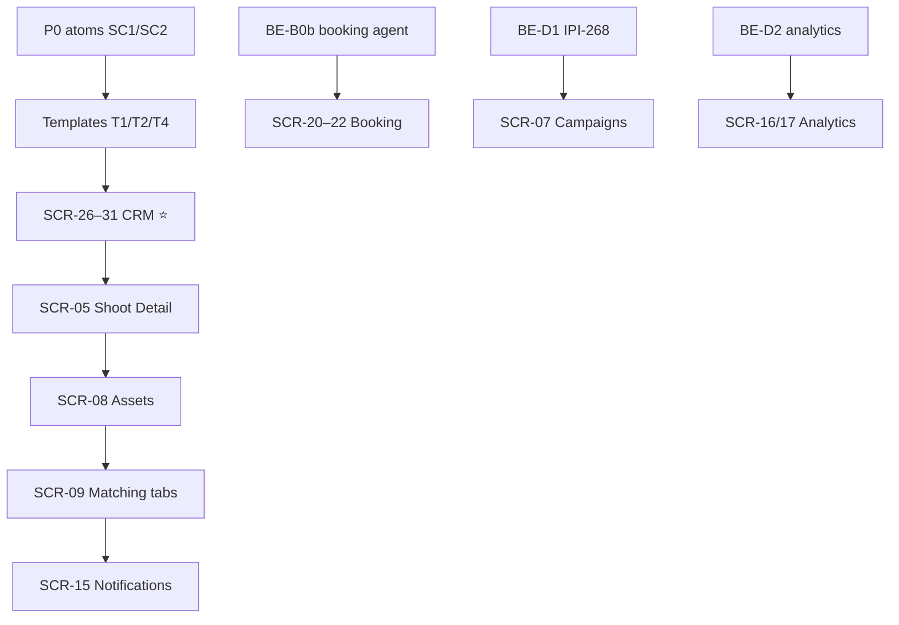

# Screen task matrix — HTML → React

> **Verified:** 2026-07-06 against `app/src/app/(operator)/` + Supabase MCP ([`../data/supabase-plan.md`](../../plan/data/supabase-plan.md))
> **Design index:** [`../../../HTML.md`](../../HTML.md) · **Wireframes:** [`wireframes/README.md`](./wireframes/README.md) · **Build discipline:** [`../designtoreact.md`](../docs/designtoreact.md) · **Screen tasks:** [`screens/SCR-TEMPLATE.md`](SCR-TEMPLATE.md)

**Legend:** ✅ Complete · 🟡 Partial · ⚪ Not started · 🔴 Blocked/stub

| SCR | Screen | Route | Design DC | React | BE | AI | Mobile | Task file | Pri | Linear |
|:---:|:---|:---|:---|:--:|:--:|:--:|:--:|:---|:--:|:---|
| 01 | Command Center | `/app` | `Command Center.v2…` | ✅ 90% | 🟢 | 🟡 | ⚪ | [SCR-01](./SCR-01-command-center.md) | P0 | [IPI-306](https://linear.app/amo100/issue/IPI-306) |
| 02 | Brand List | `/app/brand` | `Brand List.v2…` | ✅ 95% | 🟢 | 🟢 | ⚪ | [SCR-02](./SCR-02-brand-list.md) | P0 | [IPI-272](https://linear.app/amo100/issue/IPI-272) |
| 03 | Brand Detail | `/app/brand/[id]` | `Brand Detail.v2…` | ✅ 95% | 🟢 | 🟢 | ⚪ | [SCR-03](./SCR-03-brand-detail.md) | P0 | [IPI-271](https://linear.app/amo100/issue/IPI-271) |
| 04 | Shoots List | `/app/shoots` | `Shoots List.v2…` | ✅ 85% | 🟢 | 🟡 | ⚪ | [SCR-04](./SCR-04-shoots-list.md) | P1 | [IPI-372](https://linear.app/amo100/issue/IPI-372) Done |
| 05 | Shoot Detail | `/app/shoots/[shootId]` | `Shoot Detail.v2…` | 🟡 40% | 🟡 | 🟡 | ⚪ | [SCR-05](./SCR-05-shoot-detail.md) | P1 | [IPI-371](https://linear.app/amo100/issue/IPI-371) |
| 06 | Shoot Wizard | `/app/shoots/new` | `Shoot Wizard.v2…` | ✅ 80% | 🟢 | 🟢 | ⚪ | [SCR-06](./SCR-06-shoot-wizard.md) | P1 | [IPI-274](https://linear.app/amo100/issue/IPI-274) Done |
| 07 | Campaigns | `/app/campaigns` | `Campaigns.v2…` | 🔴 5% | 🔴 D1 | 🟡 | ⚪ | [SCR-07](./SCR-07-campaigns.md) | P2 | [IPI-249](https://linear.app/amo100/issue/IPI-249) |
| 08 | Assets | `/app/assets` | `Assets.v2…` | 🔴 5% | 🟢 | 🟡 | ⚪ | [SCR-08](./SCR-08-assets.md) | P2 | [IPI-404](https://linear.app/amo100/issue/IPI-404) |
| 09 | Matching | `/app/matching` | `SCR-09-Matching-Talent.dc.html` | 🟡 60% | 🟢 | 🟡 | ⚪ | [SCR-09](./SCR-09-matching.md) | P2 | [IPI-405](https://linear.app/amo100/issue/IPI-405) |
| 10 | Channel Preview | `/app/preview` | `Channel Preview.v2…` | ✅ 90% | 🟡 | 🟡 | ⚪ | [SCR-10](./SCR-10-channel-preview.md) | P1 | [IPI-269](https://linear.app/amo100/issue/IPI-269) |
| 11 | Onboarding | `/app/onboarding` | `Onboarding.v2.zeely…` | ✅ 90% | 🟢 | 🟢 | ⚪ | [SCR-11](./SCR-11-onboarding.md) | P0 | [IPI-336](https://linear.app/amo100/issue/IPI-336) |
| 15 | Notifications | `/app/inbox` | `SCR-15-Notification-Center.dc.html` | ⚪ 0% | 🟢 | — | ⚪ | [SCR-15](./SCR-15-notifications.md) | P2 | [IPI-407](https://linear.app/amo100/issue/IPI-407) |
| 16 | Analytics | `/app/analytics` | `Analytics.v2…` | ⚪ 0% | 🔴 D2 | ⚪ | ⚪ | [SCR-16](./SCR-16-analytics.md) | P3 | [IPI-296](https://linear.app/amo100/issue/IPI-296) |
| 17 | Campaign Perf | `/app/analytics/campaigns` | `Campaign Performance.v2…` | ⚪ 0% | 🔴 D2 | ⚪ | ⚪ | [SCR-17](./SCR-17-campaign-performance.md) | P3 | [IPI-297](https://linear.app/amo100/issue/IPI-297) |
| 18 | Collaboration | `/app/activity` | `SCR-18-Collaboration-Audit.dc.html` | ⚪ 0% | 🔴 ACT1 | — | ⚪ | [SCR-18](./SCR-18-collaboration.md) | P3 | [IPI-408](https://linear.app/amo100/issue/IPI-408) |
| 20 | Talent Profile | `/app/matching/talent/[id]` | `SCR-20-Talent-Profile.dc.html` | ⚪ 0% | 🟢 | 🟢 | ⚪ | [SCR-20](./SCR-20-talent-profile.md) | P2 | [IPI-409](https://linear.app/amo100/issue/IPI-409) |
| 21 | Booking Wizard | `/app/matching/talent/[id]/book` | `Shoot Wizard.v2…` (`flow=booking`) | ⚪ 0% | 🟢 | 🔴 B0b | ⚪ | [SCR-21](./SCR-21-booking-wizard.md) | P2 | [IPI-410](https://linear.app/amo100/issue/IPI-410) |
| 22 | Booking Detail | `/app/bookings/[id]` | `Shoot Detail.v2…` (`flow=booking`) | ⚪ 0% | 🟢 | — | ⚪ | [SCR-22](./SCR-22-booking-detail.md) | P2 | [IPI-411](https://linear.app/amo100/issue/IPI-411) |
| 23 | Availability | talent-scoped | `SCR-23-Availability-Editor.dc.html` | ⚪ 0% | 🟡 | — | ⚪ | [SCR-23](./SCR-23-availability.md) | P3 | [IPI-413](https://linear.app/amo100/issue/IPI-413) |
| 24 | Talent Onboarding | `/app/talent/profile` | `SCR-24-Talent-Onboarding.dc.html` | ⚪ 0% | 🟡 | 🟡 | ⚪ | [SCR-24](./SCR-24-talent-onboarding.md) | P3 | [IPI-412](https://linear.app/amo100/issue/IPI-412) |
| 25 | Role Dashboards | `/app/model` · `/app/roster` | `SCR-25-Role-Dashboards.dc.html` | ⚪ 0% | 🟢 | 🟡 | ⚪ | [SCR-25](./SCR-25-role-dashboards.md) | P3 | [IPI-414](https://linear.app/amo100/issue/IPI-414) |
| 26 | CRM Companies | `/app/crm/companies` | `SCR-26-CRM-Companies-List.dc.html` | 🟡 stub | 🟢 | 🟢 | ⚪ | [SCR-26](./SCR-26-crm-companies.md) | **P1** | [IPI-389](https://linear.app/amo100/issue/IPI-389) |
| 27 | CRM Company Detail | `/app/crm/companies/[id]` | `SCR-27-CRM-Company-Detail.dc.html` | 🟡 stub | 🟢 | 🟢 | ⚪ | [SCR-27](./SCR-27-crm-company-detail.md) | **P1** | [IPI-393](https://linear.app/amo100/issue/IPI-393) |
| 28 | CRM Contacts | `/app/crm/contacts` | `SCR-28-CRM-Contacts-List.dc.html` | 🟡 stub | 🟢 | 🟢 | ⚪ | [SCR-28](./SCR-28-crm-contacts.md) | **P1** | [IPI-390](https://linear.app/amo100/issue/IPI-390) |
| 29 | CRM Contact Detail | `/app/crm/contacts/[id]` | `SCR-29-CRM-Contact-Detail.dc.html` | 🟡 stub | 🟢 | 🟢 | ⚪ | [SCR-29](./SCR-29-crm-contact-detail.md) | **P1** | [IPI-394](https://linear.app/amo100/issue/IPI-394) |
| 30 | CRM Pipeline | `/app/crm/pipeline` | `SCR-30-CRM-Pipeline.dc.html` | 🟡 stub | 🟢 | 🟢 | ⚪ | [SCR-30](./SCR-30-crm-pipeline.md) | **P1** | [IPI-395](https://linear.app/amo100/issue/IPI-395) |
| 31 | CRM Deal Detail | `/app/crm/pipeline/[id]` | `SCR-31-CRM-Deal-Detail.dc.html` | 🟡 stub | 🟢 | 🟢 | ⚪ | [SCR-31](./SCR-31-crm-deal-detail.md) | **P1** | [IPI-396](https://linear.app/amo100/issue/IPI-396) |

## Counts

| Status | Screens |
|---|---|
| ✅ Complete (≥80%) | **7** — 01, 02, 03, 04, 06, 10, 11 |
| 🟡 Partial / stub | **8** — 05, 09, 26–31 |
| 🔴 Blocked stub | **2** — 07, 08 |
| ⚪ No route / greenfield | **10** — 15, 16, 17, 18, 20–25 |
| **Total built-design screens** | **27** (SCR-12/13/14/19 deferred, no file) |

## Build order (HTML → React, dependency-ordered)

1. Shared atoms → EntityList/Profile360
2. **SCR-26–31** CRM (backend ✅)
3. **SCR-05** Shoot Detail tabs · **SCR-08** Assets · **SCR-09** Matching
4. **SCR-15** Notifications
5. **SCR-21–22** Booking (+ **SCR-20**) after B0b agent
6. **SCR-07** after IPI-268 · **SCR-16/17** after analytics views
7. **SCR-23–25** · **SCR-18** · mobile pass (M1–M3)

## Planned (no task file — defer)

SCR-12 Product Catalog · SCR-13 Collections · SCR-14 Asset→PDP · SCR-19 Event Management
