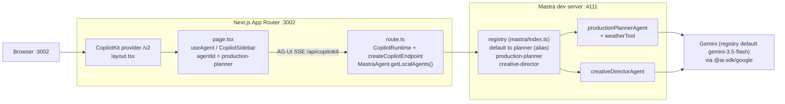
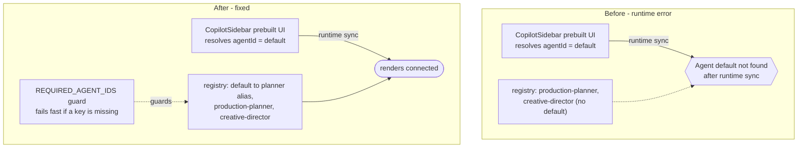

# app/ — Next.js sub-project (Mastra + CopilotKit)

This is a separate sub-project from the root Vite dashboard. It runs Next.js on port 3002 and hosts the CopilotKit runtime + Mastra agents.

## Stack

- Next.js App Router (port 3002)
- CopilotKit v1.61.0 — v2 APIs imported from the `/v2` subpath (`CopilotRuntime`, `createCopilotEndpoint`, `CopilotKit`/`CopilotSidebar`/`useAgent`) over AG-UI SSE
- Mastra — **2 distinct agents** (`production-planner`, `creative-director`) exposed under **3 registry keys** (`default` is a compatibility alias → `production-planner`; see gotcha below)
- Gemini via **`@ai-sdk/google`** (`createGoogleGenerativeAI`, reads `GEMINI_API_KEY`); model id from the registry (`src/mastra/models.ts`, default `gemini-3.5-flash`, override via `GEMINI_MODEL`) — IPI2-80
- In-memory LibSQL (Mastra memory + storage, `:memory:` — not persisted; ephemeral per process)

## Architecture



## Key files

```
src/mastra/agents/index.ts                   # 2 agents (planner + creative director)
src/mastra/index.ts                          # Mastra registry config + REQUIRED_AGENT_IDS guard
src/mastra/tools/index.ts                    # Agent tools (weatherTool)
src/app/api/copilotkit/[[...slug]]/route.ts  # CopilotRuntime endpoint (getLocalAgents)
src/app/layout.tsx                           # Root layout — <CopilotKit> provider (/v2)
src/app/page.tsx                             # Home page — CopilotChatConfigurationProvider + sidebar
.copilotkit/project.json                     # CopilotKit project config (gitignored — account-specific)
```

## Gotcha: the `default` agent (read before renaming agents)

CopilotKit's **prebuilt UI + runtime sync resolve an agent named `default`** when no `agentId` is selected (docs.copilotkit.ai/backend/copilot-runtime → "The default agent"). The vendored starter shipped its agent under that key. iPix renamed the registry to `production-planner` / `creative-director`, so the `default` slot was empty and the provider threw **`useAgent: Agent 'default' not found after runtime sync`** — rendering the whole page as a runtime-error overlay. `npm run build` / `lint` / `tsc` could **not** catch this (runtime-only).

Fix that shipped: alias `default` → `productionPlannerAgent`, and a `REQUIRED_AGENT_IDS` startup guard that fails fast (clear error at server start/build) if any required key is renamed or dropped.



> Registry key = the id the runtime exposes (via `getLocalAgents`) = the frontend `useAgent({ agentId })`. Keep `default` + `production-planner` + `creative-director` in sync; the guard enforces it.

## Notes

- CopilotKit + AG-UI are wired to Mastra via `MastraAgent.getLocalAgents()` in `route.ts` (3 registry keys: `default`, `production-planner`, `creative-director`).
- Mastra agents use in-memory storage (no Supabase connection) — thread/working memory is ephemeral and per-instance.
- `next.config.ts` does **not** use `ignoreBuildErrors`; the only suppressions are 2 targeted `@ts-expect-error` on `@mastra/memory` beta types in `agents/index.ts`. So `npm run build` typechecks the whole app.
- No `.env` tracked — copy `.env.example` (placeholders only; `GEMINI_API_KEY` required) for development.
- `.mastra/` (build output), `node_modules/`, `.next/`, `.env*`, `.copilotkit/` are gitignored.

## Graphify

A knowledge graph of this sub-project lives at `src/graphify-out/` (**75 nodes, 83 edges, 8 communities** — Gemini-enriched; rebuilt 2026-06-22 to reflect the merged state). Query it:

```bash
# From this directory (src/graphify-out/graph.json is the CWD graph)
graphify query "<question>"      # scoped subgraph for orientation / impact
graphify path "NodeA" "NodeB"    # how two symbols connect
graphify explain "NodeName"      # what a node is + its neighbours

# Rebuild (requires GEMINI_API_KEY) — incremental; run after structural changes
graphify src
```

Use it for **structural** questions (what imports/touches what, blast radius before a change), not runtime/semantic correctness — e.g. it shows `route.ts` imports `mastra`, but it can't know the prebuilt UI needs a `"default"` key (that's the gotcha above, caught only at runtime). The graph is only as fresh as the last `graphify src`.
