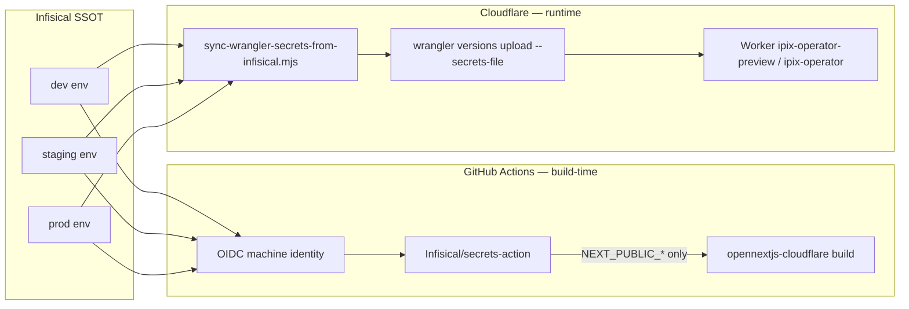

# Infisical → Cloudflare Secrets (IPI-606 · CF-SEC-010)

**Linear:** [IPI-606](https://linear.app/amo100/issue/IPI-606) · **Parent:** [IPI-487](https://linear.app/amo100/issue/IPI-487)  
**Pairs with:** [IPI-472](https://linear.app/amo100/issue/IPI-472) (OpenNext CI pipeline — see `app/docs/opennext-ci.md` when merged)  
**Wrangler SSOT:** `app/wrangler.jsonc`

Infisical is the **single source of truth** for secret values. This document defines how secret **names** route to Cloudflare build-time vs runtime surfaces. **No secret values belong in git, CI logs, or this file.**

## Flow overview



**Two paths, least privilege:**

| Path | Identity allowlist | Destination | Tool |
|------|-------------------|-------------|------|
| **CI build** | `BUILD_TIME_SECRET_NAMES` | GitHub Actions job `env` | `Infisical/secrets-action@v1` (OIDC) |
| **Deploy sync** | `RUNTIME_SECRET_NAMES` | Cloudflare Worker secrets | `scripts/sync-wrangler-secrets-from-infisical.mjs` → `wrangler versions upload --secrets-file` |

Allowlist module (SSOT for names): `app/scripts/cloudflare-secret-allowlist.mjs`

## Build-time vs runtime contract

### BUILD_TIME (CI / `next build` / OpenNext build)

Inlined into client bundles — **NEXT_PUBLIC_* only**.

| Secret name | Notes |
|-------------|-------|
| `NEXT_PUBLIC_SUPABASE_URL` | Public Supabase project URL |
| `NEXT_PUBLIC_SUPABASE_ANON_KEY` | Publishable anon key (not service role) |
| `NEXT_PUBLIC_CLOUDINARY_CLOUD_NAME` | Optional — client-side Cloudinary |
| `NEXT_PUBLIC_CLOUDINARY_API_KEY` | Optional — client-side upload widget |
| `NEXT_PUBLIC_MARKETING_CHAT_ENABLED` | Feature flag |
| `NEXT_PUBLIC_E2E_UPLOAD_POLL_MAX_MS` | E2E tuning |

**Forbidden in build export:** `SERVICE_ROLE`, `*_SECRET`, any non-`NEXT_PUBLIC_*` name (enforced by `assertNoForbiddenSecrets(..., "build")`).

### RUNTIME_WRANGLER (`wrangler versions upload --secrets-file`)

Server-only — never in client chunks. Synced by the allowlist script via a secure ephemeral JSON file (chmod 600, deleted in `finally`).

| Secret name | Notes |
|-------------|-------|
| `GEMINI_API_KEY` | Mastra / Gemini provider |
| `GROQ_API_KEY` | Groq provider |
| `OPENAI_API_KEY` | Optional OpenAI fallback |
| `DATABASE_URL` | Mastra Postgres (until Hyperdrive IPI-619) |
| `SUPABASE_SERVICE_ROLE_KEY` | Server-side Supabase admin |
| `CLOUDINARY_CLOUD_NAME` | Server Cloudinary |
| `CLOUDINARY_API_KEY` | Server Cloudinary |
| `CLOUDINARY_API_SECRET` | Server signing |
| `CLOUDINARY_NOTIFICATION_API_SECRET` | Webhook verification |
| `COPILOTKIT_LICENSE_TOKEN` | CopilotKit runtime |
| `INTELLIGENCE_API_KEY` | CopilotKit Intelligence |
| `INTELLIGENCE_API_URL` | Intelligence REST |
| `INTELLIGENCE_GATEWAY_WS_URL` | Intelligence WebSocket |
| `FIRECRAWL_API_KEY` | Visual identity agent |
| `AI_GATEWAY_URL` | Legacy custom Worker gateway (frozen) |
| `AI_GATEWAY_API_KEY` | Legacy gateway auth |
| `INTERNAL_WEBHOOK_SECRET` | Brand-intelligence workflow resume webhook auth |

**Forbidden in runtime sync:** any `NEXT_PUBLIC_*` (enforced by `assertNoForbiddenSecrets(..., "runtime")`).

### Plain configuration (not secrets)

Set in `wrangler.jsonc` `vars` — not synced from Infisical:

- `MASTRA_STORAGE_MODE`
- `OPERATOR_AUTH_ENABLED`

## Environment mapping

| Infisical env | Wrangler target | Worker name | CLI |
|---------------|-----------------|-------------|-----|
| `dev` | `preview` | `ipix-operator-preview` | `--env preview` |
| `staging` | `preview` | `ipix-operator-preview` | `--env preview` |
| `prod` | `production` | `ipix-operator` (top-level) | **no `--env` flag** (matches `npm run deploy`) |

Infisical CLI is **not linked in this repo** (no `.infisical.json`). Operators run `infisical init` locally or use dashboard + CI identity only.

## Operator setup — Infisical machine identity (OIDC preferred)

### 1. Create GitHub OIDC machine identity (recommended)

In **Infisical Dashboard**:

1. **Organization Settings → Access Control → Machine Identities → Create Identity**
   - Name: `github-actions-ipix-operator` (example)
   - Assign org role with least privilege (read secrets for target project/env only)

2. **Add OIDC Auth** on the identity:
   - **OIDC Discovery URL:** `https://token.actions.githubusercontent.com`
   - **Issuer:** `https://token.actions.githubusercontent.com`
   - **Subject:** `repo:amo-tech-ai/lumina-studio:ref:refs/heads/main` (adjust owner/repo; use `environment:production` subject for prod-only sync)
   - **Audiences:** `https://github.com/amo-tech-ai` (your GitHub org URL)

3. **Add identity to Infisical project** with project role scoped to required environments (`dev`, `staging`, `prod`).

4. Copy the **Identity ID** (public UUID — safe in workflow files as `${{ vars.INFISICAL_IDENTITY_ID }}` or repo variable).

5. Note **project slug** and **env slug** for each environment.

### 2. GitHub repository configuration

| Variable / secret | Purpose |
|-------------------|---------|
| `INFISICAL_IDENTITY_ID` | Machine identity UUID (repo **variable**, not secret) |
| `INFISICAL_PROJECT_SLUG` | Infisical project slug (variable) |
| `INFISICAL_PROJECT_ID` | Infisical project ID for CLI `--projectId` (Universal Auth fallback) |
| `INFISICAL_CLIENT_ID` | **Bootstrap only** — Universal Auth if OIDC not ready |
| `INFISICAL_CLIENT_SECRET` | **Bootstrap only** — rotate after OIDC cutover |

### 3. Bootstrap fallback (temporary — Universal Auth)

If OIDC is not yet configured:

1. On the machine identity, enable **Universal Auth** and create a client secret.
2. Store `INFISICAL_CLIENT_ID` and `INFISICAL_CLIENT_SECRET` as GitHub **secrets**.
3. Use `method: universal-auth` in `Infisical/secrets-action` until OIDC is verified.
4. Remove Universal Auth credentials after OIDC cutover.

### 4. Local development

```bash
cd app
infisical init   # once — links project (creates .infisical.json locally, gitignored)
infisical run --env=dev -- npm run dev
```

## Sync runtime secrets to Cloudflare

**Order (required):** fetch runtime secrets → `build:cf` → **one** OpenNext upload with `--secrets-file` (code + secrets in the same Worker version).

| Scenario | Command | Why |
|----------|---------|-----|
| **Bootstrap / CI upload** | `node scripts/upload-opennext-with-secrets.mjs` | Writes chmod-600 JSON and passes `--secrets-file` to `opennextjs-cloudflare upload`; satisfies `secrets.required` before Wrangler validates the version |
| **Greenfield Worker** | Same script (auto-fallback) | If the Worker script does not exist, falls back to `opennextjs-cloudflare deploy -- --secrets-file` once |
| **Secret rotation only** (Worker already live) | `sync-wrangler-secrets-from-infisical.mjs` | Metadata-only version via `wrangler versions upload --secrets-file` without rebuilding |

Do **not** upload code first and sync secrets in a second step — that creates two versions and can fail when `GEMINI_API_KEY` is listed under `secrets.required`.

### Dry-run (names only)

```bash
cd app
node scripts/upload-opennext-with-secrets.mjs \
  --infisical-env dev --wrangler-env preview --dry-run
```

Or GitHub Actions: workflow **Cloudflare secrets sync** with `dry_run=true`.

### First preview bootstrap (operator)

```bash
cd app
export NEXT_PUBLIC_SUPABASE_URL=...
export NEXT_PUBLIC_SUPABASE_ANON_KEY=...
export CLOUDFLARE_API_TOKEN=...
export CLOUDFLARE_ACCOUNT_ID=...
export GEMINI_API_KEY=...
# ... other allowlisted runtime secrets
npm run cf-typegen
npm run build:cf
node scripts/upload-opennext-with-secrets.mjs \
  --infisical-env dev --wrangler-env preview
```

After bootstrap, routine CI may use `npm run upload -- --env preview` for code-only version uploads and gradual promotion (see `app/docs/opennext-ci.md`).

### Production sync

Same sequence with `--wrangler-env production` after `build:cf`. GitHub Actions job uses `environment: production` — configure repo **Environments** with required reviewers before production runs.

Requires in env: `CLOUDFLARE_API_TOKEN`, `CLOUDFLARE_ACCOUNT_ID`, plus allowlisted runtime secrets. Values are written to a temp JSON file (mode 600) and passed to OpenNext → `wrangler versions upload --secrets-file` — **never echoed**.

**Not primary:** `wrangler secret bulk` (each bulk creates a separate deployment version; use `--secrets-file` with upload instead).

## CI integration (v1)

Workflow: `.github/workflows/cloudflare-secrets-sync.yml` (**workflow_dispatch**). Job `worker-bootstrap` uses GitHub **environment** `${{ inputs.wrangler_env }}` (`preview` | `production`) for scoped secrets and production approval gates.

Live run (`dry_run=false`):

```text
validate pairing → validate OIDC (if selected) → fetch secrets → build:cf → upload+secrets-file → record version ID
```

IPI-632 smoke is a separate manual gate after preview URL exists.

Configure repo **Settings → Environments**:

| Environment | Purpose |
|-------------|---------|
| `preview` | Preview Worker bootstrap; optional branch restriction to `main` |
| `production` | Production bootstrap; **required reviewers** + branch restriction |

Build job integration (when OIDC ready) — add to `app-build` in `ci.yml`:

```yaml
permissions:
  id-token: write
  contents: read

# Optional — enable after INFISICAL_IDENTITY_ID is configured:
# - name: Infisical build-time secrets (OIDC)
#   uses: Infisical/secrets-action@v1.0.9
#   with:
#     method: oidc
#     identity-id: ${{ vars.INFISICAL_IDENTITY_ID }}
#     project-slug: ${{ vars.INFISICAL_PROJECT_SLUG }}
#     env-slug: dev
```

The action exports all secrets from the configured path — scope the machine identity to a folder containing **only** `BUILD_TIME_SECRET_NAMES`, or filter in a follow-up step. There is no per-secret `secrets:` input on v1.0.9.

## Drift detection (v1 — names only)

Compare deployed Worker secret **names** against the allowlist (values are never compared):

```bash
cd app
wrangler secret list --env preview | jq -r '.[].name' | sort
# Compare mentally or script against allowlist:
node -e "
  import { diffSecretNames, runtimeSecretNamesForWranglerEnv } from './scripts/cloudflare-secret-allowlist.mjs';
  const deployed = process.argv.slice(2);
  console.log(diffSecretNames(deployed, 'preview'));
" $(wrangler secret list --env preview | jq -r '.[].name')
```

**Drift remediation:** re-run sync from Infisical SSOT. Extra orphan secrets: delete manually with `wrangler secret delete <NAME> --env <env>` after operator review.

## Rotation procedure

1. **Update value in Infisical** (dev → staging → prod per change window).
2. **Re-run sync** for the target wrangler env:
   `infisical run --env=prod -- node scripts/sync-wrangler-secrets-from-infisical.mjs --wrangler-env production`
3. **Redeploy Worker** if the secret is read at startup (OpenNext upload/deploy per IPI-472).
4. **Verify** runtime smoke (IPI-632) — auth, CopilotKit `/info`, one agent turn.

Rotate **Cloudflare API token** and **Infisical Universal Auth** bootstrap credentials on the same schedule if used.

## Rollback procedure

Cloudflare Worker secrets **do not retain previous values** after overwrite. Rollback path:

1. Restore previous value from **Infisical version history** (or re-issue from provider).
2. Re-run sync script for the affected wrangler env.
3. Redeploy Worker to the last known-good version if code changed (`wrangler versions list` / rollback per IPI-472).

There is no `wrangler secret restore` — Infisical remains SSOT.

## Security rules

- Never commit secret values, Universal Auth client secrets, or real account IDs if sensitive.
- Never `echo`, `printenv`, or log secret values in CI or scripts.
- CI build identity: **BUILD_TIME allowlist only**.
- Deploy sync identity: **RUNTIME allowlist + Cloudflare deploy token** only.
- Prefer OIDC over Universal Auth for GitHub Actions.

## Related

| Doc / issue | Scope |
|-------------|-------|
| `app/docs/opennext-ci.md` | IPI-472 CI pipeline, bundle gate, wrangler env names |
| IPI-468 | Fail-closed operator auth (`OPERATOR_AUTH_ENABLED`) |
| IPI-619 | Hyperdrive — may remove Worker `DATABASE_URL` |
| IPI-632 | Protected preview runtime smoke after secrets land |
