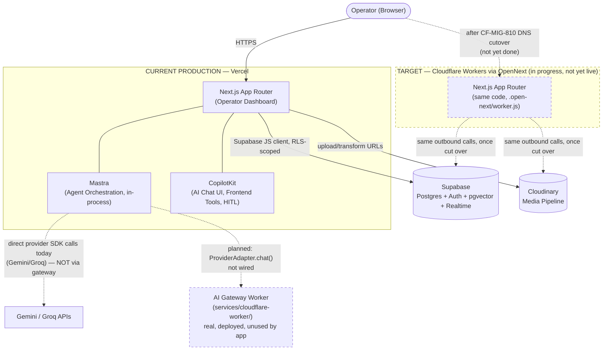

# System Overview

**Status:** 🟡 Partial — production path (Vercel) is real and verified; Cloudflare target path exists on disk but is not live.

**Purpose:** Show the full iPix request path from browser to data layer, distinguishing what is actually deployed today from the target Cloudflare-hosted state.

## Explanation

iPix's Next.js operator dashboard, Mastra agent orchestration, and CopilotKit AI chat UI all run in one Next.js process. **Today, that process is deployed on Vercel** — this remains the actual production host. The target state moves the same process onto Cloudflare Workers via OpenNext (`app/wrangler.jsonc`, `app/open-next.config.ts` exist on disk but are not yet the production path — see `CF-MIG-210`/`CF-MIG-810`, both open). Regardless of host, outbound calls are unchanged: Supabase (Postgres system of record, Auth, pgvector, Realtime) and Cloudinary (media pipeline) are called directly from Next.js server code today. The AI Gateway Worker (`services/cloudflare-worker/`) is real and deployed, but nothing in the app calls it yet (`AI_GATEWAY_URL` is absent from `app/src/lib/ai/provider.ts`) — Mastra agents still resolve providers (Gemini/Groq) directly.

## Diagram

## Verification notes

- Re-checked against `app/src/lib/ai/provider.ts` (2026-07-09): still no `AI_GATEWAY_URL` reference — `resolveModel()` resolves directly off `AI_PROVIDER` (gemini/groq). Old diagram's claim holds.
- Re-checked `services/cloudflare-worker/` and `app/wrangler.jsonc` / `app/open-next.config.ts` — all present on disk, confirming the "built but not cut over" target-state framing.
- No incorrect claims found in the old diagram this pass — ported as-is with fresher wording only.
- Missing implementation: AI Gateway wiring (Mastra → Worker), Cloudflare DNS cutover.

## Related Linear issues

IPI-454 (AI Gateway wiring, AC-F open), IPI-457 (provider registry, not on `main`), CF-MIG-210 (runtime compat, PR #286 open), CF-MIG-810 (DNS cutover, not started)

## Related PRD/Roadmap section

`prd.md` §3 (Architecture Overview) and §4.2–§4.3 (Runtime boundaries, Cloudflare migration status); `roadmap.md` §2 Phase 3 (Production Cutover)
