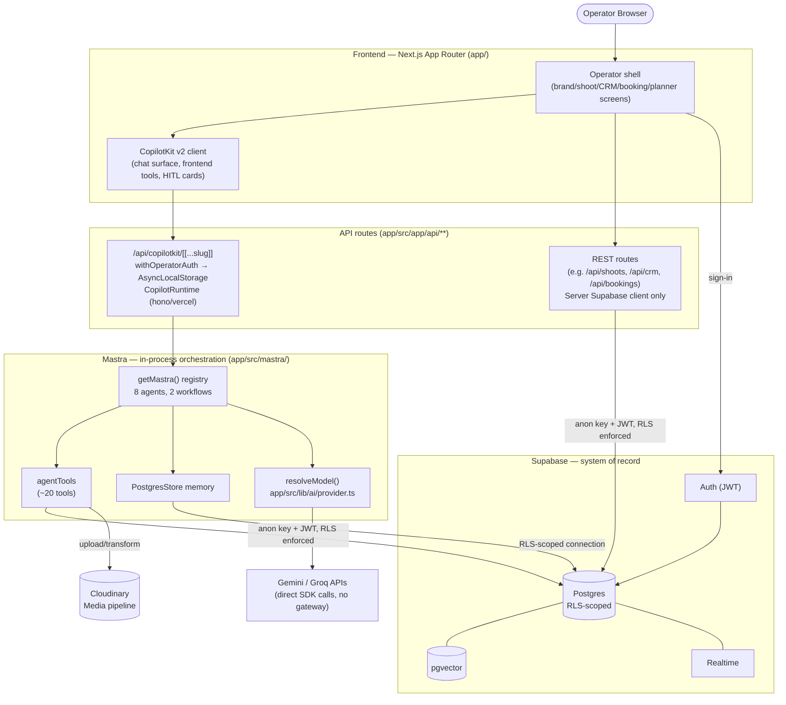

# Application Architecture

**Status:** 🟢 Built — every layer shown is real, verified against current code (2026-07-09).

**Purpose:** One diagram that shows the whole application stack at a glance — Frontend (Next.js operator shell + CopilotKit) → API routes → Mastra (AI orchestration) → Supabase (data) — for anyone who needs the big picture without reading three separate deep-dives.

## Explanation

This is a new synthesis, not a port — it composes verified pieces from the old AI-platform, CopilotKit, and Supabase diagrams into one top-level view. The operator UI is a Next.js App Router app; AI features route through `/api/copilotkit/[[...slug]]/route.ts`, which authenticates the request (`withOperatorAuth`), stashes the operator identity in `AsyncLocalStorage`, and hands off to a `CopilotRuntime` built on `hono/vercel` (not `hono/cloudflare-workers` yet — CF-MIG-210 blocker). That runtime resolves Mastra agents via `MastraAgent.getLocalAgents({ mastra: getMastra(), resourceId, requestContext })`. The Mastra registry (`app/src/mastra/index.ts`) holds 8 agents (`visual-identity`, `social-discovery`, `brand-intelligence`, `model-match`, `crm-assistant`, `booking`, plus 2 durable agents `production-planner` and `creative-director`) and 2 workflows (`shoot-wizard`, `brand-intelligence`), backed by a `PostgresStore` memory. Agents resolve LLM providers directly (Gemini/Groq via `app/src/lib/ai/provider.ts`) — not through the AI Gateway Worker (see `01-system-overview.md`). Non-AI operator screens call plain Next.js API routes, which — like everything server-side — reach Supabase only through the RLS-scoped server client, never service-role (service-role is Edge-Functions-only).

## Diagram

## Verification notes

- Confirmed `app/src/app/api/copilotkit/[[...slug]]/route.ts` uses `withOperatorAuth`, `AsyncLocalStorage`, `MastraAgent.getLocalAgents`, and `hono/vercel` (not `hono/cloudflare-workers`) — matches old `09-copilotkit-architecture.md`.
- Recounted the Mastra registry directly in `app/src/mastra/index.ts`: `agents` object = `durableAgents` (`production-planner`, `creative-director`) + `visual-identity`, `social-discovery`, `brand-intelligence`, `model-match`, `crm-assistant`, `booking` = **8 agents**, confirmed by the `REQUIRED_AGENT_IDS` guard (`default`, `production-planner`, `creative-director`). Workflows registered: `shoot-wizard`, `brand-intelligence` = **2**. This matches the old diagrams' "8 real agents, 2 workflows" claim exactly — no drift.
- Confirmed `app/src/lib/ai/provider.ts` has no gateway call — `resolveModel()` goes straight to Gemini/Groq SDKs per `AI_PROVIDER`.
- Confirmed Supabase server routes never construct a service-role client (`app/src/lib/supabase/server.ts` pattern) — service-role stays Edge-Functions-only, per old `26-supabase-architecture.md`.
- Missing implementation: AI Gateway wiring (all agent calls still bypass `services/cloudflare-worker/`).

## Related Linear issues

IPI-454 (AI Gateway wiring), CF-MIG-210 (Hono adapter blocker), IPI2-127 (per-request auth wiring)

## Related PRD/Roadmap section

`prd.md` §4.2 (Runtime boundaries), §5.2 (Agent roster — verified 2026-07-09), §5.3 (Provider/registry status)
