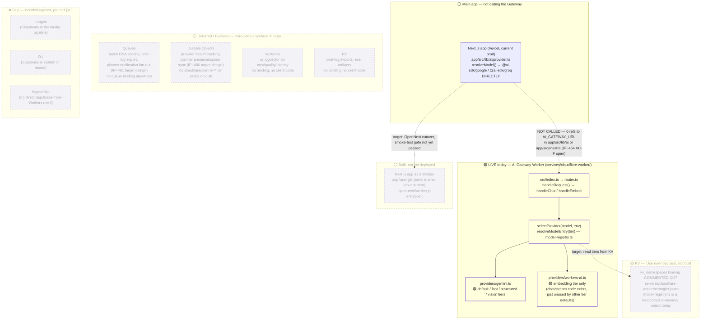

# Cloudflare Architecture — Workers, OpenNext, AI Gateway, KV, Queues, DO

**Status:** 🟡 Partial — one Worker (the AI Gateway) is live in production; the main app's move to Workers is built-but-undeployed; KV/Queues/Durable Objects/Vectorize/R2 are all decision-only with zero implementation code.

**Purpose:** One picture of everything Cloudflare-shaped in this repo — what's actually running, what's built but not deployed, and what's still just a decision-table row — so no one has to cross-reference six files to know what's real.

## Explanation

Exactly one thing runs on Cloudflare Workers in production today: the **AI Gateway Worker** (`services/cloudflare-worker/`) — a small fetch handler (`src/index.ts` → `src/router.ts`) that provider-routes `POST /v1/chat/completions` and `/v1/embeddings` between Gemini and Workers AI (`src/providers/`). It has its own `wrangler.jsonc` and is unit-tested, but **nothing in the main app calls it yet** — the Next.js operator app resolves providers directly (see `04-ai-architecture.md` / `12-ai-request-flow.md`).

The main app's move onto Workers via OpenNext is real code — `app/wrangler.jsonc` (name `ipix-operator`, entrypoint `.open-next/worker.js`) and `app/open-next.config.ts` exist — but per `prd.md` §4.3, Vercel remains the production host until the migration's smoke-test gate passes; this PRD deliberately doesn't track PR-level %, see `tasks/cloudflare/todo.md` for that.

KV is the one "Use now" decision that hasn't shipped: `services/cloudflare-worker/wrangler.jsonc` has its `kv_namespaces` binding **commented out**, and `model-registry.ts` is a hardcoded in-memory `DEFAULT_REGISTRY` — no `KVNamespace.get()`/`.put()` exists anywhere in the Worker's source. Queues, Durable Objects, Vectorize, and R2 are Deferred/Evaluate per the Service Decision Table (`prd.md` §4.1) and have **zero code** — no `cloudflare/planner-*` directories exist anywhere on disk, no bindings in any `wrangler.jsonc` in the repo.

**Verified directly against code for this pass** (not just carried forward): `services/cloudflare-worker/src/router.ts`, `model-registry.ts`, `wrangler.jsonc`; `app/wrangler.jsonc`; a repo-wide search for `cloudflare/planner-*` and any `kv_namespaces`/`r2_buckets`/queue bindings.

## Diagram

## Verification notes

- **Incorrect assumption caught mid-pass:** the source diagram set's `41-workers-ai-flow.md` describes the Workers AI account-ID URL bug as "fixed in PR #279 / commit 65d674c5" on `origin/main`. Spot-checked directly: this specific working tree (`ipi/restore-universal-design-prompt`, currently 23 commits behind `origin/main`) still has the **pre-fix** code — `getProviderConfig()` returns `{ apiKey, baseUrl }` with no `accountId` field, and `providers/workers-ai.ts` builds the URL as `${baseUrl}/accounts/${apiKey}/ai/v1/...` (using the API token as the account-ID path segment — wrong). Confirmed via `git show origin/main:...` that the fix is real and merged upstream. This diagram reflects the **canonical `origin/main` state** (fixed), not this stale worktree's copy. Flagging per `CLAUDE.md`'s worktree-health gate — this worktree should rebase before any further Cloudflare work lands in it.
- Missing implementation: KV binding (commented out), Queues, Durable Objects, Vectorize, R2 — all confirmed zero code, not just "not wired."
- No blockers to documenting current state; OpenNext deploy timing depends on the smoke-test gate referenced in `prd.md` §4.3, tracked outside this PRD.

## Related Linear issues

IPI-461 (Worker scaffold, done), IPI-454 (gateway wiring, AC-F open), IPI-480 (Durable Objects / planner presence, not started), IPI-481 (Queues / planner notifications, not started), CF-MIG-210 (OpenNext runtime compatibility), CF-MIG-111 (OpenNext CI build job)

## Related PRD/Roadmap section

`prd.md` §4.1 (Service Decision Table), §4.2 (Runtime boundaries), §4.3 (Cloudflare migration status)
