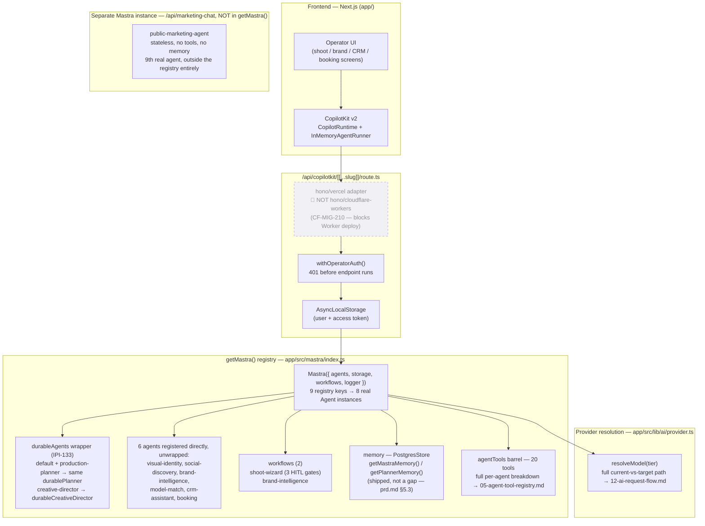

# AI Architecture — CopilotKit + Mastra + Agents + Tools + Providers

**Status:** 🟡 Partial — the CopilotKit/Mastra stack is real and serving traffic; the runtime adapter blocks a Cloudflare deploy, and provider calls bypass the AI Gateway entirely (see `12-ai-request-flow.md` for that detail).

**Purpose:** Show the whole AI stack top to bottom — CopilotKit (frontend chat surface) → the `getMastra()` registry (agents, tools, workflows, memory) → provider resolution — in one diagram, as it exists in code today.

## Explanation

`app/src/app/api/copilotkit/[[...slug]]/route.ts` enforces auth first (`withOperatorAuth`, 401 on failure), then propagates the resolved user/token through `AsyncLocalStorage` so CopilotKit's per-request agent factory sees the same identity without re-authenticating. The endpoint is built with **`hono/vercel`'s `handle()`** — confirmed by direct grep of the route file — **not** `hono/cloudflare-workers`, which `CF-MIG-210` tracks as an open blocker to running this route on a Worker.

`getMastra()` (`app/src/mastra/index.ts`) registers 9 keys resolving to 8 distinct `Agent` instances: `default` and `production-planner` both point at the same wrapped `productionPlannerAgent` (via `durablePlanner`, `createDurableAgent()` — IPI-133), `creative-director` is likewise durable-wrapped, and 6 more agents (`visual-identity`, `social-discovery`, `brand-intelligence`, `model-match`, `crm-assistant`, `booking`) are registered directly, unwrapped. Two workflows are registered (`shoot-wizard` — 3 HITL gates; `brand-intelligence`). Memory is per-agent via `PostgresStore` (`getMastraMemory()`, `getPlannerMemory()`) — already shipped, not a gap per `prd.md` §5.3. The `agentTools` barrel (confirmed 20 tools by direct read of `app/src/mastra/tools/index.ts`) is consumed selectively by agents — see `05-agent-tool-registry.md` for the full per-agent breakdown, not duplicated here.

A 9th real agent, `publicMarketingAgent`, lives in the same `agents/` directory but is **not** in this registry — it's wired into a separate, standalone Mastra instance behind `/api/marketing-chat` for the public (non-operator) marketing widget.

Provider resolution (`resolveModel(tier)` in `app/src/lib/ai/provider.ts`) is shown here only as a single exit edge — the current-vs-target routing (direct SDK calls today vs. the unwired AI Gateway Worker) is the single most detailed diagram in this set and lives in `12-ai-request-flow.md`; this file doesn't re-derive it.

## Diagram

## Verification notes

- Spot-checked directly: `hono/vercel` import confirmed by grep in the route file (not just carried from the old diagram).
- Spot-checked directly: `agentTools` barrel confirmed at exactly 20 named tool exports in `app/src/mastra/tools/index.ts`.
- Spot-checked directly: `app/src/mastra/agents/index.ts` confirms `production-planner` destructures out only 3 tools (`checkTalentAvailability`, `draftBookingQuote`, `createBookingDraft`), leaving it 17 of 20 — matches `prd.md` §5.2's corrected figure exactly (not the doc's original "10").
- Missing implementation: no gateway wiring from Mastra (see `12-ai-request-flow.md`); no declarative tool/prompt/provider registries (see `05-agent-tool-registry.md`).
- No blockers found; the license/auth gate (`COPILOTKIT_LICENSE_TOKEN` + `OPERATOR_AUTH_ENABLED`) is a deliberate fallback, not a bug, per the prior pass — not re-diagrammed here to keep this file to one concern.

## Related Linear issues

IPI-133–135 (durable agent foundation), IPI-129 (PostgresStore), CF-MIG-210 (Hono runtime adapter), IPI2-127 (per-request auth wiring)

## Related PRD/Roadmap section

`prd.md` §4.2 (Runtime boundaries), §5.1 (Principles), §5.3 (Provider/registry status — "agent memory already shipped, not a gap")
