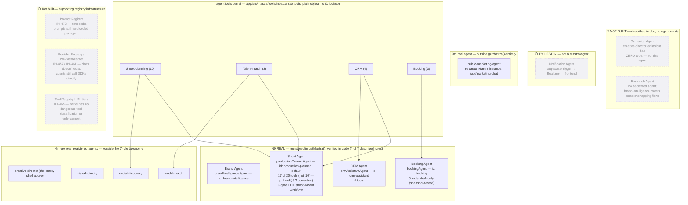

# Agent & Tool Registry — Real Status

**Status:** 🟡 Partial — 4 of 7 described agent roles are real and registered; the tool "registry" is a plain barrel file with no HITL classification; Prompt Registry and Provider Registry are both zero-code today.

**Purpose:** One inventory of every agent and every tool that actually exists in code, cross-referenced against the architecture doc's 7-role taxonomy — the most-drifted category in the original 52-file set.

## Explanation

Of the architecture doc's 7 described roles, **4 are real and registered** in `getMastra()` (Brand, CRM, Booking, Shoot), **2 are not built** (Campaign, Research), and **1 is intentionally not a Mastra agent** (Notification — system-triggered via Supabase trigger → Realtime, by design, not a gap). `creative-director` exists in code and is registered, but has **zero tools** — it is not the Campaign Agent the doc describes, just an empty shell. `brand-intelligence` covers some research-adjacent flows, but there is no dedicated Research Agent.

Four more real, registered agents fall outside this 7-role taxonomy entirely: `creative-director` (the empty shell above), `visual-identity`, `social-discovery`, `model-match`. A **9th real agent**, `public-marketing-agent`, exists outside `getMastra()` altogether — it runs behind `/api/marketing-chat` on a separate, standalone Mastra instance (see `04-ai-architecture.md`).

The shared tool surface, `agentTools` (`app/src/mastra/tools/index.ts`), is a single object exporting **20 tools** — confirmed by direct read, matching the prior pass's count exactly. There is no ID-based lookup and no HITL classification metadata; agents just import the whole barrel and destructure what they use. **`production-planner` actually holds 17 of the 20 tools, not "10"** — confirmed by direct read of `app/src/mastra/agents/index.ts`: its exclusion list removes only 3 booking-write tools (`checkTalentAvailability`, `draftBookingQuote`, `createBookingDraft`), leaving it with the other 17, including CRM and talent-match tools its own instructions never mention. This is the figure already corrected in `prd.md` §5.2 — cited here, not re-derived.

**Prompt Registry and Provider Registry are both confirmed zero-code** by a repo-wide search for `PromptRegistry`, `prompt-registry`, `ProviderAdapter`, and any provider-registry class — no hits anywhere in `app/src`. Both are Approved-architecture, tracked-in-Linear, not-yet-built — same status as the Tool Registry's HITL tiers (IPI-465).

## Diagram

## Verification notes

- Spot-checked directly: `app/src/mastra/agents/booking-agent.ts` — tool set is exactly `checkTalentAvailability`, `draftBookingQuote`, `createBookingDraft`; no `confirm_booking` tool exists.
- Spot-checked directly: `app/src/mastra/agents/index.ts` — `production-planner`'s destructuring excludes exactly the 3 booking-write tools named above, confirming 17/20 held, matching `prd.md` §5.2.
- Spot-checked directly: repo-wide grep for `PromptRegistry`/`prompt-registry`/`ProviderAdapter` in `app/src` returned zero hits — both registries are confirmed not-built, not just undocumented.
- Missing implementation: HITL tool classification (IPI-465), Prompt Registry (IPI-473), Provider Registry (IPI-457/461) — none built.
- No blockers to the diagram; the gap in every case is "ship what's already designed," per `prd.md` §5.3, not "design something new."

## Related Linear issues

IPI-465 (AGENT-002, declarative tool registry + HITL tiers), IPI-473 (Prompt Registry), IPI-457 (unified model/provider registry), IPI-461 (ProviderAdapter Worker), IPI-268 (campaigns schema, deployed — Campaign Agent still not built on top of it)

## Related PRD/Roadmap section

`prd.md` §5.2 (Agent roster — described vs. real, full verified table), §5.3 (Provider/registry status), §5.1 principles 2–3 (Tool registry, Prompt registry)
