# Database Entity Relationships

**Status:** 🟢 Built — entity-level shape verified against migrations; one column-type correction made this pass (see notes).

**Purpose:** Entity-level ER diagram of the core schemas verified in migrations — shoots, CRM, campaigns, planner, notifications, and talent — legible over exhaustive.

## Explanation

All tables are tenant-scoped through `public.organizations` (directly or via `brand_id`/`company_id`). The diagram is deliberately entity-level: it omits audit columns, timestamps, and every FK to `auth.users`/`public.profiles` for actor/owner tracking (present on nearly every table but not load-bearing for understanding the shape). `planner.*` is the newest and most fully-specified schema (10 tables, 3 enums, four-tier RLS) — verified against `20260709000000_planner_schema_rls.sql`. `public.campaigns` / `public.campaign_deliverables` schema is deployed and real, but per `prd.md` §6.6 the API/agent/UI layers on top of it remain unbuilt (schema-only feature).

## Diagram

```mermaid
erDiagram
    ORGANIZATIONS ||--o{ BRANDS : owns
    ORGANIZATIONS ||--o{ CRM_COMPANIES : "org-scoped"
    ORGANIZATIONS ||--o{ CAMPAIGNS : "org-scoped"
    ORGANIZATIONS ||--o{ PLANNER_INSTANCES : "org-scoped"
    ORGANIZATIONS ||--o{ NOTIFICATIONS : "brand_org_id / agency_org_id"

    BRANDS ||--o{ SHOOTS : "brand_id"
    BRANDS ||--o{ CAMPAIGNS : "brand_id"

    SHOOTS ||--o{ SHOOT_ASSETS : has
    SHOOTS ||--o{ SHOOT_DELIVERABLES : has
    SHOOTS ||--o{ SHOT_LIST : has
    SHOOTS ||--o{ SHOOT_CREW : has
    SHOOT_DELIVERABLES ||--o{ SHOT_DELIVERABLE_LINKS : links
    SHOT_LIST ||--o{ SHOT_DELIVERABLE_LINKS : links

    CRM_COMPANIES ||--o{ CRM_CONTACTS : has
    CRM_COMPANIES ||--o{ CRM_DEALS : has
    CRM_DEALS ||--o{ CRM_ACTIVITIES : has
    CRM_CONTACTS ||--o{ CRM_ACTIVITIES : has
    CRM_DEALS }o--o| CAMPAIGNS : "crm_deal_id (campaign_deliverables)"
    CRM_DEALS }o--o| SHOOTS : "shoot_id"

    CAMPAIGNS ||--o{ CAMPAIGN_DELIVERABLES : has

    PLANNER_WORKFLOWS ||--o{ PLANNER_PHASES : defines
    PLANNER_WORKFLOWS ||--o{ PLANNER_INSTANCES : instantiates
    PLANNER_PHASES ||--o{ PLANNER_GATE_CONDITIONS : gates
    PLANNER_INSTANCES ||--o{ PLANNER_TASKS : has
    PLANNER_TASKS ||--o{ PLANNER_TASKS : "parent_task_id (subtasks)"
    PLANNER_TASKS ||--o{ PLANNER_DEPENDENCIES : "from_task_id / to_task_id"
    PLANNER_INSTANCES ||--o{ PLANNER_ASSIGNMENTS : has
    PLANNER_INSTANCES ||--o{ PLANNER_EVENTS : logs
    PLANNER_INSTANCES ||--o{ PLANNER_VIEW_CONFIGS : "per-user view prefs"
    PLANNER_WORKFLOWS ||--o{ PLANNER_NOTIFICATION_RULES : configures

    TALENT_PROFILES ||--o{ TALENT_AVAILABILITY : has
    TALENT_PROFILES ||--o{ TALENT_SHORTLIST_ITEMS : "shortlisted in"
    TALENT_SHORTLISTS ||--o{ TALENT_SHORTLIST_ITEMS : contains
    TALENT_PROFILES ||--o{ BOOKINGS : "booked for"
    BOOKINGS ||--o{ BOOKING_STATUS_HISTORY : tracks
    TALENT_PROFILES ||--o{ NOTIFICATIONS : "talent_profile_id"

    ORGANIZATIONS {
        uuid id PK
    }
    BRANDS {
        uuid id PK
        uuid org_id FK
    }
    SHOOTS {
        uuid id PK
        uuid brand_id FK
    }
    CRM_COMPANIES {
        uuid id PK
        uuid org_id FK
        uuid brand_id FK
    }
    CAMPAIGNS {
        uuid id PK
        uuid org_id FK
        uuid brand_id FK
        enum status "campaign_status: planning/active/live/complete — schema deployed, no API/agent/UI yet"
    }
    CAMPAIGN_DELIVERABLES {
        uuid id PK
        uuid campaign_id FK
        smallint phase "1-12, unique per campaign"
        enum status "deliverable_status"
        uuid assigned_to FK "profiles(id), nullable"
    }
    PLANNER_INSTANCES {
        uuid id PK
        uuid org_id FK
        uuid workflow_id FK
        enum instance_status
    }
    PLANNER_TASKS {
        uuid id PK
        uuid instance_id FK
        enum task_status
    }
    NOTIFICATIONS {
        uuid id PK
        uuid brand_org_id FK "nullable"
        uuid talent_profile_id FK "nullable"
        uuid agency_org_id FK "nullable"
        text kind
        boolean read
    }
    TALENT_PROFILES {
        uuid id PK
    }
    BOOKINGS {
        uuid id PK
        uuid talent_profile_id FK
    }
```

## Verification notes

- Re-verified `planner.*` shape directly against `supabase/migrations/20260709000000_planner_schema_rls.sql`: exactly 10 `create table` statements (`workflows`, `phases`, `gate_conditions`, `instances`, `tasks`, `dependencies`, `assignments`, `events`, `view_configs`, `notification_rules`) — matches old diagram exactly.
- **Correction made:** the old diagram typed `CAMPAIGNS.status` as plain `text`. Checked `supabase/migrations/20260707100000_ipi268_campaigns_schema.sql` line 62 — it's actually `public.campaign_status` (a real enum: `planning | active | live | complete`), not `text`. Fixed here. Also added `CAMPAIGN_DELIVERABLES` attribute detail (`phase`, `status` enum, `assigned_to`) since it was previously under-specified as just an entity box.
- Confirmed `campaign_deliverables` columns (`phase`, `label`, `status`, `due_date`, `assigned_to`) match the migration exactly, per `prd.md` §6.6's own correction note.
- Missing implementation: no `/api/campaigns` route, no Campaign agent — schema-only feature (see `prd.md` §6.6).

## Related Linear issues

IPI-268 (campaigns schema), IPI-307 (notifications), IPI-480 (planner realtime — see planner.* schema), PLT-002

## Related PRD/Roadmap section

`prd.md` §7 (Data Model), §6.6 (Campaign — schema deployed, API/agent/UI unbuilt)
