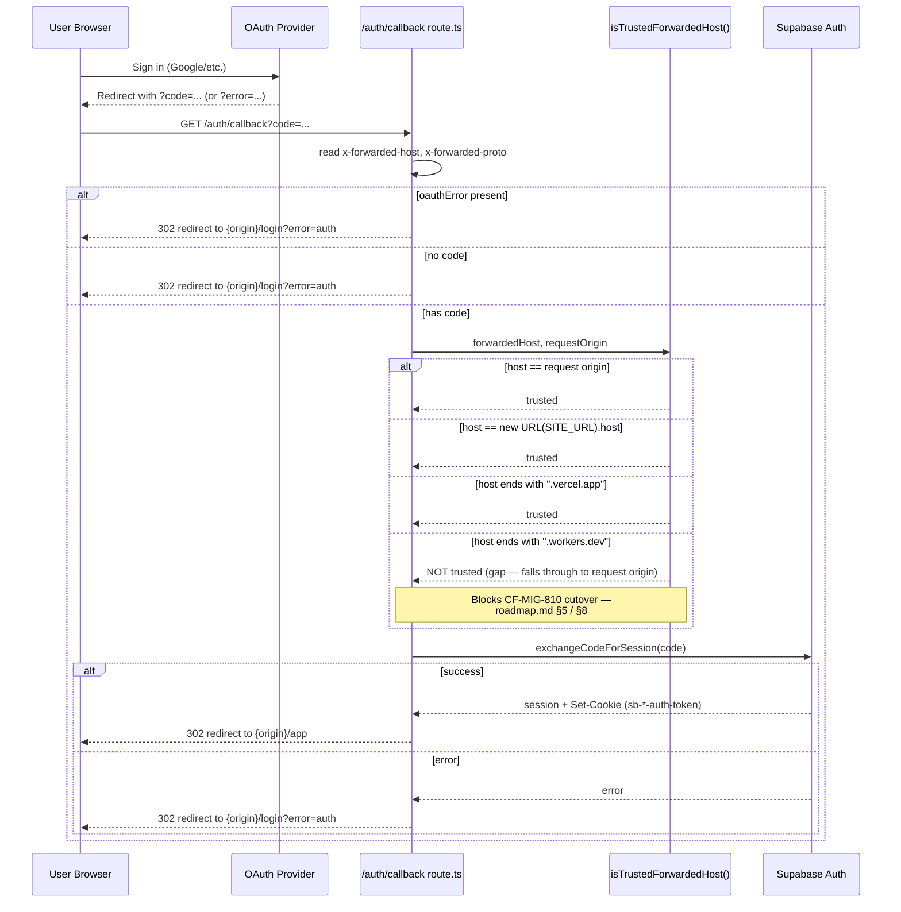

# Authentication Flow

**Status:** 🔴 Incorrect (in the old docs, now fixed here) — the `.workers.dev` trust gap is real, current, and still blocks the Cloudflare cutover.

**Purpose:** Trace the real Supabase Auth OAuth callback path in `app/src/app/auth/callback/route.ts`, including the host-trust gap that blocks the Cloudflare cutover.

## Explanation

The callback exchanges the OAuth `code` for a session via `supabase.auth.exchangeCodeForSession()`, then redirects to `/app`. Before redirecting it must pick the right origin: `redirectOrigin()` calls `isTrustedForwardedHost()`, which trusts the request's own origin, `SITE_URL`, or any `.vercel.app` host — it has **no case for `.workers.dev`**, so a Cloudflare-Workers-hosted preview cannot yet complete OAuth correctly. This is an open 🔴 blocker for `CF-MIG-810`, tracked in `roadmap.md` §5/§8 (Risk Register).

## Diagram

## Verification notes

- Re-read `app/src/app/auth/callback/route.ts` in full (2026-07-09): `isTrustedForwardedHost()` still checks only request-origin match, `SITE_URL` host match, and `.vercel.app` suffix — confirmed **no `.workers.dev` case exists**. The old diagram's core claim is accurate and still true; ported forward as-is.
- Added the OAuth-provider-error and missing-code branches to the sequence, which the old diagram omitted (both are real early-return paths in the route, redirecting to `/login?error=auth`) — a small completeness fix, not a correctness bug in the old file.
- Status marked 🔴 per the pass convention because the trust gap itself is a real, uncorrected defect blocking `CF-MIG-810` — not because the old diagram was wrong about it (it wasn't).

## Related Linear issues

CF-MIG-210 (OAuth `.workers.dev` trust fix), CF-MIG-810 (blocked by this gap)

## Related PRD/Roadmap section

`roadmap.md` §5 (Security Milestones), §8 (Risk Register); `prd.md` §8 (Non-Functional Requirements — Security & RLS)
