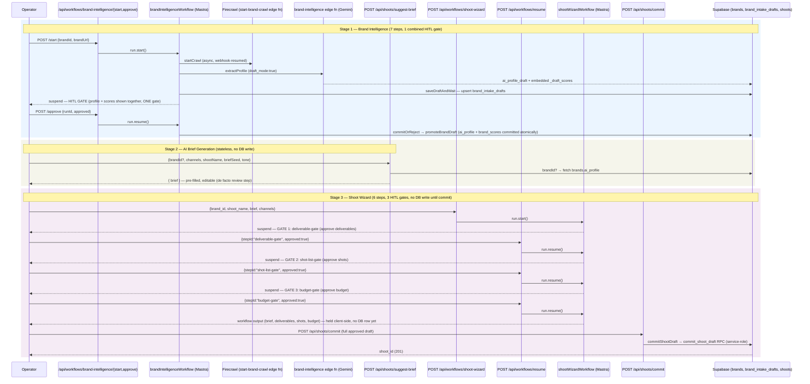

# 08 — Brand → AI Brief → Shoot Workflow

**Status:** 🟢 Built — all three stages are real, shipped code paths with working HITL gates.

**Purpose:** Show the end-to-end path from a brand URL to an approved, budgeted shoot as one continuous workflow, not three disconnected features.

## Explanation

Merges the old `16-brand-onboarding-workflow.md`, `17-ai-brief-workflow.md`, and `18-shoot-workflow.md` into one flow: **Brand Intelligence → Brief Generation → Shoot Wizard**. All three stages are verified against current code:

- **Brand stage** (`app/src/mastra/workflows/brand-intelligence-workflow.ts`): a 7-step Mastra workflow. **Carried-forward correction** (already verified, re-confirmed today): `tasks/cloudflare/plan/ai-agent-architecture.md` §3.1 describes **two** separate approval points (profile draft, then DNA scores). The real code has **one combined gate** — `saveDraftAndWait` suspends once with `resumeSchema: z.object({ approved: z.boolean() })`, and `commitOrReject` reads a single `draft.status === "approved"` to atomically commit both `ai_profile` and `brand_scores` together. Re-verified directly against `brand-intelligence-workflow.ts` lines 190–266 for this pass.
- **Brief stage** (`app/src/app/api/shoots/suggest-brief/route.ts`): stateless, single-call, no DB write, no formal HITL gate — the operator's inline edit of the returned brief text is the de facto review before it becomes Shoot Wizard input.
- **Shoot stage** (`app/src/mastra/workflows/shoot-wizard.ts`): 6-step, 3-gate workflow, re-confirmed this pass — step ids `deliverable-gate`, `shot-list-gate`, `budget-gate` all present and each calls `suspend()`. The workflow itself never writes to the database; the actual write happens afterward via `POST /api/shoots/commit` → `commitShootDraft` → `commit_shoot_draft` RPC (service-role only).

**New finding this pass (not in old diagrams, now in `prd.md` §5.2, verified 2026-07-09):** the Shoot Agent (`productionPlannerAgent`, id `"production-planner"`) was previously described as having "10 tools" — the real count is **17 of 20** registered tools in the shared `agentTools` barrel (it only excludes 3 booking-write tools). This is a registry-hygiene gap (unused tools exposed to the agent), not a functional bug, and doesn't change the gate flow below — noted here so this diagram doesn't repeat the stale "10 tools" figure.

## Diagram

## Verification notes

- **Corrected (carried forward):** Brand Agent has one combined approval gate, not two — re-confirmed against `brand-intelligence-workflow.ts` this pass (`resumeSchema: z.object({ approved: z.boolean() })` on `saveDraftAndWait`, single `draft.status` check in `commitOrReject`).
- **New note this pass:** Shoot Agent tool count is 17/20, not the previously-cited 10 — see `prd.md` §5.2 (verified 2026-07-09) and `12-shared-tool-registry.md`. Not a gate/flow change, just a stale figure this diagram avoids repeating.
- No missing implementation — all three stages are shipped, gated code paths.
- No blockers.

## Related Linear issues

IPI-32 (Brand Intelligence workflow), IPI-149 / IPI-228 (Shoot Wizard + commit RPC). No dedicated issue for `suggest-brief` itself.

## Related PRD/Roadmap section

`prd.md` §6.3 (Brand — Mature), §6.4 (Shoot — Mature), §5.2 (Agent roster, Shoot Agent tool-count correction), §3 (HITL invariant).
