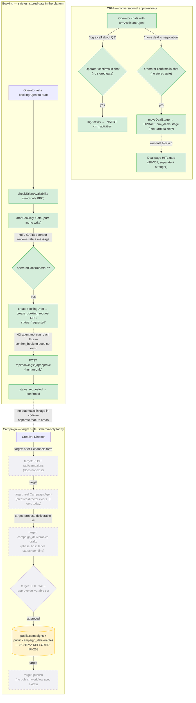

# 09 — CRM → Booking → Campaign (Customer Lifecycle)

**Status:** 🟡 Partial — CRM and Booking are 🟢 Mature; Campaign is 🔴 schema-only, everything above the DB is unbuilt.

**Purpose:** Show the customer-lifecycle path — relationship (CRM) → confirmed commitment (Booking) → ongoing multi-channel work (Campaign) — as one lifecycle, and be explicit about where each stage's HITL enforcement actually lives.

## Explanation

Merges the old `20-crm-workflow.md`, `21-booking-workflow.md`, and `22-campaign-workflow.md`. These three aren't a single pipeline in code (a CRM deal doesn't automatically become a booking or campaign) — they're grouped here because they share one property worth contrasting directly: **how strictly each stage's approval gate is enforced**, which gets weaker as you go left to right in the diagram below, not stronger:

- **CRM** (`crm-assistant-agent.ts`, 4 tools, verified against `app/src/mastra/tools/crm/`): approval is **conversational only** — no `operatorConfirmed` flag, no suspend/resume gate. `logActivity`/`moveDealStage` write directly once called; the "approval" is the operator's chat reply before the agent decides to call the tool. `moveDealStage` is schema-restricted to `NON_TERMINAL_DEAL_STAGES` — won/lost is a separate, stronger gate outside the agent (IPI-367).
- **Booking** (`app/src/mastra/tools/booking-tools.ts`, re-verified this pass): the strictest gate in the platform. File header states "Never expose confirm_booking"; re-confirmed today — no such tool exists anywhere in the registered tool set (`booking-agent.snapshot.test.ts` asserts `toolNames` excludes `confirm_booking`). `createBookingDraft` throws without `operatorConfirmed: true`, and even then only reaches `status='requested'`. The `requested → confirmed` transition is reachable **only** via the human-only `POST /api/bookings/{id}/approve` route — no agent code path can reach it at all.
- **Campaign**: 🔴 target-state only. **Corrected 2026-07-09, re-verified this pass directly against the migration:** `public.campaign_deliverables` **is already deployed** (`supabase/migrations/20260707100000_ipi268_campaigns_schema.sql`), with columns `phase smallint (1-12)`, `label`, `status` (enum `pending/in_progress/review/approved/blocked`), `due_date`, `assigned_to` — not the "deliverable type / channel / linked asset" shape an earlier draft of this documentation assumed, and not "needs schema" as an even earlier pass had it. Everything above the schema — `/api/campaigns/*` routes, a real Campaign Agent, the UI — is genuinely unbuilt; `creative-director` is a registered Mastra agent with **zero tools**, not the Campaign Agent `ai-agent-architecture.md` §3.5 describes.

## Diagram

## Verification notes

- **Incorrect assumption found and corrected (already fixed 2026-07-09, re-confirmed this pass):** `campaign_deliverables` is deployed, not merely schema-planned, and its real columns (`phase`/`label`/`status`/`due_date`/`assigned_to`) differ from an earlier "deliverable type/channel/linked asset" description. Verified directly against `supabase/migrations/20260707100000_ipi268_campaigns_schema.sql` lines 5–89 this pass — no drift from the current `prd.md` §6.6/§7.
- **Missing implementation:** Campaign has no `/api/campaigns/*` routes, no real agent, no UI beyond a route stub — confirmed no such API directory exists.
- CRM's two approval points are enforced by convention (agent instructions + operator chat reply), not by code — worth flagging as a lower-rigor pattern than Booking's, in case CRM ever needs stricter enforcement (e.g. before a bulk-write tool is added).
- No blockers to note beyond the above.

## Related Linear issues

IPI-368 (CRM assistant agent), IPI-367 (deal Won/Lost gate), IPI-348 / IPI-397 (Booking agent tools + draft-only tests), IPI-268 (Campaign schema — only shipped piece; no Campaign Agent/API/UI issue exists yet).

## Related PRD/Roadmap section

`prd.md` §6.1 (CRM — Mature), §6.2 (Booking — Mature), §6.6 (Campaign — Thin, target-state spec, corrected 2026-07-09), §7 (Data Model, `public.campaigns` row).
