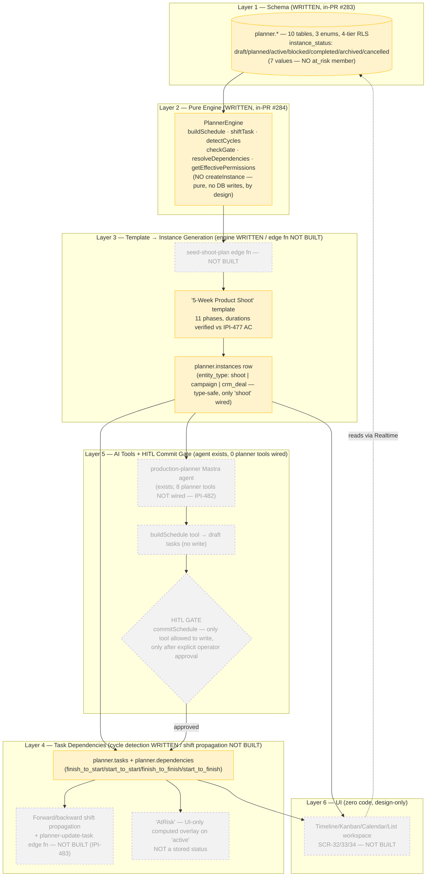

# 10 — Planner Architecture (Consolidated)

**Status:** 🟡 Partial — schema + pure engine written and CI-green in 2 open PRs, not yet merged to `main`; UI, edge functions, realtime, and AI tools are all ⚪ Planned (zero code).

**Purpose:** One layered view of the entire Planner subsystem — schema → engine → template generation → instance lifecycle → task dependencies → AI/HITL commit gate — replacing the old 6-file Planner category with a single diagram that represents status honestly instead of cramming every original relationship in.

## Explanation

Merges the old `31-planner-system-architecture.md` through `36-planner-approval-flow.md` (6 files → 1). This is intentionally a **layered/subgraph structure**, not a full redraw of all 8 original mermaid diagrams — it keeps only the relationships needed to answer "what exists, what doesn't, and where does human approval sit":

- **Schema + engine layer (🟡 written, in-PR):** `planner.*` — 10 tables, 3 enums, 4-tier RLS — is written in migration `20260709000000_planner_schema_rls.sql`, re-verified this pass: `planner.instance_status` enum has **exactly 7 values** (`draft, planned, active, blocked, completed, archived, cancelled`) — confirmed directly reading the migration this pass, no `at_risk` member exists. `PlannerEngine` (`app/src/lib/planner/engine.ts`, re-verified this pass by reading the class methods directly) has exactly: `buildSchedule`, `shiftTask`, `detectCycles`, `checkGate`, `resolveDependencies`, `getEffectivePermissions`. **Carried-forward correction, re-confirmed:** there is **no `createInstance` method** — instance creation is a DB `INSERT` that must live in the caller (an edge function), because the engine is pure/no-writes by its own design constraint. Both PRs (#283/#284) are CI-green but not merged to `main`.
- **Template → instance generation (🟡 engine written, edge fn ⚪ not built):** opening a shoot's schedule tab is supposed to call `seed-shoot-plan` (no such edge function exists in `supabase/functions/` today) which calls the real, written `PlannerEngine.buildSchedule()` to produce phases/tasks, then inserts them.
- **AtRisk is a UI overlay, not a state (carried-forward correction, re-confirmed):** `AtRisk` does not appear in the enum. It's a computed overlay on `active`, to be produced by `detectScheduleRisks` (IPI-482, not started).
- **Dependency shift propagation (⚪ not built):** only cycle detection (`detectCycles`/`resolveDependencies`) exists today; forward/backward shift propagation and the `planner-update-task` edge function are unbuilt (IPI-483, blocked on 476/477/478/479).
- **AI/HITL commit gate (⚪ not built):** `production-planner` Mastra agent exists (id `"production-planner"`) but carries none of the 8 planner tools yet (`buildSchedule`, `detectScheduleRisks`, `suggestDependencies`, `shiftTimeline`, `assignTasks`, `commitSchedule`, `explainDelay`, `summarizeTimeline`). Only `commitSchedule` is meant to ever write, and only after explicit approval — that gate is spec-only today.
- **UI (⚪ zero code):** `app/src/components/planner/` and `app/src/app/(operator)/app/planner/` are both absent — confirmed by directory search this pass. Three Claude Design prompts (`SCR-32/33/34`) exist but nothing is implemented.

## Diagram

## Verification notes

- **Corrected (carried forward, re-confirmed this pass by reading `engine.ts` directly):** `PlannerEngine` has no `createInstance` method — the original design-time class diagram listed one; the real code doesn't, because instance-row creation is a DB write and the engine is pure by its own stated constraint.
- **Corrected (carried forward, re-confirmed this pass by reading the migration directly):** `AtRisk` is not a `planner.instance_status` value — the enum has exactly 7 members, no `at_risk`. It's a UI overlay planned for `IPI-482`'s `detectScheduleRisks` tool.
- **Missing implementation:** every edge function this diagram references (`seed-shoot-plan`, `schedule-shoot-plan`, `planner-update-task`, `planner-notify-enqueue`) is unbuilt — confirmed no `supabase/functions/` directories exist for any of them. All Cloudflare containers (`planner-gateway`, `planner-coordinator` DO, `planner-notify` Queue/Worker, `planner-cache` KV, `planner-ai` Worker) are spec-only, no `cloudflare/planner-*` directory in the repo.
- **Blocker:** `IPI-483` (dependency shift) is explicitly blocked on `IPI-476, 477, 478, 479` per its own Linear issue, none of which are past schema/engine stage.

## Related Linear issues

IPI-476 (schema+engine, in-PR), IPI-477 (shoot template), IPI-478 (UI shell), IPI-479 (roles/assignments), IPI-480 (realtime/DO), IPI-481 (notifications), IPI-482 (AI tools+HITL), IPI-483 (dependency auto-shift, blocked), IPI-484 (epic).

## Related PRD/Roadmap section

`prd.md` §6.7 (Planner — Backend spec-complete, UI target-state spec, full acceptance-criteria table) and §7 (`planner.*` schema status).
