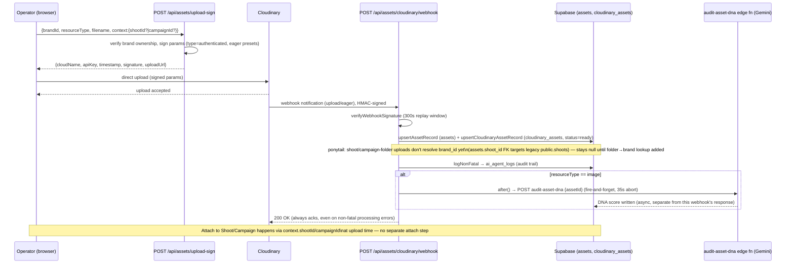

# 11 — Media Pipeline (Upload → Cloudinary → Approval → Delivery)

**Status:** 🟢 Built — signed upload, webhook ingestion, and async DNA audit are all real, shipped code; one known gap noted inline (unresolved `brand_id` on shoot/campaign-folder uploads).

**Purpose:** Show the signed-upload → transform → webhook → asset-record → DNA-audit flow, the only media pipeline in the platform.

## Explanation

Ported from old `23-media-cloudinary-workflow.md`, re-verified this pass against `app/src/app/api/assets/upload-sign/route.ts` and `app/src/app/api/assets/cloudinary/webhook/route.ts`. The client never talks to Cloudinary's API secret — the server signs upload params (`type: "authenticated"`, i.e. private/signed delivery, per IPI-257 §5, until HITL approval flips it to public) and the browser uploads directly to Cloudinary. Cloudinary's webhook (HMAC-verified, 300s replay window) is the only writer of `assets`/`cloudinary_assets` rows. Image uploads fire an async, best-effort DNA audit (`audit-asset-dna` edge fn, Gemini) via `after()` so the webhook still acks within its ~3s budget.

**Known gap, re-confirmed this pass** (own `ponytail:` comment still present at `cloudinary/webhook/route.ts` lines 33–36): shoot/campaign-folder uploads don't resolve `brand_id` — the comment explains why: `assets.shoot_id`'s FK targets the legacy `public.shoots` table, not the current backing table, so `brand_id` stays `null` (nullable column) for those uploads until a folder→brand lookup is added. This is an accepted, documented shortcut, not new drift.

## Diagram

## Verification notes

- No incorrect assumptions found in the old diagram — re-verified and it holds.
- **Missing implementation (documented, not a bug):** `brand_id` resolution for shoot/campaign-folder uploads — tracked inline via the `ponytail:` comment in the route file itself, not a Linear issue.
- No blockers.

## Related Linear issues

IPI-257 (Cloudinary signed upload + webhook pipeline, phases 074a–074e).

## Related PRD/Roadmap section

`prd.md` §6.5 (Assets & Notifications — Mature: "Cloudinary is the dedicated pipeline").
