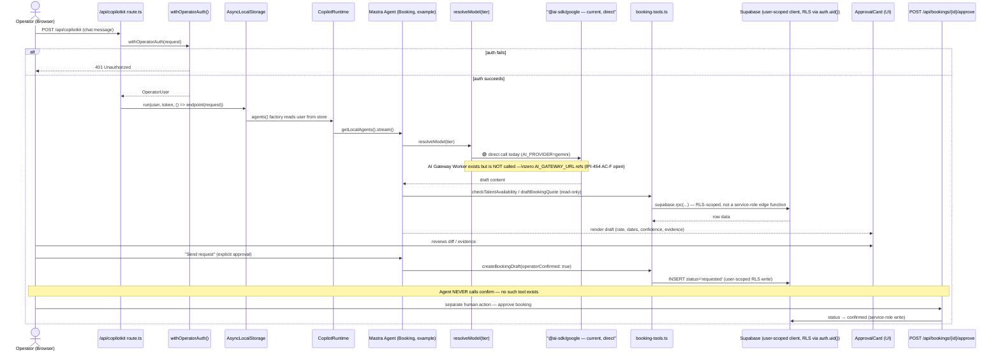
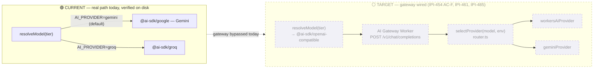

# AI Request Flow — User → CopilotKit → Mastra → AI Gateway → Model

**Status:** 🟡 Partial — the real request flow works end-to-end today via direct provider calls; the AI Gateway path is built but unwired; the HITL gate is real and enforced. (One prd.md §3 wording divergence was already corrected before this pass — carried forward, not newly found.)

**Purpose:** The single most-requested-to-get-right diagram in the whole set — trace one operator chat message from the browser all the way to a committed database write, showing **both** the current real provider path (direct to Gemini/Groq, gateway bypassed) and the target path (through the AI Gateway Worker), with the HITL approval gate as part of the same flow, not a separate diagram.

## Explanation

**Current, verified path:** `withOperatorAuth` authenticates the request (401 on failure), the resolved user/token is threaded through `AsyncLocalStorage` so CopilotKit's agent factory and every downstream tool call see the same identity without re-authenticating. The Mastra agent calls `resolveModel(tier)` (`app/src/lib/ai/provider.ts`), which branches on `AI_PROVIDER` (default `gemini`) and calls `@ai-sdk/google` or `@ai-sdk/groq` **directly** — confirmed by grep: zero references to `AI_GATEWAY_URL` anywhere in `app/src/lib/ai/` or `app/src/mastra/`. When a tool needs to write (e.g. `booking-tools.ts`), it calls Postgres through a **user-scoped Supabase client**, so `auth.uid()` resolves inside the RPC and RLS is the actual enforcement boundary — not a service-role edge function.

**This is a real, already-corrected divergence from `prd.md` §3's original wording** ("service-role edge functions are the only code path that performs the actual write, never a Mastra tool directly"). The PRD's own 2026-07-09 correction (visible in the current `prd.md` §3) confirms this: the HITL *gate* is real and enforced at the UI/workflow level, only the specific data-layer mechanism was mis-described. This diagram carries that already-applied correction forward rather than re-discovering it as new.

**Target path (not yet wired):** the AI Gateway Worker (`services/cloudflare-worker/`) already has a working `handleRequest → selectProvider → geminiProvider/workersAiProvider` router, unit-tested and deployed standalone — but nothing in Mastra calls it (IPI-461 built the Worker; IPI-454 AC-F is the open step that points `resolveModel()` at it).

**HITL gate, using the Booking Agent as the concrete example** (confirmed by direct read of `booking-agent.ts`): its tool set is exactly `checkTalentAvailability`, `draftBookingQuote`, `createBookingDraft` — there is no `confirm_booking` tool. `createBookingDraft` only proceeds with explicit `operatorConfirmed: true`, and even then writes a draft row (`status='requested'`). Confirmation is a separate, human-only action: `POST /api/bookings/{id}/approve`. This draft-only guarantee is enforced by a snapshot test (`booking-agent.snapshot.test.ts`).

## Diagram

## Verification notes

- Spot-checked directly: `app/src/lib/ai/provider.ts` — `AI_PROVIDER` defaults to `"gemini"`, zero `AI_GATEWAY_URL` references anywhere in `app/src/lib/ai/` or `app/src/mastra/` (grep-verified this pass, not assumed from the old diagram).
- Spot-checked directly: `app/src/mastra/agents/booking-agent.ts` — tool set is exactly the 3 named tools, no `confirm_booking` tool exists, confirming the draft-only HITL claim.
- Incorrect assumption already caught (not new to this pass, carried forward accurately): `prd.md` §3's original claim that service-role edge functions are the *only* write path was corrected 2026-07-09 after diagramming verification against `booking-tools.ts` found Mastra tools write via a user-scoped RLS client instead. This diagram reflects the corrected, current understanding.
- Missing implementation: gateway wiring (`resolveModel()` → AI Gateway Worker) — confirmed absent, tracked IPI-454 AC-F / IPI-461 / IPI-485.
- No blockers to documenting current state.

## Related Linear issues

IPI-454 (AC-F: wire `resolveModel()` → gateway REST), IPI-457 (model-registry SSOT), IPI-461 (AI Gateway Worker — built, unwired), IPI-462 (eval gate before default flip), IPI-485 (Mastra gateway cutover, blocked by 454+457), IPI-397 (booking draft-only verification), IPI2-116 ("no silent writes" pattern)

## Related PRD/Roadmap section

`prd.md` §3 (Architecture Overview — HITL pattern paragraph, with the 2026-07-09 correction), §4.4 (Provider strategy — "Key rule ... not yet enforced in code"), §6.2 (Booking — Mature)
