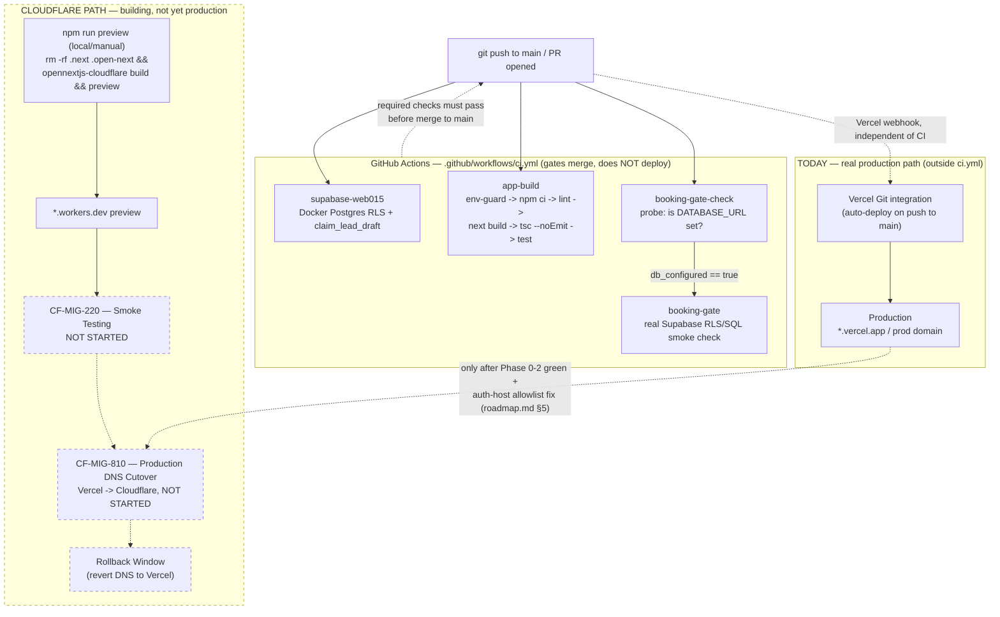

# Deployment Pipeline — GitHub → CI → Cloudflare → Production

**Status:** 🟡 Partial — CI gates merges but does not deploy; real production deploy is Vercel's git integration, not visible in `ci.yml`; the Cloudflare/OpenNext path exists and builds locally but is preview-only.

**Purpose:** Show, as one diagram, the full path from a push on GitHub through CI gating to where production traffic actually gets served today, and where it's headed once the Cloudflare cutover lands.

## Explanation

**Today, two separate things happen on every push to `main`, and they don't talk to each other:**

1. **CI (`.github/workflows/ci.yml`)** runs 4 jobs — `supabase-web015` (Docker Postgres RLS + `claim_lead_draft` tests), `app-build` (env-guard scan → `npm ci` → lint → `next build` → `tsc --noEmit` → `npm test`, all in `app/`), `booking-gate-check` (a secrets-probe job, since `if:` conditions can't read secrets directly), and `booking-gate` (the real Model Gate SQL/RLS check, which only runs when `DATABASE_URL` is configured). Confirmed directly against the workflow file — all 4 job names, their steps, and the probe-job pattern match exactly. **None of these 4 jobs builds or deploys anything** — they are merge gates only.
2. **Production deploy** is Vercel's own Git integration reacting to the push, entirely outside `ci.yml` — there is no `vercel` step anywhere in the workflow, and `.vercel`/`app/.vercel` directories on disk confirm the integration. This is the real, live production path right now.

**In parallel, a Cloudflare path is being built out but is not production yet:**

- `app/wrangler.jsonc` targets Worker name `ipix-operator`, `main: .open-next/worker.js`.
- `app/open-next.config.ts` exists (no longer the bare default scaffold — it's been edited past the original scaffold state noted in the old `03-opennext-deployment-architecture.md`).
- `app/package.json` scripts: `"preview": "rm -rf .next .open-next && opennextjs-cloudflare build && opennextjs-cloudflare preview"` and `"deploy": "... && opennextjs-cloudflare deploy"`. **Correction vs. the old diagram:** `preview` now also runs `opennextjs-cloudflare preview` (not just the build step) — it builds *and* serves the `*.workers.dev` preview in one command. This is still manual/local only; no CI job invokes either script (`CF-MIG-111`, still not present in `ci.yml` — verified fresh, zero OpenNext/Wrangler references in the workflow file).

**Planned rollout (`roadmap.md` §2 Phase 3, not started):** Preview (`*.workers.dev`, already scripted) → Smoke Testing (`CF-MIG-220`) → Production DNS Cutover (`CF-MIG-810`, Vercel → Cloudflare) → Rollback Window (revert DNS to Vercel if issues surface). Cutover is gated on Phase 0-2 completing first, and `roadmap.md` §4/§5 flags an auth-host allowlist check that specifically blocks `CF-MIG-810` today.

## Diagram

## Verification notes

- Re-verified all 4 CI job names and their step order directly against `.github/workflows/ci.yml` on disk — matches the merged old diagrams exactly (`supabase-web015`, `app-build`, `booking-gate-check`, `booking-gate`), zero OpenNext/Wrangler/vercel steps present.
- **Correction found:** the old `03-opennext-deployment-architecture.md` described `open-next.config.ts` as "STILL DEFAULT SCAFFOLD" and `preview`/`deploy` scripts as identical (`build` only). Current `app/package.json` shows `preview` now runs `build && preview` (serves the workers.dev URL too), and `open-next.config.ts` is no longer the bare scaffold. Corrected inline above — 🟡 not 🔴, since the underlying architecture claim (manual/local only, no CI job) is still accurate.
- No blockers to documenting this — all source files (`ci.yml`, `wrangler.jsonc`, `open-next.config.ts`, `package.json`) read directly for this pass.

## Related Linear issues

CF-MIG-111 (OpenNext CI build job — still 0%, not in `ci.yml`), CF-MIG-220 (preview smoke testing — not started), CF-MIG-810 (production DNS cutover — not started, blocked on auth-host allowlist), IPI-472 (deploy pipeline documentation)

## Related PRD/Roadmap section

`prd.md` §4.3 (Cloudflare migration status); `roadmap.md` §2 Phase 3 (Production Cutover) and §4 (Testing & Validation)
