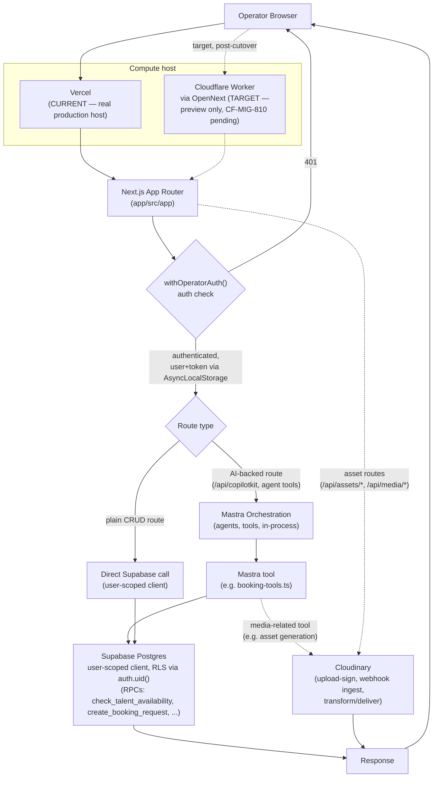

# Production Runtime — Real Request Path

**Status:** 🟢 Built (current path, Vercel-hosted) / ⚪ Planned (Cloudflare Worker target) — the request flow itself (auth → Mastra → RLS-scoped Supabase → Cloudinary) is real and verified; only the compute host is not yet cut over.

**Purpose:** Trace what actually happens to a request in production today — where it's hosted, how auth and AI orchestration wire together, and which downstream services get touched — with no Stripe node, because none exists in this codebase.

## Explanation

**Host, current vs. target:** every production request lands on **Vercel** (git-integration auto-deploy — see `13-deployment-pipeline.md`), not a Cloudflare Worker. The Worker path (`ipix-operator` via OpenNext, `app/wrangler.jsonc`) is real infrastructure but preview-only (`*.workers.dev`) until `CF-MIG-810` completes. Both hosts run the identical Next.js app — the request flow below is host-agnostic once past the compute boundary.

**Auth boundary:** verified fresh against `app/src/app/api/copilotkit/[[...slug]]/route.ts` — `withOperatorAuth()` runs first (401 on failure), then the resolved user + access token are threaded through `AsyncLocalStorage` so every downstream call (CopilotKit's per-request agent factory, Mastra tools) sees the same identity without re-authenticating.

**Mastra involvement is conditional, not universal** — only requests that hit an AI-backed route (`/api/copilotkit`, or any route that invokes a Mastra agent/tool) pass through Mastra orchestration. Plain CRUD routes (e.g. brand/shoot list endpoints) go straight from Next.js to Supabase.

**Supabase is the RLS-scoped enforcement boundary for writes**, not a service-role edge function — confirmed against `app/src/mastra/tools/booking-tools.ts`: Mastra tools call Postgres RPCs (`check_talent_availability`, `create_booking_request`, etc.) directly through a **user-scoped** Supabase client, so `auth.uid()` resolves inside the RPC and RLS does the filtering. This still matches what `06-runtime-request-flow.md` found and what `prd.md` §3 now documents as the corrected, real invariant (the doc previously and incorrectly claimed service-role edge functions were the only write path — that claim was already fixed in `prd.md` as of 2026-07-09).

**Cloudinary is real and conditional**, not universal — confirmed on disk: `app/src/lib/cloudinary/url.ts`, `app/src/app/api/assets/upload-sign/route.ts` (signed upload), `app/src/app/api/assets/cloudinary/webhook/route.ts` (ingest webhook), `app/src/app/api/media/specs/route.ts`. Only asset/media routes touch Cloudinary; it sits alongside Supabase, not in every request's critical path.

## Diagram

## Verification notes

- **Stripe check (explicit, as requested):** ran `grep -rni "stripe" app/src app/package.json supabase/functions` fresh for this pass. **Zero matches in this codebase.** No `stripe` npm package, no `STRIPE_*` env var, no `stripe.ts` module anywhere in `app/src` or `supabase/functions`. This confirms the prior forensic audit finding. **Stripe is intentionally omitted from the diagram above** — the user's own suggested purpose line ("Browser → Worker → Supabase → Cloudinary → Stripe") is not reflected in the current codebase and including it would be inventing a node that doesn't exist. (The only Stripe hits anywhere on this machine are in unrelated sibling projects — `b2c-storefront/` and a vendored `github/events/Hi.Events/` checkout — neither is part of the iPix `app/` or `supabase/` tree.)
- Re-confirmed the RLS-as-enforcement-boundary correction (already fixed in `prd.md` §3 as of 2026-07-09) still holds against current `booking-tools.ts` and the copilotkit route — no new drift found.
- Mastra and Cloudinary are both drawn as conditional branches, not mandatory hops, per the task brief ("if AI involved" / "if media involved") — verified this is accurate: plain CRUD routes and non-media routes exist and skip both.
- No blockers.

## Related Linear issues

CF-MIG-810 (production DNS cutover — gates the host swap in this diagram), IPI2-127 (auth-at-boundary pattern), IPI-348 / MODELGATE-10 (booking tools, RLS write path)

## Related PRD/Roadmap section

`prd.md` §3 (Architecture Overview — HITL/RLS invariant, corrected 2026-07-09); `prd.md` §4.2 (Runtime boundaries); `roadmap.md` §2 Phase 3 (Production Cutover)
