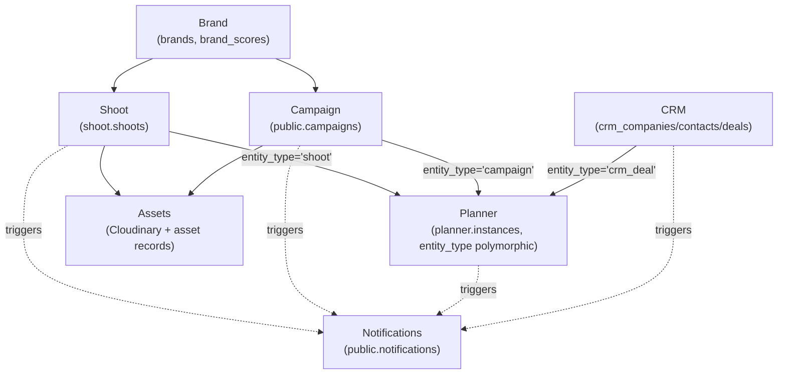

# Feature Dependency Graph

**Status:** 🟢 Built — real schema FKs and `entity_type` links, re-verified against `prd.md` §14 with zero drift.

**Purpose:** Show the real cross-feature data dependencies — schema FKs and polymorphic `entity_type` links — not an invented linear pipeline.

## Explanation

This diagram is adapted directly from `prd.md` §14, which itself corrects an earlier wrong assumption (a made-up linear chain Brand→Campaign→Shoot→Planner→Assets→CRM→Notifications). The real shape: Brand is upstream of both Shoot and Campaign (both carry `brand_id`); Planner is a polymorphic consumer of Shoot, Campaign, *and* CRM deals simultaneously via `entity_type`, not a single next-step after Campaign; CRM is otherwise independent; every feature triggers Notifications and nothing depends back on it.

## Diagram

## Verification notes

- Diffed this diagram's mermaid source character-for-character against the current `prd.md` §14 (lines 410–438, 2026-07-09): **identical, zero drift.** The old `44-feature-dependency-graph.md` was itself already a verbatim copy of `prd.md` §14, and `prd.md` §14 has not changed since — so no correction needed here, contrary to the risk the task called out.
- Cross-checked the FK claims against actual migrations: `public.campaigns.brand_id` and `shoot.shoots.brand_id` both exist (confirms Brand → Shoot/Campaign); `planner.instances` supports polymorphic `entity_type` per `20260709000000_planner_schema_rls.sql` (confirms Planner as multi-source consumer, not a linear Campaign successor).
- None found this pass — no incorrect assumptions, no missing implementation, no blockers.

## Related Linear issues

`IPI-476`–`IPI-484` (Planner epic — the polymorphic `entity_type` consumer relationship), `IPI-268` (Campaign schema)

## Related PRD/Roadmap section

`prd.md` §14 (source of this diagram, verbatim structure) and §6.6/§6.7 (Campaign and Planner target-state specs)
