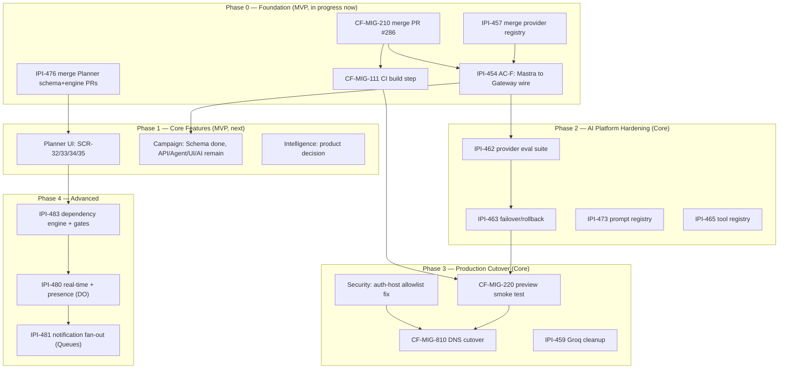

# Roadmap Timeline — MVP → Core → Advanced

**Status:** 🟡 Partial — Phase 0 items are in progress now; Phases 1-4 are planned, sequenced, and gated but not yet started.

**Purpose:** Show the build-order dependency chain across all five roadmap phases in one picture, framed as MVP (Phases 0-1) → Core hardening/cutover (Phases 2-3) → Advanced (Phase 4), so anyone can see what blocks what before picking up the next task.

## Explanation

This is the same dependency graph as `roadmap.md` §6 — not redrawn, ported verbatim because it was already verified current for this pass. Framing it as three tiers: **MVP** = Phase 0 (Foundation — merge the open PRs that unblock everything else: CF-MIG-210, Mastra→Gateway wiring, provider registry, Planner schema) and Phase 1 (Core Features — Planner UI, Campaign API/Agent/UI, the Intelligence product decision) get the product to a usable, feature-complete state. **Core** = Phase 2 (AI Platform Hardening — eval suite, failover, prompt/tool registries) and Phase 3 (Production Cutover — smoke tests, DNS cutover to Cloudflare, Groq cleanup) harden that MVP for real production traffic. **Advanced** = Phase 4 (Planner dependency engine + gates, Realtime/Durable Objects, Queues-based notification fan-out) is explicitly deferred work layered on top once the above is live.

## Diagram

## Verification notes

- Diffed against `roadmap.md` §6 (lines 161–208, 2026-07-09): diagram content identical, ported verbatim per the task's own instruction not to redraw it.
- Cross-checked "Phase 0" claims against code: `AI_GATEWAY_URL` still absent from `app/src/lib/ai/provider.ts` (confirms A3 not done), `provider.ts` still resolves Gemini/Groq directly (confirms A4/provider registry not yet merged into this path) — Phase 0 status of "in progress, not complete" holds.
- The "Security: auth-host allowlist fix" (D0) gating Phase 3 is confirmed still open — see `07-auth-flow.md` in this same batch, which independently verified the `.workers.dev` trust gap is still present in `app/src/app/auth/callback/route.ts`.
- None found this pass beyond the above — no incorrect assumptions, no blockers beyond what's already tracked in the diagram itself.

## Related Linear issues

CF-MIG-210, CF-MIG-111, CF-MIG-220, CF-MIG-810, IPI-454, IPI-457, IPI-476, IPI-462, IPI-463, IPI-473, IPI-465, IPI-459, IPI-483, IPI-480, IPI-481

## Related PRD/Roadmap section

`roadmap.md` §2 (Build-Order Phases), §6 (Dependency Diagram, source of this diagram), §8 (Risk Register)
