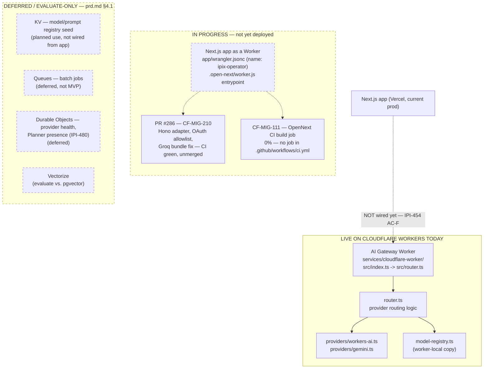

# Cloudflare Workers Architecture — Real vs. Planned

**Purpose:** Give a precise picture of what actually executes on Cloudflare Workers today versus what is still in progress or deferred, so no one assumes the main app is already Workers-hosted.

## Explanation

Exactly one thing runs on Cloudflare Workers in production today: the **AI Gateway Worker** (`services/cloudflare-worker/`), a small Hono-less fetch handler (`src/index.ts` → `src/router.ts`) that provider-routes between Workers AI and Gemini (`src/providers/`). It is deployed and has its own `wrangler.jsonc`, but nothing in the main app calls it yet. The main Next.js operator app moving onto Workers via OpenNext is real code (`app/wrangler.jsonc`, `app/open-next.config.ts` exist) but is **unmerged and not deployed** — `CF-MIG-210` (runtime compatibility) is an open PR (#286), and there is no CI job that builds or deploys it (`CF-MIG-111`, 0%). KV, Queues, Durable Objects, and Vectorize are all deferred/evaluate-only per `prd.md` §4.1 — none are provisioned or used in code today.

## Diagram

## Related Linear issues

IPI-461 (CF-AI-004, Worker scaffold — done), IPI-454 (CF-AI-001, gateway wiring — AC-F open), CF-MIG-210 (PR #286, open), CF-MIG-111 (0%), IPI-480 (Durable Objects, deferred, Phase 4)

## Related PRD section

prd.md §4.1 (Service Decision Table), §4.3 (Cloudflare migration status)
