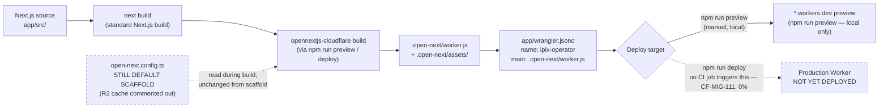

# OpenNext Deployment Architecture

**Purpose:** Document the build/deploy pipeline that turns the Next.js app into a Cloudflare Worker, and flag exactly which parts are still default scaffold versus customized.

## Explanation

`app/package.json` already scripts the OpenNext build (`"preview"` and `"deploy"` both run `rm -rf .next .open-next && opennextjs-cloudflare build`). The build takes the standard `next build` output, runs it through `@opennextjs/cloudflare`, and produces `.open-next/worker.js` — the exact file `app/wrangler.jsonc`'s `main` field points at, deployed under the Worker name `ipix-operator`. Two things are **not yet real**: `app/open-next.config.ts` is still the unedited default scaffold (R2 incremental cache commented out, no custom overrides), and no CI job runs this build (`CF-MIG-111`, 0% — verified against `.github/workflows/ci.yml`, which has zero OpenNext/Wrangler steps). Today this pipeline only runs locally via `npm run preview`/`npm run deploy`.

## Diagram

## Related Linear issues

CF-MIG-110 (OpenNext foundation/scaffold — done, PR #282 merged), CF-MIG-111 (CI build pipeline — 0%, no job exists), CF-MIG-210 (runtime compatibility, PR #286 open)

## Related PRD section

prd.md §4.3 (Cloudflare migration status — points to `tasks/cloudflare/todo.md` as live tracker)
