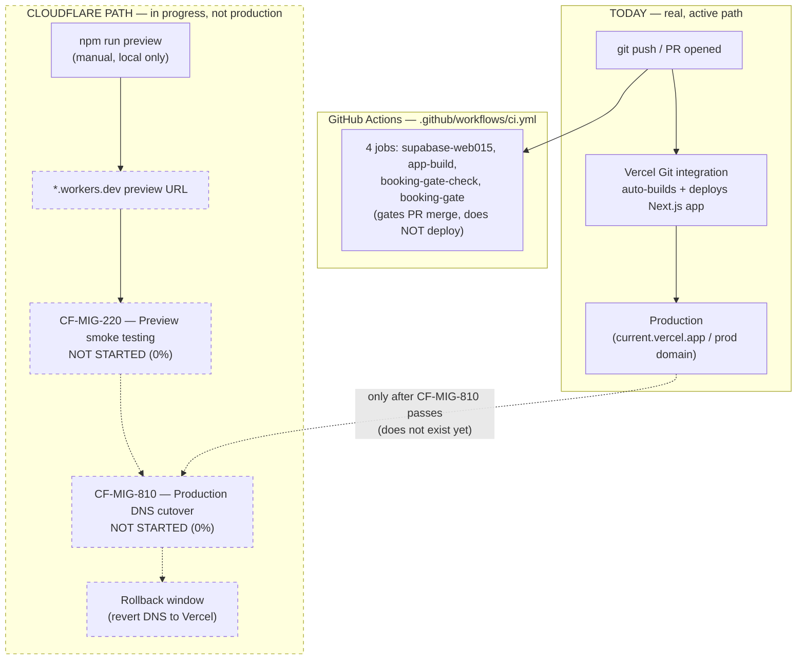

# Deployment Pipeline — Current vs. Planned Cutover

**Purpose:** Show the deployment flow that is actually in effect today (Vercel auto-deploy) alongside the emerging, not-yet-production Cloudflare path, without implying a cutover that hasn't happened.

## Explanation

Today, every push to `main` (and every PR) triggers Vercel's own auto-deploy of the Next.js app — this is the real, current production path and is not represented in `.github/workflows/ci.yml` because Vercel's Git integration runs independently of GitHub Actions. In parallel, a Cloudflare path is being built out: `npm run preview` builds via OpenNext and deploys to a `*.workers.dev` preview URL, but this is manual/local today, not CI-triggered, and not production. `roadmap.md` §2 Phase 3 documents the planned rollout: preview → `CF-MIG-220` smoke testing → `CF-MIG-810` DNS cutover → a defined rollback window back to Vercel if issues surface. None of Phase 3 has started.

## Diagram

## Related Linear issues

CF-MIG-220 (preview smoke testing, 0%), CF-MIG-810 (production DNS cutover, 0%, blocked on OAuth allowlist fix per roadmap.md §5)

## Related PRD section

prd.md §4.3 (Cloudflare migration status); roadmap.md §2 Phase 3 (Production Cutover)
