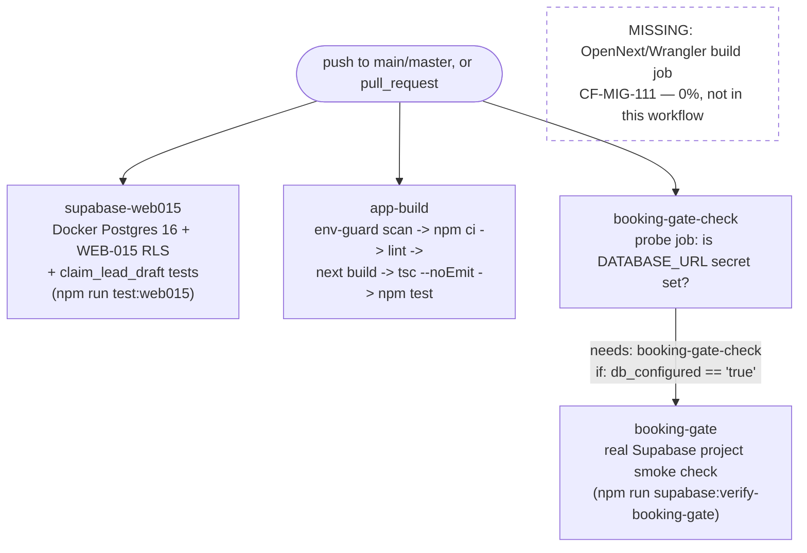

# CI/CD Pipeline — GitHub Actions

**Purpose:** Document the real CI job graph in `.github/workflows/ci.yml` exactly as it exists on disk, including the explicit gap where an OpenNext/Wrangler build job does not yet exist.

## Explanation

CI runs 4 jobs on every push to `main`/`master` and every PR, with `cancel-in-progress` concurrency per ref. `supabase-web015` and `app-build` run independently and unconditionally. `booking-gate-check` is a lightweight probe job (needed because `if:` conditions can't read secrets directly — GitHub Actions runner limitation) whose output gates the real `booking-gate` job, which only runs when the `DATABASE_URL` secret is configured. **No job builds or deploys the OpenNext/Cloudflare Worker artifact** — this is `CF-MIG-111`, tracked at 0% in `tasks/cloudflare/todo.md:18`, not a diagram omission.

## Diagram

## Related Linear issues

CF-MIG-111 (OpenNext CI build pipeline, 0%, no job exists — verified against `.github/workflows/ci.yml` directly)

## Related PRD section

roadmap.md §4 (Testing & Validation table, verified against `.github/workflows/ci.yml`); roadmap.md §2 Phase 0 item 2
