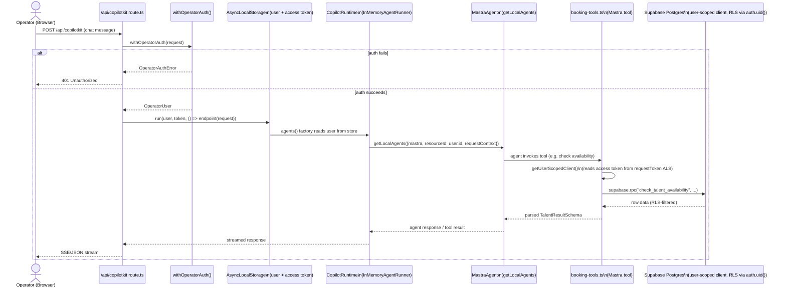

# Runtime Request Flow — CopilotKit Agent Call

**Purpose:** Trace one real, verified request end-to-end — an operator chat message that invokes a Mastra agent tool — through auth, orchestration, and the Supabase RLS boundary.

## Explanation

Based on `app/src/app/api/copilotkit/[[...slug]]/route.ts` and `app/src/mastra/tools/booking-tools.ts`, both read in full for this diagram. The route enforces auth first (`withOperatorAuth`, 401 on failure), then propagates the resolved user and access token through `AsyncLocalStorage` so every downstream callback — including CopilotKit's per-request agent factory — sees the same identity without re-authenticating. Mastra tools (e.g. `booking-tools.ts`) call Postgres **directly via a user-scoped Supabase client** so `auth.uid()` resolves correctly inside RPCs (`check_talent_availability`, `create_booking_request`) — RLS is the enforcement boundary, not a service-role edge function. **This diverges from `prd.md` §3's stated invariant** ("service-role edge functions are the only code path that performs the actual write, never a Mastra tool directly") — see the Inconsistencies note in the final report; this diagram reflects the code as it actually runs today.

## Diagram

## Related Linear issues

none directly — this reflects already-shipped infrastructure (IPI2-127 auth-at-boundary pattern, IPI-348 MODELGATE-10 booking tools)

## Related PRD section

prd.md §3 (HITL pattern paragraph — note the divergence found, above); prd.md §6.2 (Booking — Mature)
