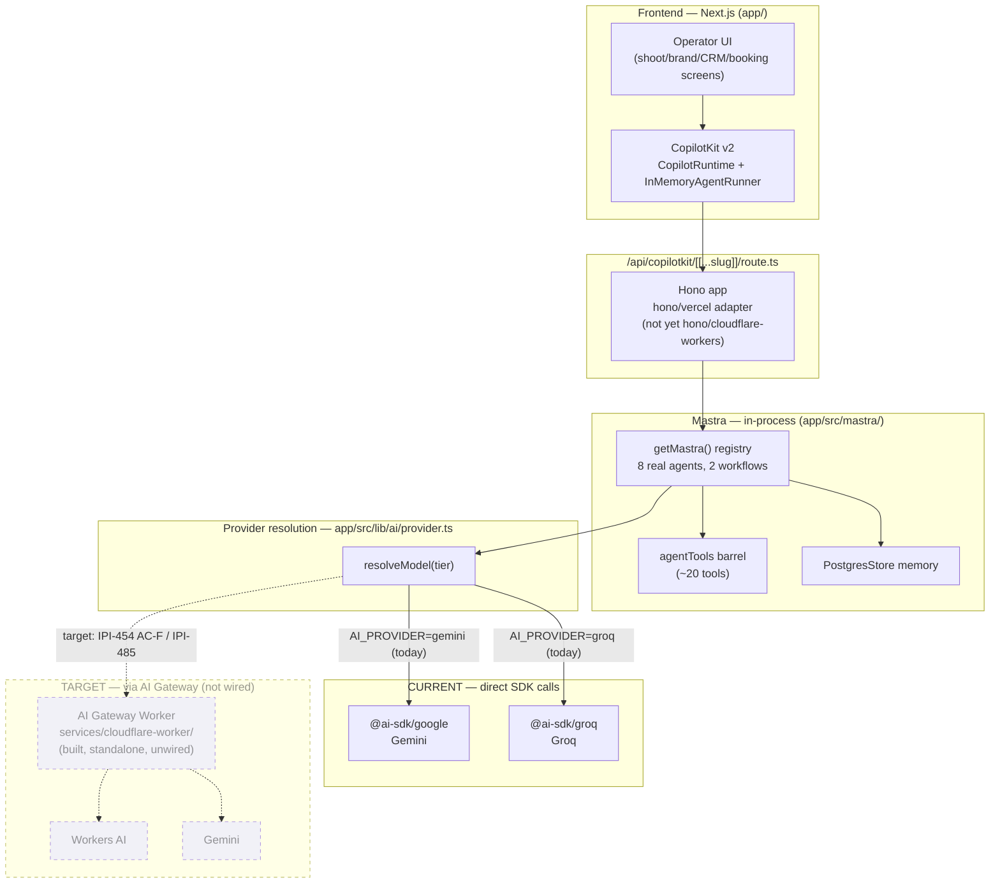

# 07 — AI Platform Architecture

**Purpose:** Show the whole AI stack top to bottom — CopilotKit (frontend chat surface) → Mastra (in-process orchestration) → provider resolution → inference — and make the current-vs-target provider path unambiguous.

## Explanation

Today, `resolveModel()` in `app/src/lib/ai/provider.ts` resolves straight to `@ai-sdk/google` (Gemini) or `@ai-sdk/groq` (Groq) based on the `AI_PROVIDER` env var — there is no gateway in this path. A real Cloudflare Worker AI Gateway exists at `services/cloudflare-worker/` (router + model-registry + Gemini/Workers AI providers), but it is a standalone scaffold: zero code in `app/src/mastra/` or `app/src/lib/ai/` references `AI_GATEWAY_URL`. The target (IPI-454 AC-F, IPI-461, IPI-485) routes every agent call through that Worker instead. Both states are shown below, clearly labeled.

## Diagram

## Related Linear issues

IPI-454 (AI Gateway routing, AC-F), IPI-457 (unified provider registry), IPI-461 (ProviderAdapter), IPI-462 (eval suite), IPI-485 (Mastra gateway cutover).

## Related PRD section

`prd.md` §4.4 (Provider strategy — "Key rule ... not yet enforced in code"), §5.3 (Provider/registry status).
