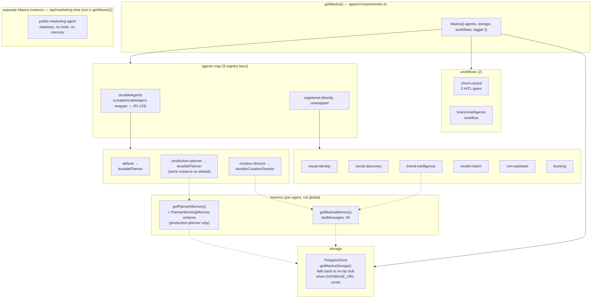

# 08 — Mastra Architecture

**Purpose:** Document Mastra's real internal structure — the `getMastra()` registry, the `durableAgents` wrapper, the actual registered agent IDs, workflows, and memory backing — as it exists in `app/src/mastra/index.ts` today.

## Explanation

`getMastra()` (`app/src/mastra/index.ts:43`) registers 9 keys resolving to 8 distinct `Agent` instances — `default` and `production-planner` both point at the same wrapped `productionPlannerAgent` (via `durablePlanner`). Two agents (`production-planner`/`default`, `creative-director`) are wrapped in `createDurableAgent()` for resumable streams (IPI-133); the other 6 are registered directly, unwrapped. Two Mastra workflows are registered: `shoot-wizard` and `brand-intelligence`. A 9th agent, `publicMarketingAgent`, exists in the same `agents/` directory but is **not** in this registry — it's wired into a separate, standalone Mastra instance behind `/api/marketing-chat` for the public (non-operator) marketing widget.

## Diagram

**Registry-hygiene note (verified in code, not in prd.md's table):** `productionPlannerAgent`'s `tools` field (`app/src/mastra/agents/index.ts:14-19`) is built by destructuring `agentTools` and excluding only 3 booking-write tools (`checkTalentAvailability`, `draftBookingQuote`, `createBookingDraft`). That leaves it holding all 17 remaining tools — including `searchCompanies`/`searchContacts`/`logActivity`/`moveDealStage` (CRM) and `searchTalentByFilters`/`computeTalentMatchScore`/`manageShortlist` (talent-match) — even though its own instructions only reference the 10 shoot-specific tools. `prd.md` §5.2's "10 tools" figure describes the *instructed* tool set, not the *registered* one; the gap between the two isn't currently caught by any lint/test.

## Related Linear issues

IPI-133–135 (durable agent foundation), IPI-129 (PostgresStore), IPI2-121/114 (production-planner foundation).

## Related PRD section

`prd.md` §5.2 (Agent roster — described vs. real), §5.3 ("Agent memory — already shipped. Not a gap").
