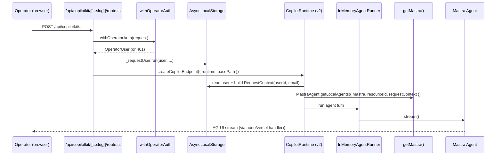
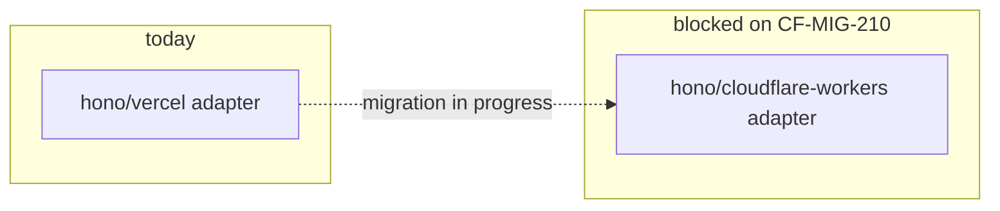

# 09 — CopilotKit Architecture

**Purpose:** Show how the operator chat surface wires to Mastra through CopilotKit v2, and flag the one runtime detail that blocks the Cloudflare migration for this route.

## Explanation

`app/src/app/api/copilotkit/[[...slug]]/route.ts` builds a `CopilotRuntime` with a per-request `agents` factory that reads the authenticated operator identity out of `AsyncLocalStorage` (no Request-object keying — fixes a prior WeakMap-miss bug) and calls `MastraAgent.getLocalAgents({ mastra: getMastra(), resourceId, requestContext })`. Auth is enforced at the HTTP boundary (`withOperatorAuth`) before the CopilotKit endpoint ever runs. The endpoint itself is built with `hono/vercel`'s `handle()` — **not** `hono/cloudflare-workers`, which `MASTRA-EPIC.md` (CF-MIG-210) tracks as an open blocker for running this route on a Cloudflare Worker.

## Diagram

**License/auth gate:** `COPILOTKIT_LICENSE_TOKEN` + `OPERATOR_AUTH_ENABLED=true` together enable thread persistence (72h / 200 threads, free tier). Without both, `identifyUser` returns an `UNKNOWN_USER` stub and every page load starts a fresh conversation — this is a deliberate fallback, not a bug.

## Related Linear issues

CF-MIG-210 (runtime compatibility: Hono adapter, OAuth, Groq JSON bundling), IPI2-127 (per-request auth wiring).

## Related PRD section

`prd.md` §4.2 (Runtime boundaries — "Next.js ... CopilotKit UI, Mastra orchestration").
