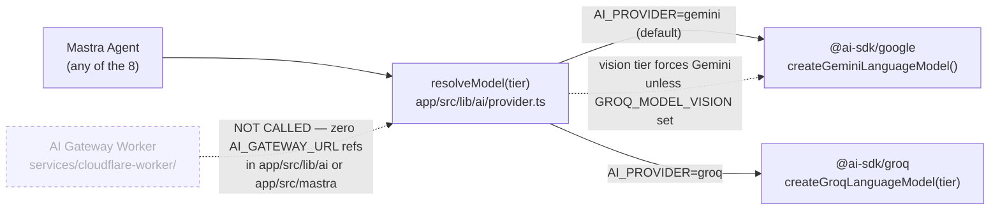
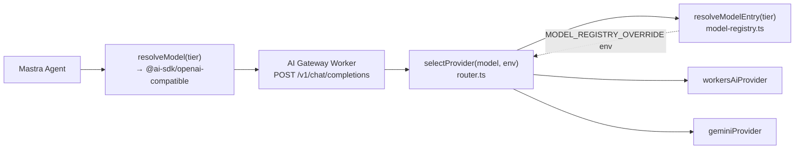
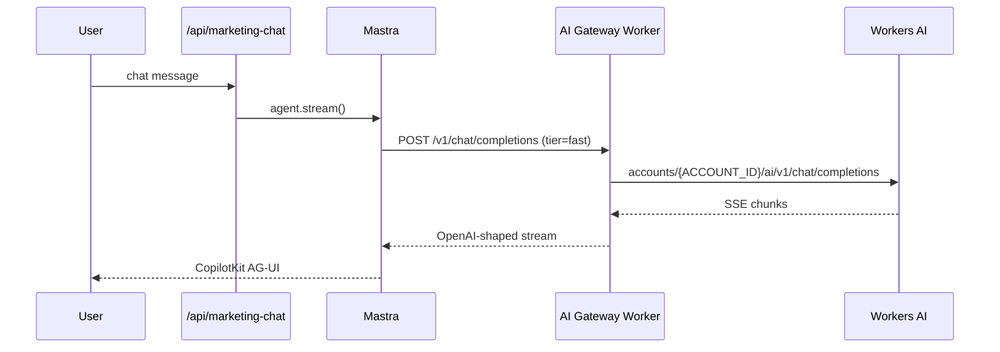

# 10 — AI Gateway Routing: Current vs Target

**Purpose:** The single most important diagram to get right — show, with no ambiguity, that Mastra agents call Gemini/Groq directly today and the AI Gateway Worker is real but unwired.

## Explanation

This updates `tasks/diagrams/02-ai-provider-flow.md`, whose "Today on main" / "Target architecture" split was verified accurate and is reproduced here in the required format. **Current:** `resolveModel(tier)` in `app/src/lib/ai/provider.ts` branches on `AI_PROVIDER` (`gemini` | `groq` | `openai`) and calls `@ai-sdk/google` or `@ai-sdk/groq` directly — zero references to `AI_GATEWAY_URL` anywhere in `app/src/lib/ai/` or `app/src/mastra/`. **Target:** `services/cloudflare-worker/` already has a working `handleRequest` → `selectProvider` → `geminiProvider`/`workersAiProvider` router (`router.ts`, `model-registry.ts`) exposing `/v1/chat/completions` and `/v1/embeddings` — it's unit-tested and deployed on `main`, but nothing in Mastra calls it yet (IPI-461 built the Worker; IPI-454 AC-F is the still-open step that points `resolveModel()` at it).

## Diagram

### Current state (verified on `main`)

### Target state (IPI-454 AC-F, IPI-461, IPI-485)

### Sequence — happy path after wire (marketing-chat, first candidate route)

## Related Linear issues

IPI-454 (AC-F: wire `resolveModel()` → gateway REST), IPI-457 (model-registry SSOT, branch-only), IPI-461 (ProviderAdapter Worker — built, unwired), IPI-462 (eval gate before default flip), IPI-485 (Mastra gateway cutover, blocked by both 457 and 454).

## Related PRD section

`prd.md` §4.3 ("AI Gateway wiring ... a parallel, dependent track ... not yet enforced in code"), §4.4 ("Key rule ... Current reality: this rule is not yet enforced in code").
