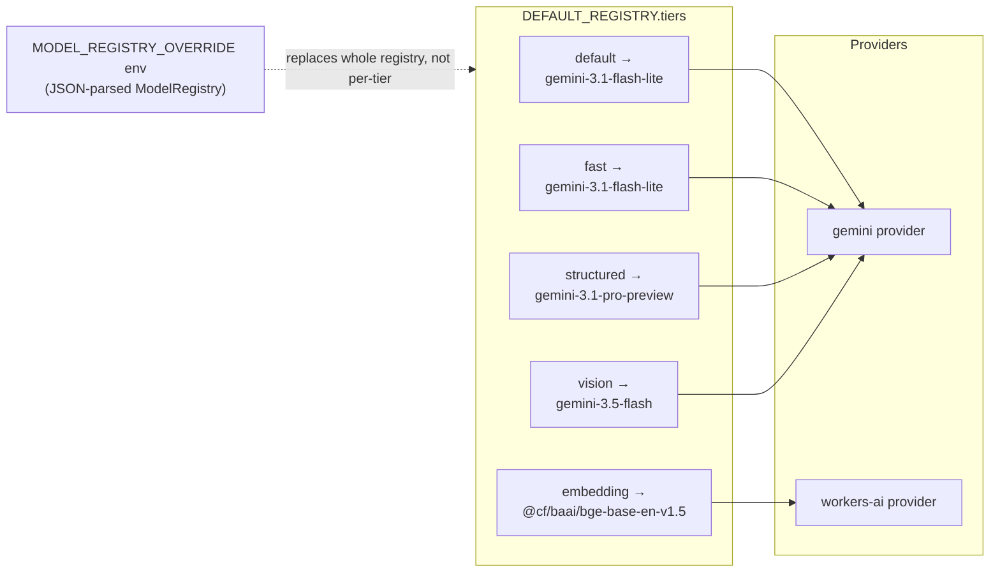
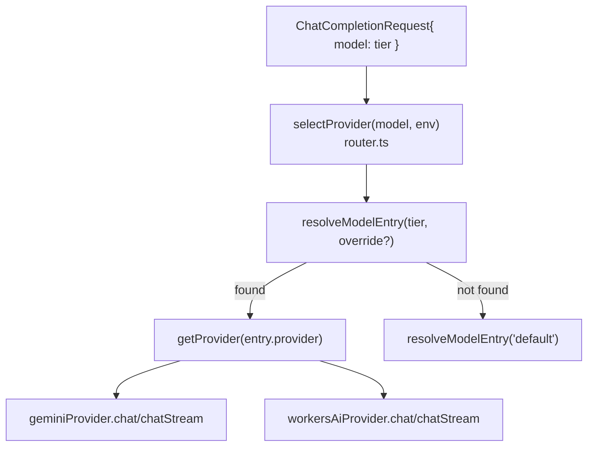

# 11 — Model/Provider Routing (Tier System)

**Purpose:** Show the tier-based routing logic that lives inside the AI Gateway Worker — `router.ts` + `model-registry.ts` — and reconcile it against `prd.md` §4.4's provider-strategy table.

## Explanation

`prd.md` §4.4 documents a target tier table (MVP provider = Workers AI for default/fast/structured, Gemini for vision, Workers AI for embedding). The Worker's actual `DEFAULT_REGISTRY` (`services/cloudflare-worker/src/model-registry.ts:14-57`) currently assigns **Gemini** as the provider for `default`, `fast`, and `structured` — only `embedding` uses `workers-ai` today. This is a real discrepancy between the documented target and the code's current default, worth calling out explicitly rather than redrawing the doc's aspirational table as if it were already live. Both are shown below.

## Diagram

### Code today — `DEFAULT_REGISTRY` (services/cloudflare-worker/src/model-registry.ts)

### prd.md §4.4 target table (not yet reflected in `DEFAULT_REGISTRY`)

| Tier | MVP provider (doc) | Fallback (doc) | Actual code provider today |
|:---:|:---:|:---:|:---:|
| default | Workers AI | Gemini | **Gemini** |
| fast | Workers AI | Gemini | **Gemini** |
| structured | Workers AI | Gemini | **Gemini** |
| vision | Gemini | NVIDIA NIM (eval) | Gemini (matches doc) |
| embedding | Workers AI | Gemini (text-embedding) | Workers AI (matches doc) |

## Related Linear issues

IPI-457 (registry SSOT), IPI-462 (eval suite — gates flipping default tiers to Workers AI), IPI-463 (failover/rollback).

## Related PRD section

`prd.md` §4.4 (Provider strategy table).
