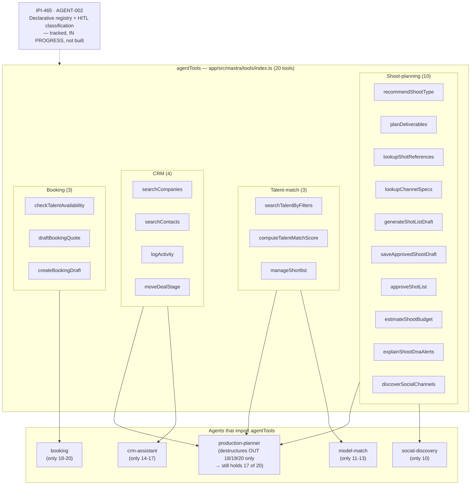

# 12 — Shared Tool Registry

**Purpose:** Show the real tool registration surface — `app/src/mastra/tools/index.ts`'s `agentTools` barrel — and its actual per-agent distribution, not the aspirational "declarative registry" described in the architecture doc.

## Explanation

`agentTools` (`app/src/mastra/tools/index.ts:35-56`) is a single object exporting 20 tools, each a plain import from its own file — there is no ID-based lookup, no HITL classification metadata, and no runtime enforcement of "dangerous tools require approval." Agents import the whole barrel and destructure what they use (see `08-mastra-architecture.md`'s registry-hygiene note: `production-planner` ends up holding 17 of the 20 because its exclusion list only removes 3 booking tools). IPI-465 (AGENT-002) is the tracked work to turn this into a declarative registry with HITL tiers — **not built yet**; today it's a plain barrel file.

## Diagram

## Related Linear issues

IPI-465 (AGENT-002 — declarative tool registry with HITL classification).

## Related PRD section

`prd.md` §5.1 principle 2 ("Tool registry ... IPI-465, tracked, in progress"), §5.3 ("Model evaluation, failover, cost routing ... not built yet, not a missing architectural layer — just not shipped").
