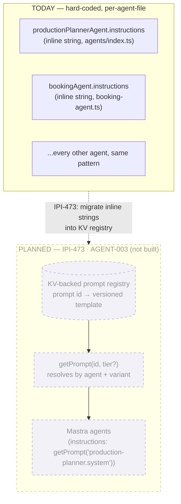

# 13 — Prompt Registry (Planned — Not Yet Built)

**Purpose:** Show the target design for a shared prompt registry. **This diagram is a proposal, not a description of anything in the codebase today.**

## Explanation

`grep`-confirmed: there is no `prompt-registry`, no KV-backed prompt store, and no indirection layer for prompts anywhere in `app/src/mastra/`. Every agent's `instructions` string is hard-coded inline in its own file (e.g. `productionPlannerAgent`'s multi-step instructions in `app/src/mastra/agents/index.ts:30-50`, `bookingAgent`'s in `booking-agent.ts:18-31`). IPI-473 (AGENT-003) tracks building this; it is referenced in the architecture doc and in `prd.md`, but per `prd.md` §5.1 it "had fallen out of `MASTRA-EPIC.md`'s own child-issue table" and needs to be re-added there. Nothing below exists in code — it is the proposed shape only.

## Diagram

## Related Linear issues

IPI-473 (AGENT-003 — Prompt Registry, tracked in Linear, not built; missing from `MASTRA-EPIC.md`'s child-issue table as of this audit).

## Related PRD section

`prd.md` §5.1 principle 3 ("Prompt registry ... IPI-473 — tracked in Linear and in this architecture doc, but had fallen out of MASTRA-EPIC.md's own child-issue table").
