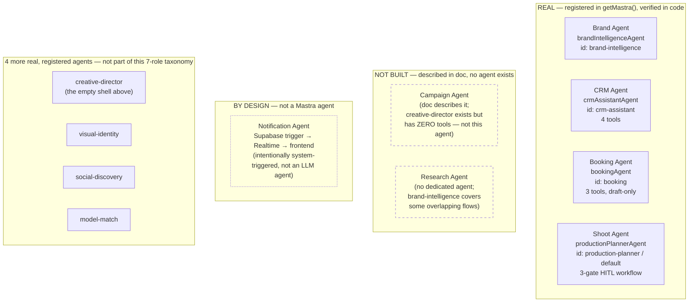

# 14 — Agent Architecture (7-Role Inventory — Real Status)

**Purpose:** The architecture doc's 7-role taxonomy (Brand, CRM, Booking, Shoot, Campaign, Research, Notification), redrawn with each role's verified real-vs-not-built status — the most important accuracy check in this category.

## Explanation

Of the 7 described roles, **4 are real and registered** (Brand, CRM, Booking, Shoot), **2 are not built** (Campaign, Research), and **1 is intentionally not a Mastra agent at all** (Notification — system-triggered via Supabase trigger → Realtime, by design). `creative-director` exists in code (registered, has memory, zero tools) but is **not** the Campaign Agent the architecture doc describes — it's an empty shell. `brand-intelligence` covers some research-adjacent flows but there is no dedicated Research Agent. This corrects `tasks/diagrams/03-agent-tool-architecture.md:12`, which draws both `CgA["Campaign Agent"]` and `RA["Research Agent"]` inside the same "Mastra Agents — Vercel" subgraph as Brand/CRM/Booking/Shoot — with no visual distinction — and wires all six into `ProviderAdapter` / `Tool Registry` / `Prompt Registry` as if those integration points exist for any of them today. None of the three integration points in that diagram are actually wired for any agent (see diagrams 10, 12, 13).

## Diagram

## Related Linear issues

IPI-268 (campaigns schema, deployed), CAMPAIGN work item "Add Campaign Agent" (architecture doc §7 step 6, depends on Campaigns UI), RESEARCH work item "Add Research Agent" (§7 step 7, depends on IPI-467 Browser Rendering eval).

## Related PRD section

`prd.md` §5.2 (Agent roster — described vs. real, full verified table), §6.6 (Campaign — thin, full target-state spec).
