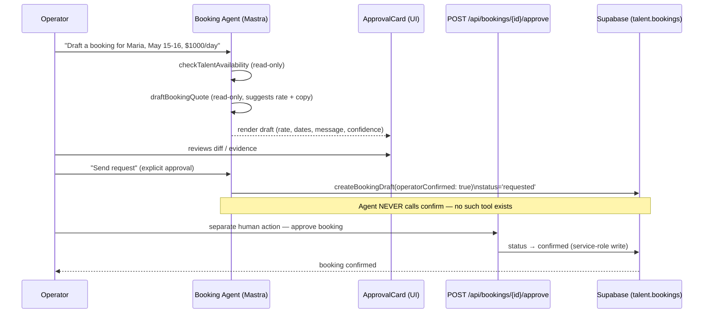
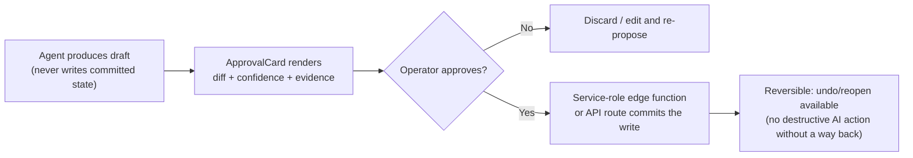

# 15 — Human-in-the-Loop (HITL) Flow

**Purpose:** Show the real HITL pattern — agent proposes a draft, an `ApprovalCard` renders it with confidence/evidence, the operator approves, and only then does a service-role write happen — using the Booking Agent's confirm flow as the concrete, test-guaranteed example.

## Explanation

The Booking Agent (`app/src/mastra/agents/booking-agent.ts`) never confirms a booking — there is no `confirm_booking` tool in its registered tool set (`checkTalentAvailability`, `draftBookingQuote`, `createBookingDraft` only). `createBookingDraft` only proceeds when the operator has explicitly set `operatorConfirmed: true`; even then it writes a draft row (`status='requested'`), not a confirmed booking. Confirmation itself is a separate, human-only HTTP action: `POST /api/bookings/{id}/approve`. This draft-only guarantee is enforced by a snapshot test (`app/src/mastra/agents/booking-agent.snapshot.test.ts`), which is what makes this a good reference example — the invariant is actively checked, not just documented.

## Diagram

## Related Linear issues

IPI-397 (booking draft-only verification), IPI2-116 ("no silent writes" pattern — write tools call edge functions after HITL, never write durable tables directly).

## Related PRD section

`prd.md` §3 (HITL description), §5.1 principle 5, §6.2 (Booking — mature, 3 tools, snapshot-tested draft-only).
