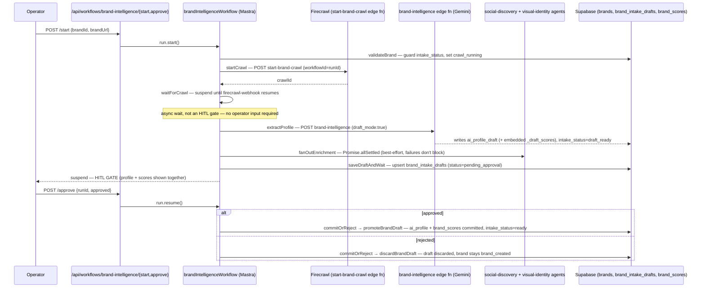

# 16 — Brand Onboarding Workflow

**Purpose:** Show the real crawl → analyze → score → approve flow that turns a brand URL into an approved Brand DNA profile.

## Explanation

Verified against `app/src/mastra/workflows/brand-intelligence-workflow.ts` (7-step Mastra workflow) and its two entry/exit API routes: `app/src/app/api/workflows/brand-intelligence/start/route.ts` and `.../approve/route.ts`. **Correction to source docs:** `tasks/cloudflare/plan/ai-agent-architecture.md` §3.1 states the Brand Agent has **two** approval points ("profile draft" and "DNA scores" reviewed separately). The actual code has **one** combined HITL gate: `saveDraftAndWait` suspends once with a single `brand_intake_drafts` row whose `draft_profile` JSON embeds both the AI profile and `_draft_scores` together; `commitOrReject` (via `promoteBrandDraft`) commits both atomically on a single `approved` boolean. There is no separate scores-only approval step in code today.

## Diagram

## Related Linear issues

IPI-32 (Brand Intelligence workflow, source of the workflow file header).

## Related PRD section

`prd.md` §6.3 (Brand — Mature), §3 (HITL invariant — three-level enforcement).
