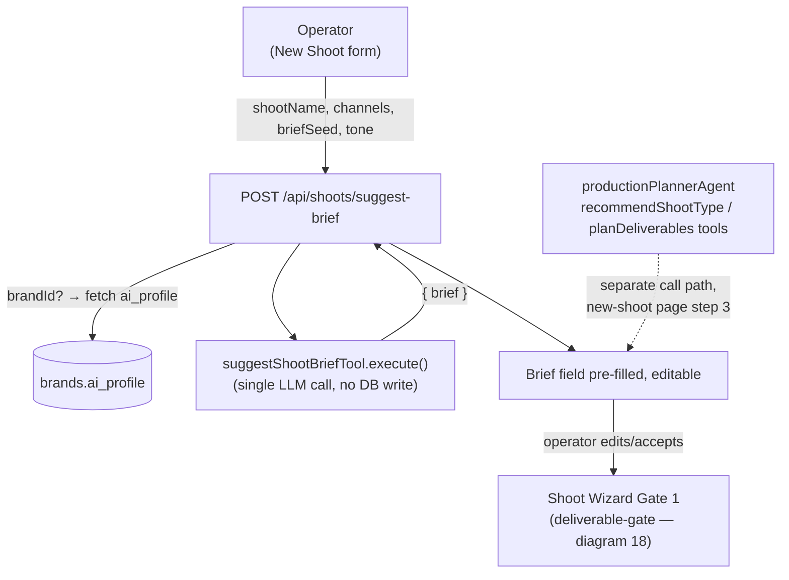

# 17 — AI Shoot-Brief Generation Workflow

**Purpose:** Show how an operator turns a rough idea into a usable shoot brief before starting the Shoot Wizard.

## Explanation

Verified against `app/src/app/api/shoots/suggest-brief/route.ts` and `app/src/mastra/tools/suggestShootBrief.ts`. This is a **stateless, single-call** generation endpoint, not a Mastra workflow — it takes an optional `brandId` (used only to pull brand-voice context for the prompt), `channels`, `shootName`, an optional `briefSeed`, and `tone`, and returns one `brief` string. It writes nothing to the database, so per `prd.md` §3's own rule ("no AI agent writes data ... without approval"), no formal `ApprovalCard`/suspend-resume gate is required here — the write only happens later, inside the Shoot Wizard's Gate 1 (`deliverable-gate`, see diagram 18). The operator's edit of the returned brief text in the shoot-creation form **is** the de facto review step before that brief becomes wizard input. Note: `recommendShootType` and `planDeliverables` (referenced in the task brief) are separate tools registered on `productionPlannerAgent` and called from the shoot-creation UI (`app/src/app/(operator)/app/shoots/new/page.tsx`) — they are not part of the `suggest-brief` call chain; `shoot-wizard.ts`'s own Gate 1 re-implements equivalent deliverable-planning logic inline rather than calling the `planDeliverables` tool.

## Diagram

## Related Linear issues

No dedicated Linear issue found for `suggest-brief` itself; it is part of the Shoot feature's mature surface (`prd.md` §6.4).

## Related PRD section

`prd.md` §6.4 (Shoot — Mature); `tasks/cloudflare/plan/ai-agent-architecture.md` §3.4 (Shoot Agent tool list).
