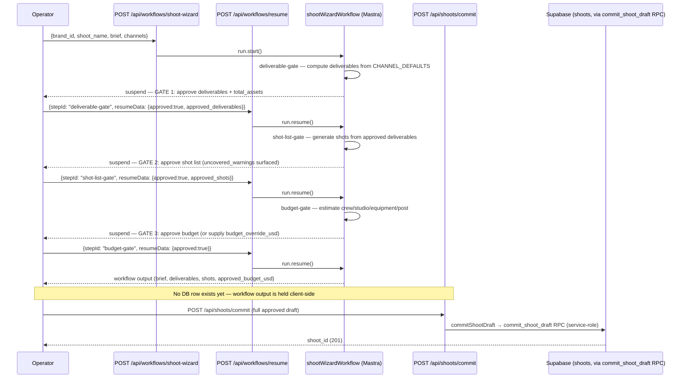

# 18 — Shoot Wizard Workflow (3-Gate HITL)

**Purpose:** Show the real 6-step, 3-gate shoot planning workflow that is iPix's canonical HITL pattern.

## Explanation

Verified directly against `app/src/mastra/workflows/shoot-wizard.ts` (file path is non-negotiable per its own header comment: `shoot-wizard.ts`, not `shoot-production.ts`). The workflow itself never writes to the database — it computes deliverables/shots/budget in-memory at each gate and suspends. The actual data write happens afterward, in a **separate** call to `POST /api/shoots/commit` (`app/src/app/api/shoots/commit/route.ts`) which invokes `commitShootDraft` → `commit_shoot_draft` RPC via the service-role client — matching `prd.md` §3's "data" HITL level ("service-role edge functions/RPCs are the only code path that performs the actual write, never a Mastra tool directly"). All three gates are driven through the same generic `POST /api/workflows/resume` endpoint (`{ workflowId, runId, stepId, resumeData }`).

## Diagram

## Related Linear issues

IPI-149 (SHOOT-AI-002 — shoot-wizard workflow), IPI-228 (Gate 3 commit path via `commit_shoot_draft` RPC).

## Related PRD section

`prd.md` §6.4 (Shoot — Mature: "Workflow: shoot-wizard.ts (6 steps, 3 HITL gates)"); `tasks/cloudflare/plan/ai-agent-architecture.md` §3.4.
