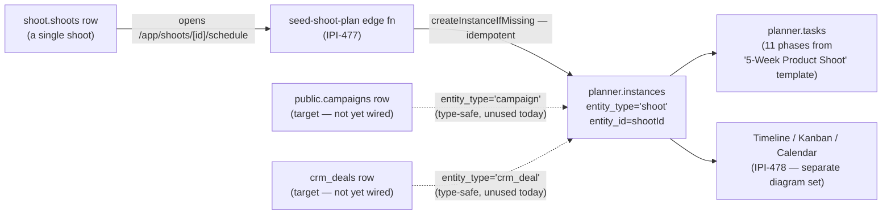

# 19 — Planner Attachment to Shoot (Polymorphic Instance)

**Purpose:** Show, at a high level only, how a Shoot attaches to the reusable Planner engine — not a full Planner workflow (that lives in the dedicated Planner diagram set from another agent).

## Explanation

Verified against `app/src/lib/planner/types.ts`: `PlannerInstance.entityType` is a real, typed union — `EntityType = "shoot" | "campaign" | "crm_deal"` — confirming the polymorphic-attachment design `prd.md` §6.7/§7 describes is implemented in the type layer. Per `IPI-477` (PLN-002), opening a shoot's schedule tab (`/app/shoots/[id]/schedule`) idempotently ensures a `planner.instances` row exists with `entity_type='shoot'`, `entity_id=<shootId>`, seeded from the "5-Week Product Shoot" workflow template (11 phases). This diagram intentionally stops at the attachment boundary — timeline/kanban/calendar views, dependencies, and real-time sync are `IPI-478`–`483`'s own diagrams, not duplicated here.

## Diagram

## Related Linear issues

IPI-476 (PLN-001 schema+engine), IPI-477 (PLN-002 shoot template — this diagram's primary source), IPI-478 (PLN-003 views, out of scope here).

## Related PRD section

`prd.md` §6.7 (Planner), §7 (Data Model — `planner.*` polymorphic instance/task tables).
