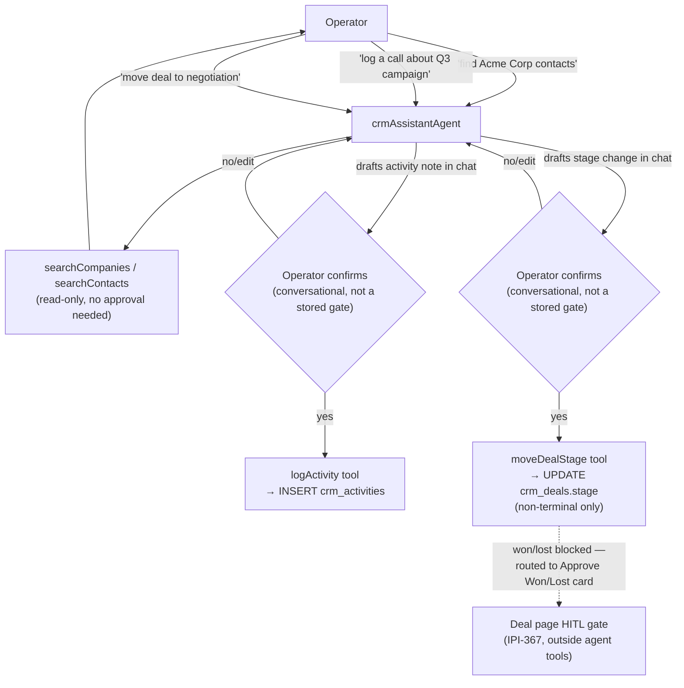

# 20 — CRM Workflow

**Purpose:** Show the search → view → log activity → move deal stage flow and its two HITL points.

## Explanation

Verified against `app/src/mastra/agents/crm-assistant-agent.ts` (4 tools: `searchCompanies`, `searchContacts`, `logActivity`, `moveDealStage`) and the tool implementations in `app/src/mastra/tools/crm/`. **Architectural note:** unlike the Booking and Shoot agents, `logActivity`/`moveDealStage` have **no `operatorConfirmed`-style flag or suspend/resume gate at the tool level** — they write to `crm_activities`/`crm_deals` directly when called. The two approval points `ai-agent-architecture.md` §3.2 describes are enforced by the conversational UI convention (the agent states its intended action, the operator must reply affirmatively before the tool call is issued), not by a stored approval gate the way `booking-tools.ts`'s `createBookingDraft` or the shoot-wizard's `suspend()` calls are. `moveDealStage` is additionally hard-restricted at the schema level to `NON_TERMINAL_DEAL_STAGES` — it cannot set `won`/`lost`; that terminal transition is a separate, stronger HITL gate on the deal page itself (IPI-367), outside this agent's tool surface entirely.

## Diagram

## Related Linear issues

IPI-368 (CRM-AI-002 — crm-assistant agent), IPI-367 (deal Approve Won/Lost HITL gate).

## Related PRD section

`prd.md` §6.1 (CRM — Mature); `tasks/cloudflare/plan/ai-agent-architecture.md` §3.2.
