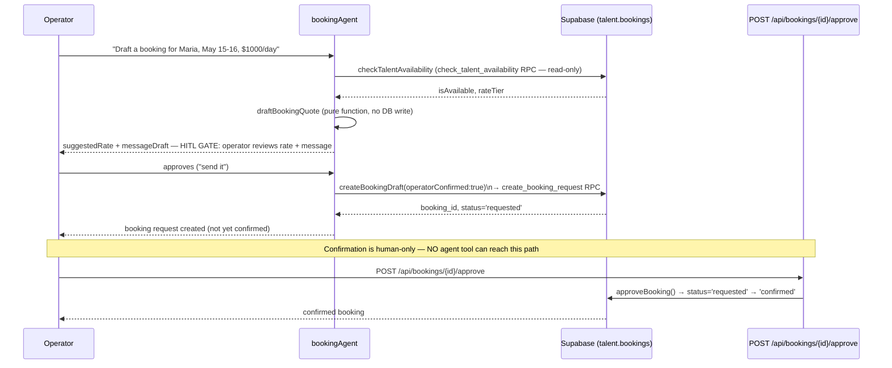

# 21 — Booking Workflow (Strictest HITL Example)

**Purpose:** Show the check-availability → draft-quote → operator-approve → confirm flow, and why this is the platform's strictest HITL example.

## Explanation

Verified against `app/src/mastra/tools/booking-tools.ts` and `app/src/app/api/bookings/[id]/approve/route.ts`. There is **no `confirm_booking` tool** — the file header states this explicitly: "Never expose confirm_booking — confirmation is human-only via POST .../approve." The agent's own `createBookingDraft` tool throws if called without `operatorConfirmed: true`, and even then only writes `talent.bookings` in `status='requested'`. The actual `requested → confirmed` transition happens exclusively through `approveBooking()` (`app/src/lib/booking/booking-service.ts`), reached only via the human-only REST endpoint — no agent code path can reach it at all, not even with a flag.

## Diagram

## Related Linear issues

IPI-348 (MODELGATE-10 — Booking Agent tools), IPI-397 (draft-only snapshot test verification).

## Related PRD section

`prd.md` §6.2 (Booking — Mature); `tasks/cloudflare/plan/ai-agent-architecture.md` §3.3 ("⛔ Agent NEVER confirms a booking").
