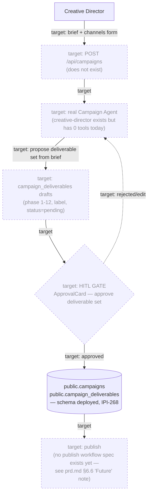

# 22 — Campaign Workflow (Target State — Not Yet Built)

**Purpose:** Show the target brief → deliverable-set proposal → HITL approval → publish flow for Campaign. **None of the API/Agent/UI/AI layers below exist in code today** — only the database schema is deployed.

## Explanation

Per `roadmap.md` §2 Phase 1's milestone table: Schema 🟢 Done, API/Agent/UI/AI all ⚪ Not started. Verified against `supabase/migrations/20260707100000_ipi268_campaigns_schema.sql`: `public.campaigns` and `public.campaign_deliverables` are **both already deployed** — `app/src/app/(operator)/app/campaigns/` is a route-only UI stub, there is no `/api/campaigns` route, and `creative-director` (`app/src/mastra/agents/`) is a real registered Mastra agent with **zero tools**, not the Campaign Agent the architecture doc describes. **Correction to `prd.md` §6.6:** it states `campaign_deliverables` "needs schema" — the table already exists (migration above), just with different columns than described there (`phase` smallint 1–12 + `label` + `status` enum `pending/in_progress/review/approved/blocked` + `due_date` + `assigned_to`, not "deliverable type, channel ... linked asset"). The schema note in `prd.md` should be updated to "deployed, column shape differs from original spec," not "not started."

## Diagram

## Related Linear issues

IPI-268 (campaigns schema — the only shipped piece). No Campaign Agent, API, or UI Linear issue exists yet — `roadmap.md` §2 Phase 1 calls for opening one per milestone.

## Related PRD section

`prd.md` §6.6 (Campaign — Thin, full target-state spec); `roadmap.md` §2 Phase 1 (milestone split table).
