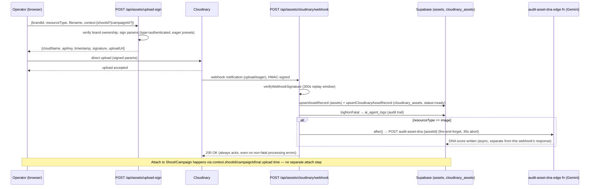

# 23 — Media Upload & Cloudinary Workflow

**Purpose:** Show the signed-upload → transform → webhook → asset-record → DNA-audit flow, the only media pipeline in the platform.

## Explanation

Verified against `app/src/app/api/assets/upload-sign/route.ts` and `app/src/app/api/assets/cloudinary/webhook/route.ts`. The client never talks to Cloudinary's API secret — the server signs upload params (`type: "authenticated"`, i.e. private/signed delivery, per IPI-257 §5, until HITL approval flips it to public) and the browser uploads directly to Cloudinary. Cloudinary's webhook (HMAC-verified, 300s replay window) is the only writer of `assets`/`cloudinary_assets` rows. Image uploads fire an async, best-effort DNA audit (`audit-asset-dna` edge fn, Gemini) via `after()` so the webhook still acks within its ~3s budget. **Known gap in code** (own `ponytail:` comment at `cloudinary/webhook/route.ts:33-37`): shoot/campaign-folder uploads don't yet resolve `brand_id` — it stays `null` for those until a `shoot.shoots` folder→brand lookup is added.

## Diagram

## Related Linear issues

IPI-257 (Cloudinary signed upload + webhook pipeline, phases 074a–074e).

## Related PRD section

`prd.md` §6.5 (Assets & Notifications — Mature: "Cloudinary is the dedicated pipeline").
