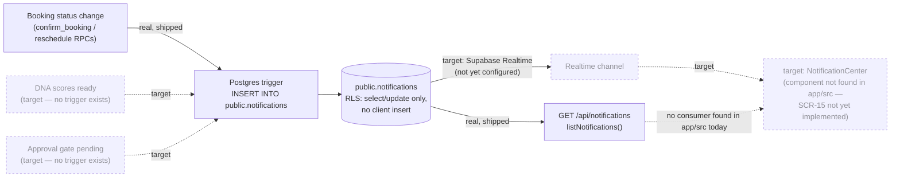

# 24 — Notification Workflow (System-Triggered, No Agent)

**Purpose:** Show that notifications are system-triggered by design — a DB write, not an AI agent action — matching the architecture doc's explicit non-goal for this "agent."

## Explanation

Verified against `supabase/migrations/20260701125400_notifications_table.sql` (RLS comment: "inserts happen via the bookings trigger / service role, never a direct client insert") and the trigger migrations `20260701125500_confirm_booking_rpc.sql` / `20260702160000_...` / `20260702170000_...`, which are the **only** migrations that actually `INSERT INTO public.notifications` today. **Gap found:** `prd.md` §6.5 and the roadmap both describe a `NotificationCenter` dropdown component (reusing Claude Design screen `SCR-15`) as the frontend consumer — no `NotificationCenter` component exists anywhere in `app/src/components`, and no file in the app fetches `GET /api/notifications` outside its own route/tests. The API (`app/src/app/api/notifications/route.ts`, `listNotifications`) and DB layer are real and shipped; the frontend consumer is not yet built. Per `roadmap.md` line 246 / §1: "Realtime not yet configured for all notification types" — booking-confirmed is the only real trigger source today; "DNA scores ready" and "gate pending" (cited in `ai-agent-architecture.md` §3.7's example) have no matching trigger in the migrations and should be read as target examples, not shipped ones.

## Diagram

## Related Linear issues

IPI-307 (MODEL-P1 — notifications table), IPI-343 (notification reads + RPCs).

## Related PRD section

`prd.md` §6.5 (Assets & Notifications — Mature, "extend for Planner events ... reuse SCR-15, do not redesign"); `tasks/cloudflare/plan/ai-agent-architecture.md` §3.7 (Notification Agent — "system-triggered, not agent-written").
