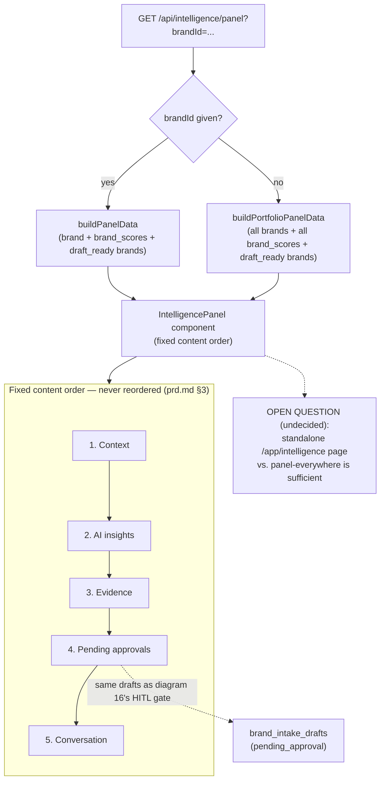

# 25 — Intelligence Panel Workflow (Current: Panel-Only)

**Purpose:** Show the current panel-only Intelligence flow and its fixed content order — and flag, without deciding, the open standalone-page question.

## Explanation

Verified against `app/src/app/api/intelligence/panel/route.ts` (`buildPanelData` for a single brand, `buildPortfolioPanelData` when no `brandId` is given — so a portfolio-wide aggregate already exists at the API level even though no page renders it) and `app/src/components/intelligence-panel/intelligence-panel.tsx`. Content order is fixed per `prd.md` §3 line 86: **context → AI insights → evidence → pending approvals → conversation**, "never reordered." The panel's data ultimately comes from `brand-intelligence-agent.ts` / `brand-intelligence-workflow.ts` (diagram 16) — no separate agent exists for Intelligence itself, it is a read/render layer over Brand's existing outputs, plus `brand_scores` and any `draft_ready` brands (the pending-approvals queue).

**Open question (not decided here, per `prd.md` §6.8):** does Intelligence need a standalone `/app/intelligence` page (cross-brand, cross-shoot dashboard), or does the existing panel-everywhere pattern already satisfy the need? Neither the architecture doc nor the ground-truth audit found evidence either way. The diagram below shows only the current, real, panel-only state; the standalone-page branch is annotated as an open question, not drawn as a decided target.

## Diagram

## Related Linear issues

No Linear issue found for a standalone Intelligence page — `prd.md` §6.8 confirms this is intentionally open, not a tracked gap.

## Related PRD section

`prd.md` §6.8 (Intelligence — Panel-only, target-state spec); §3 (IntelligencePanel fixed content order).
