# Supabase Architecture

**Purpose:** Show Supabase as the platform's sole system of record — Postgres, Auth, pgvector, and Realtime — and how the three Next.js connection paths (browser, server, service-role) reach it.

## Explanation

Supabase Postgres is the system of record for all business data (shoots, CRM, campaigns, planner, notifications, talent). The Next.js app never talks to Postgres directly — it always goes through one of three Supabase client constructors, each scoped to a different trust level and each enforcing Row-Level Security (RLS) except the service-role path. No Cloudflare D1 or Hyperdrive sits in this picture (both are explicit Skips per `cf-000-platform-architecture.md` §2 — Supabase is the sole database).

## Diagram

```mermaid
flowchart TB
  subgraph Client["Browser"]
    Browser["createSupabaseBrowserClient()\napp/src/lib/supabase/client.ts\nanon key + RLS"]
  end

  subgraph NextServer["Next.js Server (Vercel)"]
    ServerClient["createSupabaseServerClient()\napp/src/lib/supabase/server.ts\nanon key + user JWT cookie + RLS"]
    Middleware["updateSession()\napp/src/lib/supabase/session.ts\nrefreshes session cookie every request"]
    APIRoutes["API routes (app/src/app/api/**)\nuse ServerClient — never service-role"]
  end

  subgraph EdgeFn["Supabase Edge Functions (server-only)"]
    ServiceRole["service_role key\nprivileged writes, RLS bypassed"]
  end

  subgraph Supabase["Supabase Platform"]
    PG[("PostgreSQL\nSystem of Record")]
    Auth["Supabase Auth\n(OAuth, JWT issuance)"]
    Vector[("pgvector\nembeddings")]
    Realtime["Realtime\n(logical replication\nover supabase_realtime publication)"]
  end

  Browser -->|anon key, RLS enforced| PG
  Browser -->|sign-in| Auth
  ServerClient -->|anon key + JWT, RLS enforced| PG
  Middleware -.refreshes.-> ServerClient
  APIRoutes --> ServerClient
  ServiceRole -->|bypasses RLS, edge functions only| PG
  Auth --> PG
  PG --- Vector
  PG --- Realtime

  style ServiceRole fill:#3a1f1f,stroke:#c0392b
```

**Key rule (enforced in code):** the browser and Next.js server clients (`client.ts`, `server.ts`) only ever use `NEXT_PUBLIC_SUPABASE_ANON_KEY` — RLS is always active. `SUPABASE_SERVICE_ROLE_KEY` appears only in Supabase Edge Functions, never in a Mastra tool or browser bundle (PRD §8).

## Related Linear issues

IPI-307 (notifications), PLT-002 (Auth)

## Related PRD section

PRD §7 (Data Model), §8 (Non-Functional Requirements — RLS pattern)
