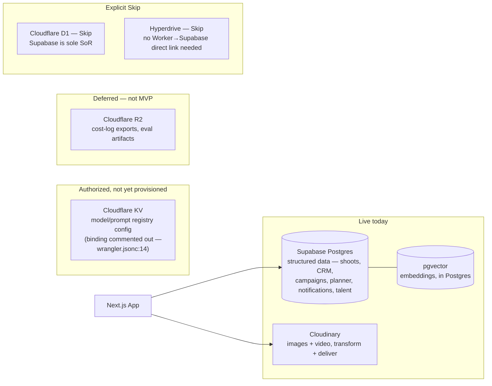

# Storage Architecture

**Purpose:** Show where each data type actually lives today — structured data, media, and embeddings — and correct the assumption that Cloudflare R2/KV are active storage backends.

## Explanation

Structured business data lives exclusively in Supabase Postgres; media (images/video) is handled entirely by Cloudinary's pipeline; vector embeddings use pgvector, the default per `cf-000-platform-architecture.md` §6 principle 2 (Vectorize must clearly win on cost/quality to displace it — no such evaluation has concluded). Cloudflare R2 is an explicit `⏳ Defer` in `cf-000`'s decision table (§2) — no code references `R2Bucket`. Cloudflare KV is listed `✅ Use now` in that same table for model/prompt **config** registries, but as of this writing its binding is still commented out in `services/cloudflare-worker/wrangler.jsonc:14` — it is authorized, not yet provisioned, and even once live it is config storage, not a business-data store. D1 and Hyperdrive are `❌ Skip` — Supabase is sole system of record.

## Diagram

## Related Linear issues

CF-AI-005 (KV registry), CF-AI-010 (R2 cost/eval export)

## Related PRD section

PRD §7 (Data Model); `tasks/cloudflare/plan/cf-000-platform-architecture.md` §2, §6
