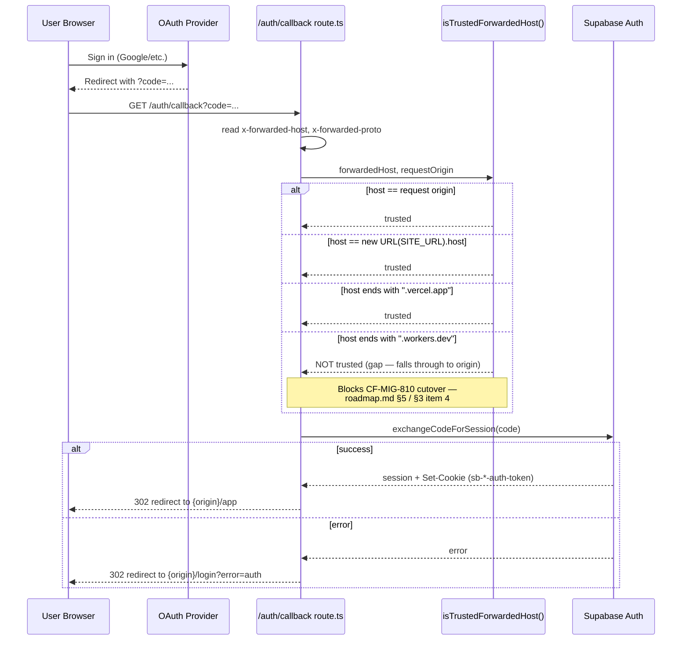

# Authentication Flow

**Purpose:** Trace the real Supabase Auth OAuth callback path in `app/src/app/auth/callback/route.ts`, including the host-trust gap that blocks the Cloudflare cutover.

## Explanation

The callback exchanges the OAuth `code` for a session via `supabase.auth.exchangeCodeForSession()`, then redirects to `/app`. Before redirecting it must pick the right origin: `redirectOrigin()` trusts `x-forwarded-host` only if `isTrustedForwardedHost()` says so. That function trusts the request's own origin, `SITE_URL`, or any `.vercel.app` host — it has **no case for `.workers.dev`**, so a Cloudflare-Workers-hosted preview cannot yet complete OAuth correctly (per `roadmap.md` §5, this is an open 🔴 blocker for `CF-MIG-810`).

## Diagram

## Related Linear issues

CF-MIG-210 (OAuth `.workers.dev` trust fix, per roadmap.md §5 line 36), CF-MIG-810 (blocked by this gap)

## Related PRD section

`roadmap.md` §3 item 4, §5 (Go/No-Go checklist, line 114/154/247); PRD §8 (Security & RLS)
